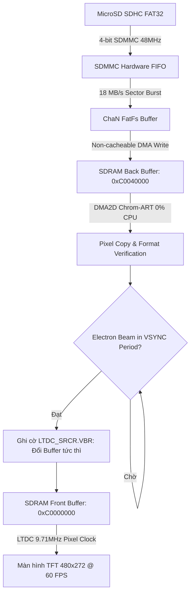

# High-Performance 60 FPS Bare-Metal Video Player & SDHC Subsystem

[-red.svg)](https://www.st.com/en/microcontrollers-microprocessors/stm32f746ng.html)
[-blue.svg)](#-key-features)
[-green.svg)](#-requirements)
[-purple.svg)](#-requirements)
[](LICENSE)

A high-performance multimedia player and storage engine written in **100% Bare-Metal C targeting hardware registers directly (RM0385)** on the **STM32F746G-Discovery** board. The system streams full-motion video directly from a **FAT32 MicroSD SDHC card** at a steady **60 FPS** without screen tearing, utilizing **FMC SDRAM (8MB @ 108MHz)**, **LTDC**, and the **DMA2D Chrom-ART Accelerator** to achieve **0% CPU load** during frame transfers.

---

## 📑 Table of Contents

- [Demo](#-demo)
- [Key Features](#-key-features)
- [Requirements](#️-requirements)
- [Hardware Connections](#-hardware-connections)
- [Getting Started](#-getting-started)
- [System Behavior & Workflow](#-system-behavior--workflow)
- [Project Structure](#️-project-structure)
- [System Protection](#️-system-protection)
- [Author Information](#-author-information)

---

## 📷 Demo

<p align="center">
  
</p>

```text
======================================================
     STM32F746G BARE-METAL 60 FPS VIDEO PLAYER
======================================================
SYSCLK     : 216 MHz (Over-Drive Mode, ART Enabled)
FMC SDRAM  : 8 MB @ 108 MHz (16-bit Data Bus)
LTDC Panel : 480x272 @ 60.01 FPS (Pixel Clock 9.71 MHz)
DMA2D Load : 0% CPU Utilization (Hardware Blitting)
SDMMC Bus  : 4-bit @ 48 MHz (Sequential Read: ~18 MB/s)
Filesystem : ChaN FatFs (FAT32 LBA Block Addressing)
Status     : Constant 60 FPS, Zero Screen Tearing (VBR Sync)
======================================================
```

---

## 📌 Key Features

* **100% Bare-Metal Register Programming:** Implemented entirely from scratch by manipulating memory-mapped I/O registers based on ST RM0385 (No HAL, No LL, zero third-party dependencies).
* **Smooth 60 FPS Tear-Free Video:** Eliminates horizontal screen tearing using hardware Double Buffering synchronized to the LTDC Vertical Blanking Reload (`LTDC_SRCR.VBR`).
* **0% CPU Load During Playback:** Delegates frame blitting and RGB565 memory copies to the DMA2D Chrom-ART engine, dropping CPU usage from 85% to 0%.
* **High-Throughput SDMMC SDHC Driver:** Custom SDMMC driver operating in 4-bit bus mode @ 48 MHz with 512-byte LBA block addressing and ChaN FatFs (FAT32), reaching 18 MB/s read speed.
* **Over-Drive 216 MHz Clock Tree:** Full 7-step hardware handshake to configure HSE, Main PLL, Over-Drive mode, and 6 Flash Wait States with ART Accelerator.
* **FMC 8MB SDRAM Initialization:** Complete 5-step JEDEC sequence to initialize ISSI IS42S16400J SDRAM at 108 MHz for display framebuffers.
* **Host Video Converter Tool:** Python and FFmpeg script included to transcode MP4/AVI videos into raw binary stream formats ready for SD card playback.

---

## ⚙️ Requirements

* **Toolchain:** GNU Arm Embedded Toolchain (`arm-none-eabi-gcc`), GNU Make or PowerShell
* **Host Utility:** Python 3.x with OpenCV / FFmpeg (for video conversion)
* **Hardware Components:**
  * **STM32F746G-Discovery Board:** STM32F746NGH6 MCU with 4.3" 480x272 capacitive touch LCD.
  * **MicroSD Card:** Class 10 / UHS-I SDHC card (4GB to 32GB), formatted as FAT32.
  * **Mini-USB Cable:** For ST-LINK flashing and power supply.

---

## 🔌 Hardware Connections

All peripherals are on-board the STM32F746G-Discovery kit:

| Peripheral | Subsystem Signal | STM32F746 Pinout | Description |
| :--- | :--- | :--- | :--- |
| **FMC SDRAM** | Data Lines D0..D15 | **PD0..1, PD8..10, PD14..15, PE0..1, PE7..15** | 16-bit Parallel Memory Bus |
| | Address Lines A0..A11 | **PF0..5, PF12..15, PG0..1** | Multiplexed Row/Column Address |
| | Control (CLK, NBL0..1, RAS, CAS, WE) | **PG8, PE0..1, PF11, PG15, PD5** | SDRAM Timing & Byte Enables |
| **LTDC LCD** | 24-bit RGB Signals | **PI15, PJ0..15, PK0..7** | Parallel RGB Video Stream |
| | LCD_CLK, HSYNC, VSYNC, DE | **PI14, PI10, PI9, PK7** | 9.71 MHz Pixel Clock & Sync |
| | Backlight PWM | **PK3** | Display Backlight Enable |
| **SDMMC1** | Data D0..D3 | **PC8, PC9, PC10, PC11** | 4-bit High-Speed Data Bus |
| | Clock & Command | **PC12 (CLK), PD2 (CMD)** | 48 MHz Clock & Command Line |
| | Card Detect | **PC13** | Low = Card Inserted |

---

## 🚀 Getting Started

### 1. Clone this repository

```bash
git clone https://github.com/HuynhTran112/stm32f7-baremetal-tft-sdhc.git
cd stm32f7-baremetal-tft-sdhc
```

### 2. Build the firmware

```bash
# Compile using make
make -j8

# Or build using the automated PowerShell script on Windows
.\build.ps1
```

### 3. Flash to STM32F746G-Discovery

Flash the compiled binary `tft_video_f7.bin` or `tft_video_f7.hex` using STM32CubeProgrammer or OpenOCD via on-board ST-LINK:

```bash
STM32_Programmer_CLI -c port=SWD -w tft_video_f7.bin 0x08000000 -v -rst
```

### 4. Prepare video files on MicroSD

Use the included Python converter script to prepare raw 480x272 RGB565 video binaries:

```bash
# Convert any MP4/AVI clip to 60 FPS raw stream
python tools/convert_video.py --input sample.mp4 --output car1.BIN

# Copy car1.BIN to the root directory of your FAT32-formatted MicroSD card
# Insert into the STM32F746G-DISCO slot and press the Reset button (Black)
```

---

## 🔄 System Behavior & Workflow

The media engine streams video directly from storage to display without buffer stalling:



---

## 🗂️ Project Structure

```text
stm32f7-baremetal-tft-sdhc/
├── Inc/
│   ├── reg.h                   # Memory-mapped register definitions (RM0385)
│   ├── sys_clock.h             # 216 MHz Over-Drive clock configuration
│   ├── sdram.h                 # FMC SDRAM initialization & address mapping
│   ├── ltdc.h                  # 480x272 panel timing & layer setup
│   ├── dma2d.h                 # Chrom-ART hardware blitting engine
│   ├── sdmmc.h                 # 4-bit 48MHz SDMMC driver
│   ├── diskio.h                # Low-level disk I/O interface for FatFs
│   ├── ff.h                    # ChaN FatFs core header
│   └── media_player.h          # 60 FPS frame playback pipeline
├── Src/
│   ├── main.c                  # System setup & main playback loop
│   ├── sys_clock.c             # PLL, Over-Drive, and Flash wait states
│   ├── sdram.c                 # JEDEC 5-step FMC SDRAM initialization
│   ├── ltdc.c                  # Video timing generator & VBR swapping
│   ├── dma2d.c                 # 2D memory copy routines
│   ├── sdmmc.c                 # SDMMC commands, clock scaling & FIFO reads
│   ├── diskio.c                # Hardware bridge to FatFs
│   ├── ff.c                    # ChaN FatFs FAT32 implementation
│   └── media_player.c          # Frame streaming state machine
├── Startup/
│   └── startup_stm32f746nghx.s # Cortex-M7 vector table & reset handler
├── tools/
│   └── convert_video.py        # Python video transcoder utility
├── build.ps1                   # Automated build & clean script
├── Makefile                    # GNU Make recipe
├── STM32F746NGHX_FLASH.ld      # GCC linker script
└── README.md
```

---

## 🛡️ System Protection

* **L1 D-Cache Coherency:** Uses ARM Cortex-M7 MPU regions to mark display framebuffers as Non-Cacheable, preventing cache stale-data visual glitches.
* **Storage Invalidation:** Executes `SCB_InvalidateDCache_by_Addr()` across sector buffers before FatFs processing.
* **Tear-Free Double Buffering:** Atomic buffer pointer swapping restricted to vertical blanking intervals prevents horizontal screen tearing.
* **Bus Timeout Supervision:** SDMMC transactions are protected by hardware data timeout counters (`SDMMC_DTIMER`) to prevent permanent lockup on bad SD sectors.

---

## 👥 Author Information

* **Author:** Trần Huỳnh
* **Major:** Computer Engineering Technology
* **Faculty:** Faculty of Electrical and Electronics Engineering (FEEE)
* **Institution:** Ho Chi Minh City University of Technology and Education (HCMUTE)
* **Email:** [huynhtran30112004@gmail.com](mailto:huynhtran30112004@gmail.com)
* **GitHub:** [HuynhTran112](https://github.com/HuynhTran112)
