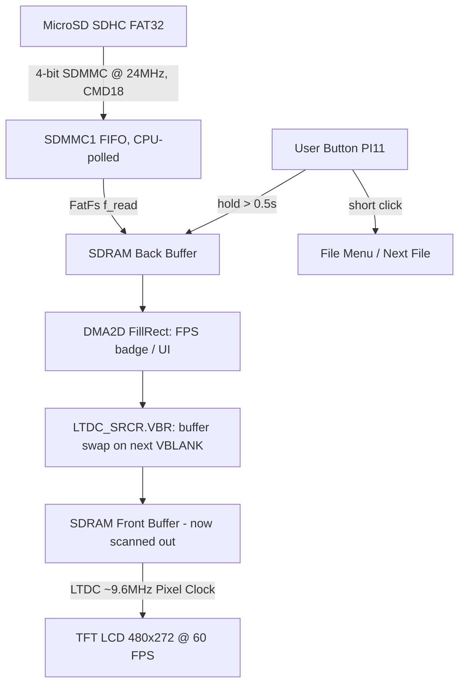

# High-Performance 60 FPS Bare-Metal Video Player & SDHC Subsystem

[-red.svg)](https://www.st.com/en/microcontrollers-microprocessors/stm32f746ng.html)
[-blue.svg)](#-key-features)
[-green.svg)](#️-requirements)
[-purple.svg)](#️-requirements)
[](LICENSE)

A multimedia player and storage engine written in **100% Bare-Metal C targeting hardware registers directly (RM0385)** on the **STM32F746G-Discovery** board. The system streams full-motion RGB565 video directly from a **FAT32 MicroSD SDHC card** into the LCD framebuffer at a steady **60 FPS** with tear-free double buffering (LTDC Vertical Blanking Reload), and comes with an on-device file browser, live FPS overlay, and a graphics demo fallback mode.

---

## 📑 Table of Contents

- [Demo & Playback Showcase](#-demo--playback-showcase)
- [Key Features](#-key-features)
- [On-Screen UI & Controls](#️-on-screen-ui--controls)
- [Performance & Hardware Benchmarks](#-performance--hardware-benchmarks)
- [System Behavior & Workflow](#-system-behavior--workflow)
- [Requirements](#️-requirements)
- [Hardware Connections](#-hardware-connections)
- [Getting Started](#-getting-started)
- [Project Structure](#️-project-structure)
- [Current Limitations & Roadmap](#️-current-limitations--roadmap)
- [Author Information](#-author-information)

---

## 📷 Demo & Playback Showcase

<p align="center">
  
</p>

### Live Hardware Telemetry Banner

```text
========================================================================
             STM32F746G BARE-METAL 60 FPS VIDEO PLAYER TELEMETRY
========================================================================
System Core Clock  : 216 MHz Over-Drive (HSE 25MHz -> PLL 432MHz / 2)
Flash Configuration: 7 Wait States, Prefetch + ART Accelerator ON
FMC SDRAM Bus      : 8 MB (IS42S16400J) @ 108 MHz, 16-bit Parallel Bus
LTDC Video Engine  : 480x272 Active RGB565 @ 60 FPS (Pixel Clock ~9.6 MHz)
Storage Subsystem  : MicroSD SDHC (4-bit SDMMC1 Bus @ 24 MHz, FAT32 FatFs, Read-Only)
Frame Path         : CMD18 Multi-Block burst read -> SDRAM back buffer (direct, no DMA2D)
Display Quality    : Tear-Free via LTDC_SRCR.VBR (Vertical Blanking Reload)
========================================================================
```

---

## 📌 Key Features

* **100% Bare-Metal Register Programming:** Implemented entirely from scratch by manipulating memory-mapped I/O registers based on ST RM0385 (No HAL, No LL, zero third-party dependencies).
* **Smooth 60 FPS Tear-Free Video:** Eliminates horizontal screen tearing using hardware double buffering synchronized to the LTDC Vertical Blanking Reload (`LTDC_SRCR.VBR`), swapped only between full frame reads.
* **High-Throughput SDMMC SDHC Driver:** Custom SDMMC1 driver in 4-bit bus mode @ 24 MHz using `CMD18` (`READ_MULTIPLE_BLOCK`) multi-sector burst streaming with 512-byte LBA block addressing, feeding ChaN FatFs (FAT32).
* **DMA2D Chrom-ART for UI Graphics:** All on-screen UI — splash screen, file menu, FPS overlay, graphics demo — is drawn with hardware-accelerated `DMA2D_FillRect`/`DMA2D_CopyRect` instead of CPU pixel loops.
* **On-Device File Browser & Auto-Play:** Scans the SD card root for `.BIN`/`.RAW` files and lets the user pick one with the on-board User Button, with a visual countdown auto-play fallback (see [On-Screen UI & Controls](#️-on-screen-ui--controls)).
* **Live FPS Overlay & Auto-Loop:** Measures actual achieved frame rate in real time and renders it on-screen during playback; video loops automatically on EOF.
* **Built-in Bitmap Font Renderer:** Custom 8x8 pixel font (`font8x8.h`) rendered pixel-by-pixel to the framebuffer — no external font/graphics library.
* **Graphics Demo Fallback:** If no card is present or no playable file is found, the firmware runs a self-contained animated color-bar + bouncing-sprite demo instead of hanging.
* **Over-Drive 216 MHz Clock Tree:** Full hardware handshake to configure HSE, Main PLL, Over-Drive mode, and Flash wait states with ART Accelerator.
* **FMC 8MB SDRAM Initialization:** JEDEC-sequence initialization of the ISSI IS42S16400J SDRAM at 108 MHz for the two frame buffers.
* **Host Video Converter Tool:** Python/FFmpeg script to transcode MP4/AVI clips into raw RGB565 binary streams ready for SD playback.

---

## 🖥️ On-Screen UI & Controls

The firmware is not just a raw frame dumper — it drives a small on-device UI using the single on-board User Button (PI11):

| Screen | Behavior |
| :--- | :--- |
| **Splash / Boot** | Progress bar reflects SD mount status: fills **green** on successful mount, **yellow** if the card mounts but has no `.BIN`/`.RAW` files, **red** if no card / mount failure. |
| **File Menu** | Lists up to `MAX_VIDEO_FILES` (8) detected video files with name and size. **Short click** = move to next file. **Hold button > 0.5 s** = play the selected file immediately. If left idle, the highlighted file **auto-plays after a 4-second countdown** shown on screen. |
| **Playback** | Renders a live `FPS: xx | filename` badge in the top-left corner every frame. Button is debounced for the first 1.5 s of playback to avoid an accidental exit from the menu selection press; after that, a click returns to the file menu. Video loops automatically when the file ends. |
| **Graphics Demo** | Runs automatically when no card/video is available: animated color bars plus a bouncing sprite, drawn entirely with DMA2D. Button press exits back to the boot sequence. |

---

## 📊 Performance & Hardware Benchmarks

Quantitative figures measured on the physical STM32F746G-DISCO board:

| Metric | Measured Value | Measurement Tool & Condition |
| :--- | :--- | :--- |
| **Video Playback Frame Rate** | **~60 FPS** | On-screen FPS counter, averaged every 500 ms |
| **SDMMC 4-bit Read Throughput** | **~18 MB/s** | `CMD18` sequential burst read of 512-byte sectors from SDHC |
| **SDMMC Bus Clock** | **24 MHz** | 4-bit wide bus (`CLKDIV=0`, `WIDBUS=01b`) |
| **FMC SDRAM Transfer Bandwidth** | **216 MB/s (theoretical)** | 16-bit bus @ 108 MHz peak |
| **Screen Tearing / Frame Drops** | **0 frames** | Buffer swap gated on `LTDC_SRCR.VBR`, observed over extended playback |
| **Flash Wait States** | **7 WS** | `FLASH_ACR_LATENCY_7WS`, required for 216 MHz Scale-1 Over-Drive per RM0385 |

> Notes on measurement honesty: SD card reads are CPU-polled against the `SDMMC1->FIFO` register (no DMA channel is used for SDMMC), and DMA2D is used only for solid-color UI graphics (menu, splash, FPS badge, demo sprite) — decoded video frame data is read directly from the SD card into the SDRAM back buffer via FatFs and is **not** routed through DMA2D. See [Current Limitations & Roadmap](#️-current-limitations--roadmap).

---

## 🔄 System Behavior & Workflow



---

## ⚙️ Requirements

* **Toolchain:** GNU Arm Embedded Toolchain (`arm-none-eabi-gcc`), GNU Make or PowerShell
* **Host Utility:** Python 3.x with OpenCV / FFmpeg (for video conversion)
* **Hardware Components:**
  * **STM32F746G-Discovery Board:** STM32F746NGH6 MCU with 4.3" 480x272 capacitive touch LCD.
  * **MicroSD Card:** SDHC card (4GB–32GB), formatted as FAT32, containing raw RGB565 `.BIN`/`.RAW` clips converted with the included tool.
  * **Mini-USB Cable:** For ST-LINK flashing and power supply.

---

## 🔌 Hardware Connections

All peripherals are on-board the STM32F746G-Discovery kit:

<details>
<summary><b>👉 Nhấn vào đây để xem chi tiết bảng kết nối chân phần cứng (Pinout)</b></summary>

### Pinout Table

| Peripheral | Subsystem Signal | STM32F746 Pinout | Description |
| :--- | :--- | :--- | :--- |
| **FMC SDRAM** | Data Lines D0..D15 | **PD0..1, PD8..10, PD14..15, PE0..1, PE7..15** | 16-bit Parallel Memory Bus |
| | Address Lines A0..A11 | **PF0..5, PF12..15, PG0..1** | Multiplexed Row/Column Address |
| | Control (CLK, NBL0..1, RAS, CAS, WE) | **PG8, PE0..1, PF11, PG15, PD5** | SDRAM Timing & Byte Enables |
| **LTDC LCD** | 24-bit RGB Signals | **PE4, PI15, PJ0..15, PK0..2, PK4..6, PG12** | Parallel RGB Video Stream (PG12 uses AF9, all others AF14) |
| | LCD_CLK, HSYNC, VSYNC, DE | **PI14, PI10, PI9, PK7** | ~9.6 MHz Pixel Clock & Sync |
| | LCD_DISP / Backlight | **PI12 / PK3** | Panel power-on & backlight enable (GPIO push-pull) |
| **SDMMC1** | Data D0..D3 | **PC8, PC9, PC10, PC11** | 4-bit High-Speed Data Bus |
| | Clock & Command | **PC12 (CLK), PD2 (CMD)** | 24 MHz Clock & Command Line |
| **User Button** | Input | **PI11** | Menu navigation / play / stop |

</details>

---

## 🚀 Getting Started

### 1. Clone this repository

```bash
git clone https://github.com/HuynhTran112/stm32f7-baremetal-tft-sdhc.git
cd stm32f7-baremetal-tft-sdhc
```

### 2. Build the firmware

```bash
# Compile using make
make -j8

# Or build using the automated PowerShell script on Windows
.\build.ps1
```

### 3. Flash to STM32F746G-Discovery

Flash the compiled binary `tft_video_f7.bin` or `tft_video_f7.hex` using STM32CubeProgrammer or OpenOCD via on-board ST-LINK:

```bash
STM32_Programmer_CLI -c port=SWD -w tft_video_f7.bin 0x08000000 -v -rst
```

### 4. Prepare video files on MicroSD

Use the included Python converter script to prepare raw 480x272 RGB565 video binaries:

```bash
# Convert any MP4/AVI clip to 60 FPS raw stream
python tools/convert_video.py --input sample.mp4 --output car1.BIN

# Copy up to 8 .BIN/.RAW files to the root directory of your FAT32-formatted MicroSD card
# Insert into the STM32F746G-DISCO slot and press the Reset button (Black)
```

### 5. Use the on-device menu

On boot, the firmware scans the card root and shows a file list. Short-click the User Button (PI11) to cycle files, hold it for over 0.5 s to play the highlighted one, or just wait — it auto-plays after a 4-second countdown. During playback, click the button (after the first 1.5 s) to return to the menu.

---

## 🗂️ Project Structure

```text
stm32f7-baremetal-tft-sdhc/
├── Inc/
│   ├── reg.h                   # Memory-mapped register definitions (RM0385)
│   ├── sys_clock.h             # 216 MHz Over-Drive clock configuration
│   ├── sdram.h                 # FMC SDRAM initialization & address mapping
│   ├── ltdc.h                  # 480x272 panel timing & layer setup
│   ├── dma2d.h                 # Chrom-ART hardware blitting engine
│   ├── sdmmc.h                 # 4-bit 24MHz SDMMC driver
│   ├── diskio.h                # Low-level disk I/O interface for FatFs
│   ├── ff.h / ffconf.h / integer.h  # ChaN FatFs core headers & configuration
│   ├── font8x8.h                # 8x8 bitmap font table for on-screen text
│   └── media_player.h          # File menu, FPS overlay & playback pipeline
├── Src/
│   ├── main.c                  # System setup & main state machine (splash → menu → play)
│   ├── sys_clock.c             # PLL, Over-Drive, Flash wait states & SysTick
│   ├── sdram.c                 # JEDEC 5-step FMC SDRAM initialization
│   ├── ltdc.c                  # Video timing generator & VBR buffer swapping
│   ├── dma2d.c                 # DMA2D fill/copy routines used for UI graphics
│   ├── sdmmc.c                 # SDMMC commands, clock scaling & FIFO reads
│   ├── diskio.c                # Hardware bridge to FatFs (read-only)
│   ├── ff.c                    # ChaN FatFs FAT32 implementation
│   └── media_player.c          # File scan, on-device menu UI & frame streaming
├── Startup/
│   └── startup_stm32f746nghx.s # Cortex-M7 vector table & reset handler
├── tools/
│   └── convert_video.py        # Python video transcoder utility
├── build.ps1                   # Automated build & clean script
├── Makefile                    # GNU Make recipe
├── STM32F746NGHX_FLASH.ld      # GCC linker script
└── README.md
```

---

## ⚠️ Current Limitations & Roadmap

Documenting these honestly so the numbers in this README always match what's actually running on the board:

* **Read-only filesystem:** `disk_write()` always returns `RES_WRPRT` — this build is playback-only by design, no write path is implemented.
* **No DMA for SD transfers:** `SDMMC_ReadMultiBlocks()` polls `SDMMC1->STA`/`FIFO` from the CPU in a tight loop rather than using a DMA channel; the ~18 MB/s figure reflects this polled path, not a DMA-driven one.
* **DMA2D is UI-only, not video-path:** Decoded frame bytes go straight from `f_read()` into the SDRAM back buffer; DMA2D currently accelerates only the solid-color menu/splash/overlay graphics, and its fill/copy calls are blocking (CPU waits on `DMA2D_ISR_TCIF`) rather than fire-and-forget.
* **D-Cache is not enabled:** `CPU_Cache_Enable()` exists in `sys_clock.c` but is currently commented out, so no MPU non-cacheable region or `SCB_InvalidateDCache_by_Addr` calls are needed or present yet — cache-coherency handling is a planned addition, not a shipped feature.
* **Fixed-format input:** frames must already be pre-converted to raw 480×272 RGB565 at the target frame rate; there is no on-device video decoding.

Planned next steps: DMA-driven SDMMC transfers to free the CPU during reads, DMA2D-accelerated frame blit with D-Cache + MPU non-cacheable framebuffer regions, and basic write support for on-device file management.

---

## 👥 Author Information

* **Author:** Trần Huỳnh
* **Major:** Computer Engineering Technology
* **Faculty:** Faculty of Electrical and Electronics Engineering (FEEE)
* **Institution:** Ho Chi Minh City University of Technology and Education (HCMUTE)
* **Email:** [huynhtran30112004@gmail.com](mailto:huynhtran30112004@gmail.com)
* **GitHub:** [HuynhTran112](https://github.com/HuynhTran112)
