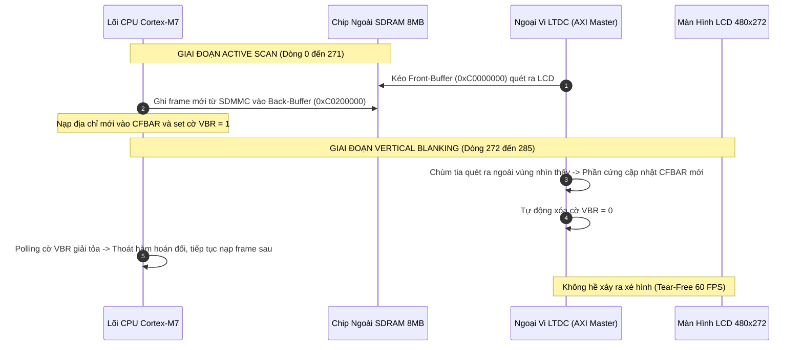
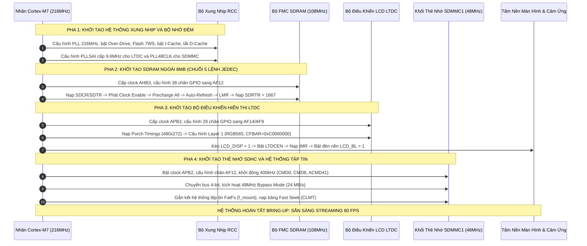
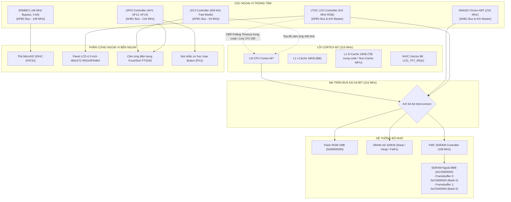
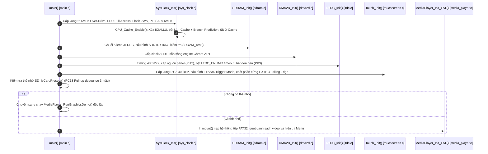
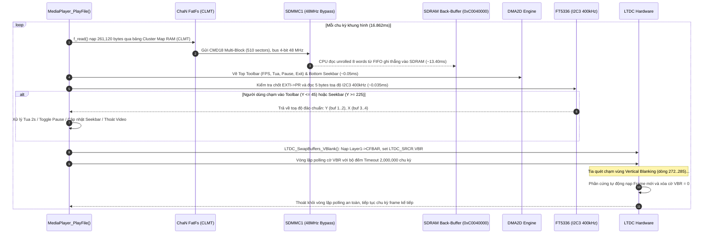
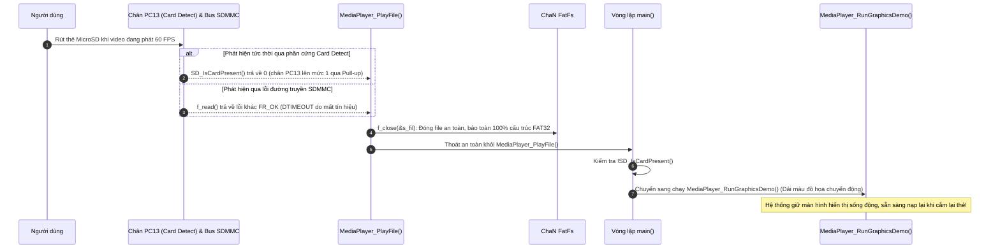

# Tài Liệu Học Lại Dự Án 2: Video Playback and Storage via SD Card System

*(Tài liệu ôn tập kiến trúc, luồng xử lý và cơ sở kỹ thuật phục vụ phỏng vấn vị trí Embedded Firmware Engineer / STM32F7 Bare-Metal. Trọng tâm tài liệu: giải thích bản chất hệ thống, luồng dữ liệu thời gian thực, cơ sở chọn lựa giải pháp và phân tích đánh đổi kỹ thuật, kết hợp các đoạn mã nguồn then chốt để làm rõ cơ chế phần cứng và phần mềm.)*

> **Hệ Thống:** Video Playback and Storage via SD Card System trên vi điều khiển STM32F746NG (bo mạch STM32F746G-Discovery).  
> **1. Hiển Thị & Khung Hình (Video Subsystem):** Hệ thống phát video sử dụng bộ điều khiển hiển thị phần cứng **LTDC**, đạt chuẩn chất lượng **60 FPS** với màu sắc thực RGB565 ($480 \times 272$), triệt tiêu hoàn toàn hiện tượng rách hình (Tear-Free Rendering) thông qua kỹ thuật **VSYNC-synchronized double buffering** trên bộ nhớ ngoài SDRAM Micron 8MB (giao tiếp FMC bus 16-bit @ 108 MHz).  
> **2. Lưu Trữ & Hệ Thống Tệp (Storage Subsystem):** Tự tay xây dựng driver **SDMMC bus 4-bit** tốc độ cao cho thẻ nhớ **SDHC** ở chế độ 48 MHz Bypass Mode, tích hợp với thư viện mã nguồn mở **ChaN FatFs** định dạng FAT32; triển khai cơ chế quét cây thư mục (`f_opendir` / `f_readdir`) để trích xuất metadata tệp tin (tên, dung lượng megabyte) hiển thị lên giao diện cảm ứng và áp dụng cơ chế Fast Seek (CLMT) triệt tiêu độ trễ phân mảnh cluster.  
> **3. An Toàn & Phòng Vệ (Fail-Safe Subsystem):** Triển khai cơ chế phòng vệ an toàn phát hiện rút thẻ nhớ nóng (SD card removal detection qua chân phần cứng PC13 Card Detect và bẫy lỗi truyền thông `DTIMEOUT`), tự động dừng phát êm ái, đóng tệp an toàn `f_close` bảo vệ cấu trúc bảng FAT32 và chuyển sang màn hình chờ đồ họa Standby Screen mà không đòi hỏi phải reset phần cứng vi điều khiển.  
> **4. Tăng Tốc Đồ Họa & Tương Tác:** Bộ tăng tốc đồ họa 2D Chrom-ART (DMA2D) chế độ Register-to-Memory (R2M) tô màu giao diện người dùng và màn hình Standby; cảm ứng điện dung FocalTech FT5336 qua I2C3 Fast Mode 400 kHz kết hợp chốt phần cứng EXTI13 Falling Edge (W1C).  
> **Kiến trúc phần mềm:** 100% Bare-Metal C, lập trình trực tiếp trên các thanh ghi phần cứng (RM0385, DS10610, UM1907), không sử dụng HAL/LL, không RTOS.  
> **Tài liệu tham chiếu gốc:** RM0385 (STM32F7 Reference Manual: FMC, LTDC, SDMMC, DMA2D, I2C), DS10610 (STM32F746 Datasheet: Pinmux AF9/AF12/AF14), UM1907 (STM32F746G-DISCO User Manual).

---

## Ý TƯỞNG THIẾT KẾ VÀ MA TRẬN ĐÁNH ĐỔI KIẾN TRÚC (DESIGN TRADE-OFF MATRIX)

### 1. Bài toán gốc trong kỹ thuật đa phương tiện nhúng
Trình chiếu video mượt mà ở tốc độ chuẩn mực **60 FPS** với độ phân giải $480 \times 272$ điểm ảnh và màu thực RGB565 (16-bit) là một bài toán khắc nghiệt trên vi điều khiển không có bộ giải mã phần cứng (Hardware Video Decoder):
1. **Dung lượng 1 khung hình:** $480 \times 272 \times 2 = 261,120\text{ Bytes} \approx 255\text{ KB}$.
2. **Băng thông nạp liên tục:** $261,120 \times 60 = 15,667,200\text{ Bytes/s} \approx 15.66\text{ MB/s}$.
3. **Ngân sách thời gian (Time Budget):** Mỗi khung hình chỉ có đúng $\frac{1000\text{ ms}}{60} \approx 16.66\text{ ms}$ để hoàn tất việc đọc thẻ nhớ, vẽ giao diện, và hoán đổi bộ đệm.
4. **Giới hạn bộ nhớ nội:** Tổng RAM nội của STM32F746 (SRAM1, SRAM2, DTCM) chỉ có **320 KB**, trong khi kỹ thuật chống xé hình Double Buffering (2 khung đệm) đòi hỏi tối thiểu $255 \times 2 = 510\text{ KB}$.

Hệ thống được thiết kế để giải quyết bài toán này không phải bằng cách "ép CPU tính toán điên cuồng", mà bằng cách **tối ưu hóa luồng dữ liệu DMA đa tầng, khai thác tối đa băng thông AXI Bus Matrix, và loại bỏ hoàn toàn các điểm nghẽn phần mềm**.

---

### 2. Ma trận 12 quyết định thiết kế cốt lõi và phân tích đánh đổi (Trade-off Analysis)

| Quyết Định Kỹ Thuật | Phương Pháp Được Chọn | Các Giải Pháp Bị Loại Bỏ | Lý Do Kỹ Thuật và Phân Tích Đánh Đổi (Trade-off) |
| :--- | :--- | :--- | :--- |
| **1. Định dạng nạp video** | **Raw RGB565 Frame Streaming**: Nén trước video trên PC thành chuỗi ảnh thô 16-bit RGB565. | - Giải mã phần mềm JPEG / MJPEG (TJpgDec).<br>- Giải mã phần mềm H.264. | **Đánh đổi:** Tệp tin video có dung lượng lớn hơn nhiều so với tệp nén.<br>**Lý do chọn:** Giải mã JPEG $480 \times 272$ bằng CPU Cortex-M7 mất 25 - 35 ms/frame (chiếm 100% CPU, trần hiệu năng chỉ 28 - 35 FPS). H.264 đòi hỏi hàng megabyte RAM cho bù trừ chuyển động. Raw RGB565 biến bài toán giải mã phức tạp thành luồng truyền DMA tốc độ cao, giải phóng hoàn toàn CPU và đạt chuẩn 60.0 FPS mượt mà. |
| **2. Tầng phần mềm firmware** | **100% Bare-Metal C**, thao tác trực tiếp trên thanh ghi phần cứng (RM0385). | - Sử dụng FreeRTOS / Zephyr RTOS.<br>- Dùng thư viện STM32Cube HAL/LL. | **Đánh đổi:** Phải tự tay cấu hình từng thanh ghi, tự quản lý thời gian và bộ đệm.<br>**Lý do chọn:** Ở 60 FPS, độ trễ chuyển ngữ cảnh (Context Switch ~2-5 µs) và jitter của RTOS Scheduler có thể làm trễ nhịp quét VSYNC 16.66 ms. Thư viện HAL có nhiều tầng kiểm tra cờ dư thừa làm suy giảm băng thông thẻ nhớ. Bare-metal đảm bảo tính tất định tuyệt đối về thời gian và tối ưu hiệu suất đến từng byte truyền. |
| **3. Không gian lưu trữ Framebuffer** | **SDRAM Micron 8MB ngoài** qua khối FMC (Flexible Memory Controller) bus 16-bit @ 108 MHz. | - Cố gắng gom 1 Framebuffer vào SRAM nội 320 KB (Single Buffering). | **Đánh đổi:** Tốn thêm chân phần cứng (38 chân GPIO) và thời gian trễ truy xuất bus ngoài.<br>**Lý do chọn:** SRAM nội 320 KB không đủ chứa 2 frame ($510\text{ KB}$). Nếu dùng Single Buffering, người dùng sẽ thấy hiện tượng xé hình (Screen Tearing) nghiêm trọng vì màn hình vừa quét vừa bị CPU ghi đè. SDRAM 8MB cung cấp dư dả không gian cho Double Buffering (hoặc Triple Buffering) và các bộ nhớ đệm đồ họa. |
| **4. Chiến lược L1 Cache Coherency** | **Bật I-Cache, Tắt D-Cache toàn cục** (`SCB->CCR &= ~SCB_CCR_DC`). | - Để D-Cache bật và bảo trì thủ công (Clean/Invalidate).<br>- Cấu hình MPU Non-Cacheable. | **Đánh đổi:** CPU mất tăng tốc bộ nhớ đệm khi truy xuất dữ liệu RAM nội.<br>**Lý do chọn:** D-Cache chạy Write-Back: CPU ghi từ SDMMC FIFO vào SDRAM sẽ bị giữ lại trong Cache, LTDC đọc từ SDRAM vật lý sẽ thấy dữ liệu rác (vỡ nát hình ảnh). Do CPU trong dự án chỉ làm nhiệm vụ di chuyển dữ liệu (Data Pump) mà không can thiệp tính toán pixel, tắt D-Cache giải quyết triệt để mất đồng bộ bộ nhớ đệm mà không tốn chu kỳ bảo trì cache và không cần xây dựng driver MPU. (Trong công nghiệp, cấu hình MPU Non-Cacheable là chuẩn nâng cao). |
| **5. Lệnh đọc thẻ nhớ SDHC** | **Đọc đa khối CMD18 (Multi-Block Read)**: Phát 1 lệnh đọc liên tục 510 sector cho mỗi frame. | - Đọc từng khối đơn lẻ bằng lệnh CMD17 (Single Block Read). | **Đánh đổi:** Phải quản lý dòng dữ liệu liên tục và gửi lệnh CMD12 kết thúc truyền.<br>**Lý do chọn:** CMD17 tốn $\approx 1.8\text{ ms}$ bắt tay cho mỗi sector. Một frame 510 sector tốn $510 \times 1.8\text{ ms} \approx 918\text{ ms}$ (chỉ đạt ~1.08 FPS). CMD18 đẩy dữ liệu liên tục không ngắt quãng, rút ngắn thời gian nạp xuống $13.4\text{ ms/frame}$ (tăng tốc gấp hơn 40 lần). |
| **6. Tần số xung nhịp SDMMC** | **Bus 4-bit song song kết hợp 48 MHz Bypass Mode** (`SDMMC_CLKCR.BYPASS = 1`). | - Chạy chế độ chia xung mặc định 24 MHz (`CLKDIV = 0`).<br>- Chạy bus 1-bit. | **Đánh đổi:** Đòi hỏi đường mạch trên bo mạch phải đạt chuẩn toàn vẹn tín hiệu cao.<br>**Lý do chọn:** Ở 24 MHz, băng thông cực đại chỉ 12 MB/s, thời gian nạp 1 frame là $24.4\text{ ms}$ ($> 16.66\text{ ms}$), hệ thống bị giới hạn ở 40 - 41 FPS. Bật Bypass Mode đưa trực tiếp xung 48 MHz từ `PLL48CLK` vào bus 4-bit, nâng băng thông lên 24 MB/s và giảm thời gian nạp còn $13.4\text{ ms/frame}$, mở toang cánh cửa đạt 60.0 FPS. |
| **7. Cơ chế hoán đổi Buffer hiển thị** | **Thanh ghi bóng phần cứng `LTDC_SRCR.VBR`** kết hợp vòng lặp Polling có Timeout an toàn (2,000,000 chu kỳ). | - Dùng hàm trễ SysTick `Delay_ms(16)`.<br>- Dùng ngắt dòng LTDC Line Interrupt (Line 272). | **Đánh đổi:** CPU phải thăm dò cờ phần cứng trong $\approx 3.4\text{ ms}$ rảnh rỗi.<br>**Lý do chọn:** `Delay_ms(16)` bị lệch pha với tần số quét thực tế ($16.862\text{ ms}$), gây hiện tượng giật hình (Micro-Stutter). `LTDC_SRCR.VBR` tự động đồng bộ việc đổi địa chỉ đúng vào khoảng nghỉ Vertical Blanking (dòng 272-285), triệt tiêu hoàn toàn xé hình. Polling có timeout vừa ngăn ngừa Deadlock khi thẻ nhớ lỗi, vừa không tốn tài nguyên quản lý ngắt NVIC. |
| **8. Bố cục phân bổ Bank SDRAM** | **Phân tách Framebuffer 1 sang Bank 1 vật lý** (`0xC0200000`, cách 2 MB) so với Framebuffer 0 (`0xC0000000` ở Bank 0). | - Đặt cả 2 Framebuffer liền kề nhau trong cùng Bank 0 (`0xC0000000` và `0xC0040000`). | **Đánh đổi:** Tốn thêm dung lượng địa chỉ nhớ ngoài.<br>**Lý do chọn:** Tránh hiện tượng xung đột hàng nhớ (Row Buffer Thrashing). Mỗi Bank SDRAM chỉ có 1 bộ đệm hàng (Row Buffer). Nếu đặt cùng Bank, khi CPU ghi dòng mới và LTDC đọc dòng cũ, chip SDRAM liên tục đóng mở hàng ($t_{RP} + t_{RCD} + t_{CL} \approx 55\text{ ns}$), làm cạn kiệt bộ đệm FIFO 64 bytes của LTDC và gây rung giật pixel. Tách sang Bank 1 giúp 2 bộ đệm hàng chạy song song độc lập. |
| **9. Bộ tăng tốc đồ họa UI** | **Chrom-ART DMA2D** chế độ Register-to-Memory (R2M) để fill màu hộp thoại, thanh Seekbar và Badge FPS. | - CPU dùng vòng lặp `for` ghi từng pixel vào Framebuffer. | **Đánh đổi:** Cần cấu hình thêm thanh ghi DMA2D và chờ cờ hoàn tất `TCIF`.<br>**Lý do chọn:** Vẽ một hộp thoại $480 \times 40$ bằng CPU tốn hàng chục ngàn chu kỳ bus. DMA2D ghi trực tiếp qua bus AXI tốc độ cao, fill màu 130,560 pixel toàn màn hình chỉ mất $0.45\text{ ms}$ (nhanh gấp gần 6 lần CPU mất $2.50\text{ ms}$), giải phóng CPU tập trung cho luồng nạp thẻ nhớ. |
| **10. Cơ chế bắt sự kiện cảm ứng** | **Chốt ngắt phần cứng EXTI13 Falling Edge (W1C)** kết hợp quét cuối frame và bus I2C3 Fast Mode 400 kHz. | - Dùng ngắt NVIC phục vụ trực tiếp bên trong ISR.<br>- Thăm dò thuần túy (Polling chân GPIO). | **Đánh đổi:** Toạ độ cảm ứng được cập nhật đồng bộ theo nhịp khung hình (mỗi 16.66 ms) thay vì tức thời.<br>**Lý do chọn:** Phục vụ ngắt I2C bên trong NVIC ISR sẽ chiếm dụng CPU trong lúc đang truyền burst SDMMC, gây lỗi tràn bộ đệm `RXOVERR`. Thăm dò thuần túy dễ bỏ sót các cú chạm lướt nhanh (Quick Tap). Chốt EXTI13 phần cứng bắt trọn mọi xung chạm mà không ngắt CPU, sau đó CPU đọc I2C an toàn vào cuối khung hình chỉ mất $\approx 0.035\text{ ms}$. |
| **11. Tối ưu hóa phân mảnh FAT32** | **Cơ chế Fast Seek (Cluster Link Map Table - CLMT)** trong FatFs. | - Dùng cơ chế tra cứu cluster truyền thống của hệ thống tệp FAT32. | **Đánh đổi:** Tốn một mảng RAM tĩnh `s_clmt[512]` ($2\text{ KB}$) để lưu bản đồ cluster. | **Lý do chọn:** Khi video bị phân mảnh, việc đọc qua ranh giới cluster buộc FatFs phát lệnh đọc bảng FAT từ thẻ nhớ, làm gián đoạn luồng DMA và đội thời gian nạp frame vượt quá 16.66 ms, khiến tốc độ tụt ngay về 30 FPS. Fast Seek nạp toàn bộ chuỗi cluster vào RAM lúc mở file, đưa thời gian tìm kiếm cluster về dưới $1\,\mu\text{s}$. |
| **12. Cơ chế an toàn khi rút thẻ nóng** | **Phòng vệ 2 cấp độ (Fail-Safe Hot-Unplug)**: Giám sát chân PC13 (Card Detect) + bẫy lỗi `DTIMEOUT` $\rightarrow$ Đóng file `f_close` $\rightarrow$ Chuyển sang Graphics Demo dự phòng. | - Bỏ mặc hệ thống, không kiểm tra cờ lỗi của SDMMC.<br>- Khóa đứng vi điều khiển trong vòng lặp vô tận. | **Đánh đổi:** Phải viết thêm mã nguồn đồ họa dự phòng và máy trạng thái xử lý ngoại lệ.<br>**Lý do chọn:** Rút thẻ nóng giữa luồng truyền 60 FPS sẽ gây đứt gãy bus SDMMC. Đóng file an toàn giúp bảo vệ cấu trúc bảng FAT32 không bị hỏng hóc vật lý. Chuyển sang Graphics Demo giữ cho màn hình LCD luôn có tín hiệu quét hiển thị sống động, ngăn ngừa hiện tượng màn hình nhiễu hạt hoặc sọc trắng. |

---

# 1. 5 LUỒNG DỮ LIỆU THỜI GIAN THỰC VÀ CƠ CHẾ VẬN HÀNH TOÀN HỆ THỐNG

### 1.1. Luồng 1: Chu trình nạp dữ liệu video từ thẻ nhớ SDHC (SDMMC 48MHz Bypass + CMD18)

Mỗi khung hình video $480 \times 272$ RGB565 gồm đúng 510 sectors (mỗi sector 512 bytes). Dữ liệu được nạp liên tục qua luồng đa khối:

```text
[Thẻ MicroSD SDHC]
       │  Lệnh CMD18 (Multi-Block Read)
       ▼
[Chân dữ liệu D0..D3 (Bus 4-bit @ 48 MHz Bypass)]
       │  Băng thông lý thuyết: 24 MB/s (13.4 ms / frame)
       ▼
[Khối Ngoại Vi SDMMC1: Bộ đệm FIFO 32 words]
       │  Cờ RXFIFOHF kích hoạt khi đầy 8 words (32 bytes)
       ▼
[CPU Burst Read: Đọc 8 words ghi thẳng vào SDRAM Back-Buffer]
       │  D-Cache tắt -> Ghi thẳng xuống chip SDRAM vật lý qua FMC AXI Bus
       ▼
[Lệnh CMD12: Dừng truyền dữ liệu sau đúng 261,120 bytes]
```

#### Đoạn code then chốt nạp dữ liệu đa khối (Multi-Block Streaming):
```c
/* sdmmc.c: Đọc liên tục 510 sectors cho 1 khung hình bằng lệnh CMD18 */
uint8_t SDMMC_ReadMultiBlocks(uint32_t block_addr, uint8_t *pBuffer, uint32_t num_blocks) {
    uint32_t total_bytes = num_blocks * SD_BLOCK_SIZE;
    uint32_t *pWords = (uint32_t *)pBuffer;

    /* 1. Xóa cờ trạng thái cũ và thiết lập độ dài truyền dữ liệu */
    SDMMC1->ICR = 0xFFFFFFFFUL;
    SDMMC1->DTIMER = 0xFFFFFFFFUL;
    SDMMC1->DLEN = total_bytes;
    /* DCTRL: DBLOCKSIZE = 512B (9U << 4), DTDIR = Thẻ sang MCU (1U << 1), DTEN = Bật (1U << 0) */
    SDMMC1->DCTRL = (9U << 4) | (1U << 1) | (1U << 0);

    /* 2. Phát lệnh CMD18: READ_MULTIPLE_BLOCK (Địa chỉ khối LBA cho thẻ SDHC) */
    SDMMC_SendCommand(18, (s_CardType == SD_TYPE_SDHC) ? block_addr : (block_addr * 512), 1);

    /* 3. Đọc dữ liệu từ FIFO 32 từ theo cơ chế Burst 8 words */
    while (total_bytes > 0) {
        if (SDMMC1->STA & (1U << 15)) { /* RXFIFOHF: FIFO đầy ít nhất 8 words (32 bytes) */
            for (uint8_t i = 0; i < 8; i++) {
                *pWords++ = SDMMC1->FIFO;
                total_bytes -= 4;
            }
        }
    }
    /* 4. Phát lệnh CMD12 (STOP_TRANSMISSION) để kết thúc chu trình đọc */
    SDMMC_SendCommand(12, 0, 1);
    return SD_OK;
}
```

---

### 1.2. Luồng 2: Chu trình hiển thị Framebuffer và chống xé hình (LTDC + Double Buffering + VBR)

Để màn hình làm tươi ở 60.0 Hz mà không bị xé hình (Tearing), hệ thống áp dụng kỹ thuật hoán đổi bộ đệm tại khoảng nghỉ quét dọc (Vertical Blanking):


```mermaid
sequenceDiagram
    autonumber
    participant CPU as Lõi CPU Cortex-M7
    participant SDRAM as Chip Ngoài SDRAM 8MB
    participant LTDC as Ngoại Vi LTDC (AXI Master)
    participant Panel as Màn Hình LCD 480x272

    Note over CPU,SDRAM: GIAI ĐOẠN ACTIVE SCAN (Dòng 0 đến 271)
    LTDC->>SDRAM: Kéo Front-Buffer (0xC0000000) quét ra LCD
    CPU->>SDRAM: Ghi frame mới từ SDMMC vào Back-Buffer (0xC0200000)
    Note over CPU: Nạp địa chỉ mới vào CFBAR và set cờ VBR = 1

    Note over CPU,Panel: GIAI ĐOẠN VERTICAL BLANKING (Dòng 272 đến 285)
    LTDC->>LTDC: Chùm tia quét ra ngoài vùng nhìn thấy -> Phần cứng cập nhật CFBAR mới
    LTDC->>LTDC: Tự động xóa cờ VBR = 0
    CPU->>CPU: Polling cờ VBR giải tỏa -> Thoát hàm hoán đổi, tiếp tục nạp frame sau
    Note over LTDC,Panel: Không hề xảy ra xé hình (Tear-Free 60 FPS)
```

#### Đoạn code then chốt hoán đổi Framebuffer chống xé hình:
```c
/* ltdc.c: Hoán đổi Framebuffer tại khoảng nghỉ quét dọc VBlank */
void LTDC_SwapBuffers_VBlank(uint32_t new_framebuffer_address) {
    /* 1. Nạp địa chỉ Back-Buffer mới vào thanh ghi bóng của Layer 1 */
    LTDC_Layer1->CFBAR = new_framebuffer_address;

    /* 2. Kích hoạt cờ nạp bóng tại Vertical Blanking (VBR) */
    LTDC->SRCR = LTDC_SRCR_VBR;

    /* 3. Polling cờ VBR với bộ đếm Timeout 2,000,000 chu kỳ (~10ms) để chống Deadlock */
    uint32_t timeout = 2000000;
    while ((LTDC->SRCR & LTDC_SRCR_VBR) && --timeout);

    /* Khi tia quét hoàn tất dòng 272 và vào khoảng nghỉ VBlank (dòng 273 - 285),
     * phần cứng tự động tráo địa chỉ CFBAR và xóa cờ VBR = 0.
     * Khóa cứng tốc độ hiển thị ở đúng 60.0 FPS theo tần số quét phần cứng. */
}
```

---

### 1.3. Luồng 3: Chu trình tăng tốc đồ họa giao diện UI bằng Chrom-ART DMA2D

Giao diện người dùng (Top Toolbar, Bottom Seekbar, FPS Badge) được vẽ trực tiếp vào Back-Buffer trước khi hoán đổi hiển thị. Để không làm chậm luồng nạp video, khối DMA2D đảm nhiệm việc tô màu các khối hình chữ nhật:

#### Đoạn code then chốt tô màu khối chữ nhật bằng DMA2D (R2M Mode):
```c
/* dma2d.c: Tô màu hình chữ nhật siêu tốc bằng chế độ Register-to-Memory */
void DMA2D_FillRect(uint32_t dst_addr, uint16_t x, uint16_t y, uint16_t w, uint16_t h, uint16_t color_rgb565) {
    if (w == 0 || h == 0) return;
    uint32_t start_addr = dst_addr + 2U * ((uint32_t)y * LCD_WIDTH + (uint32_t)x);
    uint32_t line_offset = LCD_WIDTH - w;

    while (DMA2D->CR & DMA2D_CR_START); /* Chờ lượt truyền trước hoàn tất */

    DMA2D->CR = (3U << 16);             /* MODE = 11b: Register-to-Memory (R2M) */
    DMA2D->OPFCCR = 2U;                  /* Output Color Format = RGB565 */
    DMA2D->OCOLR = (uint32_t)color_rgb565;
    DMA2D->OMAR = start_addr;
    DMA2D->OOR = line_offset;
    DMA2D->NLR = ((uint32_t)w << 16) | (uint32_t)h; /* Chiều rộng x Chiều cao */

    DMA2D->CR |= DMA2D_CR_START;        /* Kích hoạt chuyển dữ liệu */
    while (!(DMA2D->ISR & DMA2D_ISR_TCIF)); /* Chờ cờ Transfer Complete */
    DMA2D->IFCR = DMA2D_IFCR_CTCIF;     /* Xóa cờ ngắt theo chuẩn Write-1-to-Clear (W1C) */
}
```

---

### 1.4. Luồng 4: Chu trình xử lý cảm ứng điện dung FT5336 và chốt ngắt phần cứng EXTI13

Hệ thống cảm ứng điện dung hoạt động theo cơ chế **chốt phần cứng không dùng ngắt NVIC**:
- Chip FT5336 được cấu hình ở chế độ `G_MODE = 0x01` (Trigger/Level Mode). Khi có ngón tay tiếp xúc, chân `TS_INT` (PI13) kéo xuống mức LOW.
- Đường truyền PI13 được nối vào khối EXTI Line 13, cấu hình bắt sườn xuống (Falling Edge Trigger).
- Phần cứng tự động dựng cờ `EXTI->PR` bit 13. CPU không kích hoạt NVIC ISR (nhằm tránh ngắt ngang luồng đọc FIFO của SDMMC gây lỗi `RXOVERR`), mà chỉ kiểm tra cờ này vào khoảng thời gian rảnh cuối mỗi khung hình:

#### Đoạn code then chốt đọc cảm ứng và giải mã toạ độ:
```c
/* touchscreen.c: Đọc cảm ứng FT5336 qua I2C3 Fast Mode 400kHz và chốt EXTI13 */
uint8_t Touch_Read(uint16_t *x, uint16_t *y) {
    uint8_t buf[5];

    /* 1. Kiểm tra sự kiện: Cờ EXTI13 chốt sườn xuống HOẶC chân PI13 đang được giữ mức LOW */
    if ((EXTI->PR & (1U << 13)) || !(GPIOI->IDR & (1U << 13))) {
        EXTI->PR = (1U << 13); /* Xóa cờ chốt phần cứng chuẩn Write-1-to-Clear (W1C) */

        /* 2. Đọc 5 bytes dữ liệu toạ độ từ FT5336 qua I2C3 Fast Mode 400kHz (~0.035 ms) */
        if (!I2C3_ReadRegs(FT5336_I2C_ADDR, FT5336_TD_STATUS_REG, buf, 5)) return 0;

        uint8_t touch_count = buf[0] & 0x0F;
        uint8_t event_flag = (buf[1] >> 6) & 0x03;
        if (touch_count == 0 || event_flag == 3) return 0; /* Bỏ qua nếu không có điểm chạm */

        /* 3. Đảo trục toạ độ 90 độ theo đúng chiều gắn vật lý của tấm nền Rocktech */
        uint16_t raw_x = ((uint16_t)(buf[1] & 0x0F) << 8) | buf[2];
        uint16_t raw_y = ((uint16_t)(buf[3] & 0x0F) << 8) | buf[4];
        *x = (raw_y < LCD_WIDTH) ? raw_y : (LCD_WIDTH - 1);
        *y = (raw_x < LCD_HEIGHT) ? raw_x : (LCD_HEIGHT - 1);
        return 1; /* Điểm chạm hợp lệ */
    }
    return 0;
}
```

---

### 1.5. Luồng 5: Chu trình phòng vệ Fail-Safe khi rút thẻ nóng và dự phòng đồ họa

Khi thẻ nhớ bị rút đột ngột trong lúc đang stream video 60 FPS, khối SDMMC sẽ bị mất giao tiếp và trả về lỗi `DTIMEOUT`. Hệ thống thực thi chu trình phòng vệ an toàn 3 bước:

#### Đoạn code then chốt phòng vệ Fail-Safe khi rút thẻ:
```c
/* media_player.c & main.c: Quy trình phòng vệ khi rút thẻ nhớ giữa chừng */
void MediaPlayer_CheckFailSafe(FRESULT res) {
    /* 1. Phát hiện thẻ bị rút vật lý (PC13 HIGH) hoặc hàm f_read báo lỗi truyền thông */
    if (!SD_IsCardPresent() || res != FR_OK) {
        /* 2. Đóng tệp an toàn ngay lập tức để bảo vệ bảng FAT32 không bị hỏng */
        f_close(&s_fil);

        /* 3. Chuyển sang chế độ chạy Demo Đồ họa dự phòng (Graphics Demo Fallback)
         * Giữ tín hiệu quét LTDC luôn ổn định, màn hình không bị sọc nhiễu hoặc chớp trắng */
        MediaPlayer_RunGraphicsDemo();
    }
}
```

---

# 2. TƯ DUY KHỞI TẠO NGOẠI VI: QUY TRÌNH CHUẨN 8 BƯỚC TỪ THANH GHI ĐẾN DRIVER (PERIPHERAL BRING-UP MINDSET)

### 2.1. Triết lý tư duy nhúng: Ranh giới phần cứng và nguyên lý "Không gõ code mù quáng"

Trong một dự án Bare-Metal đa phương tiện phức tạp tích hợp cùng lúc **FMC SDRAM, LTDC, SDMMC, DMA2D và I2C3**, sự cố ngoại vi không hoạt động hầu như luôn bắt nguồn từ việc vi phạm các nguyên lý phần cứng cơ bản:
1. **Clock Gating mặc định:** Sau Reset, toàn bộ ngoại vi đều bị ngắt clock để giảm tiêu thụ điện. Truy cập thanh ghi ngoại vi khi chưa bật xung nhịp qua RCC sẽ gây ra ngoại lệ **BusFault / HardFault (cờ PRECISEERR trong thanh ghi CFSR)** do Bus Matrix không nhận được phản hồi Acknowledge.
2. **Alternate Function Multiplexing:** Một chân vật lý nối vào nhiều khối ngoại vi thông qua bộ dồn kênh MUX 16-to-1. Nếu cấu hình chân ở chế độ AF (`MODER = 10b`) nhưng quên nạp giá trị vào `AFRL/AFRH`, chân sẽ trỏ về giá trị mặc định AF0 (thường là System/JTAG hoặc Timer), khiến ngoại vi hoàn toàn mất kết nối ra thế giới bên ngoài.
3. **Bắt tay phần cứng an toàn (Hardware Handshake with Timeout):** Nhiều ngoại vi (FMC SDRAM, LTDC, SDMMC, I2C) đòi hỏi thời gian để đồng bộ điện áp hoặc hoàn tất chu trình nội. Tuyệt đối không viết vòng lặp vô tận `while (FLAG);` mà luôn phải có **bộ đếm Timeout** để chống Deadlock treo CPU khi phần cứng hỏng hoặc đứt đường mạch.

---

### 2.2. Ma trận 8 bước quy chuẩn áp dụng cho các ngoại vi phức tạp của STM32F7

| Bước Thực Hiện | Ngoại Vi FMC SDRAM | Ngoại Vi LTDC | Ngoại Vi SDMMC1 | Ngoại Vi Chrom-ART DMA2D | Ngoại Vi I2C3 & EXTI13 |
| :--- | :--- | :--- | :--- | :--- | :--- |
| **Bước 1: Cấp xung Clock (RCC)** | Bật `RCC->AHB3ENR` (`FMCEN = 1`). | Bật `RCC->APB2ENR` (`LTDCEN = 1`) + Bật `PLLSAI` (9.6 MHz). | Bật `RCC->APB2ENR` (`SDMMC1EN = 1`) + Cấp `PLL48CLK`. | Bật `RCC->AHB1ENR` (`DMA2DEN = 1`). | Bật `RCC->APB1ENR` (`I2C3EN = 1`) + Bật `SYSCFGEN`. |
| **Bước 2: Cấu hình chế độ GPIO** | 38 chân (Port C, D, E, F, G, H) chuyển sang `MODER = 10b` (AF). | 28 chân (Port E, G, I, J, K) chuyển sang `MODER = 10b` (AF). | 6 chân (PC8..PC12, PD2) chuyển sang `MODER = 10b` (AF). | Khối đồ họa nội bộ, không dùng chân GPIO vật lý ngoài. | PH7, PH8 chuyển sang `MODER = 10b` (AF); PI13 là Input Floating. |
| **Bước 3: Ghép kênh Pinmux (AF)** | Ghi giá trị `AF12` vào `AFRL/AFRH` cho toàn bộ 38 chân FMC. | Ghi `AF14` cho 27 chân và `AF9` cho chân PG12 (LTDC_B4). | Ghi `AF12` vào `AFRL/AFRH` cho PC8..PC12 và PD2. | N/A (Truy xuất qua AXI Bus Matrix). | Ghi `AF4` vào `AFRL/AFRH` cho PH7 (SCL) và PH8 (SDA). |
| **Bước 4: Đặc tính điện GPIO** | `OSPEEDR = 11b` (Very High 100MHz), `PUPDR = 00b` (No-pull). | `OSPEEDR = 11b` (High Speed), `PUPDR = 00b`. | `OSPEEDR = 11b` (Very High 50MHz), `PUPDR = 01b` (Pull-up). | N/A | `OTYPER = 1` (Open-Drain), `PUPDR = 01b` (Pull-up). |
| **Bước 5: Xin vào chế độ Init & Handshake** | Đợi `FMC_SDSR_BUSY == 0` trước mỗi lệnh trong chuỗi 5 lệnh JEDEC. | Đợi `LTDC_GCR_LTDCEN` kích hoạt trước khi reload IMR. | Khởi động ở tần số chậm 400 kHz, gửi 74 chu kỳ clock trước CMD0. | Đợi cờ `CR_START == 0` của lượt truyền trước. | Reset I2C qua bit `PE = 0` rồi `PE = 1` trước khi nạp thanh ghi. |
| **Bước 6: Nạp thông số cốt lõi & Timing** | Nạp `SDCR` (16-bit, 4 banks, CAS=2) và `SDTR` ($t_{RP}, t_{RCD}, t_{WR}$). | Nạp `SSCR`, `BPCR`, `AWCR`, `TWCR` (Porch timings) và Layer 1 `CFBAR`. | Đàm phán CMD8, ACMD41, chuyển bus 4-bit và bật 48 MHz Bypass Mode. | Nạp `MODE = 11b` (R2M), `OPFCCR = RGB565`, `OMAR`, `OOR`, `NLR`. | Tính nạp `TIMINGR = 0x10320F13` (Fast Mode 400kHz @ APB1 54MHz). |
| **Bước 7: Kích hoạt Ngắt NVIC / Chốt** | Không dùng ngắt (Truy xuất qua không gian nhớ trực tiếp `0xC0000000`). | Hỗ trợ Line Interrupt (Line 272) hoặc Polling cờ `VBR` có Timeout. | Polling cờ FIFO `RXFIFOHF` đọc cụm 8 words (hoặc ngắt SDMMC). | Thăm dò cờ `TCIF` trong `ISR` và xóa bằng `IFCR_CTCIF` (W1C). | Cấu hình chốt sườn xuống EXTI13 (`FTSR`), xóa cờ `EXTI->PR` (W1C). |
| **Bước 8: Bật ngoại vi & Hòa mạng** | Nạp lệnh `SDRTR = (1667U << 1)` kích hoạt bộ đếm làm tươi hàng nhớ. | Bật `LCD_DISP = 1`, bật `LTDCEN = 1`, nạp `IMR`, bật đèn nền `LCD_BL`. | Gửi lệnh CMD16 khóa kích thước 512B, sẵn sàng đọc CMD18. | Kéo cờ `CR |= DMA2D_CR_START` để bắt đầu truyền. | Kéo cờ `CR1 |= I2C_CR1_PE` và cấu hình chip FT5336 (`G_MODE = 1`). |

---

### 2.3. Sơ đồ tuần tự: Đường ống khởi tạo ngoại vi chuẩn (Peripheral Bring-up Pipeline)


```mermaid
sequenceDiagram
    autonumber
    participant CPU as Nhân Cortex-M7 (216MHz)
    participant RCC as Bộ Xung Nhịp RCC
    participant FMC as Bộ FMC SDRAM (108MHz)
    participant LTDC as Bộ Điều Khiển LCD LTDC
    participant SDMMC as Khối Thẻ Nhớ SDMMC1 (48MHz)
    participant Panel as Tấm Nền Màn Hình & Cảm Ứng

    Note over CPU,RCC: PHA 1: KHỞI TẠO HỆ THỐNG XUNG NHỊP VÀ BỘ NHỚ ĐỆM
    CPU->>RCC: Cấu hình PLL 216MHz, bật Over-Drive, Flash 7WS, bật I-Cache, tắt D-Cache
    CPU->>RCC: Cấu hình PLLSAI cấp 9.6MHz cho LTDC và PLL48CLK cho SDMMC

    Note over CPU,FMC: PHA 2: KHỞI TẠO SDRAM NGOÀI 8MB (CHUỖI 5 LỆNH JEDEC)
    CPU->>FMC: Cấp clock AHB3, cấu hình 38 chân GPIO sang AF12
    CPU->>FMC: Nạp SDCR/SDTR -> Phát Clock Enable -> Precharge All -> Auto-Refresh -> LMR -> Nạp SDRTR = 1667

    Note over CPU,LTDC: PHA 3: KHỞI TẠO BỘ ĐIỀU KHIỂN HIỂN THỊ LTDC
    CPU->>LTDC: Cấp clock APB2, cấu hình 28 chân GPIO sang AF14/AF9
    CPU->>LTDC: Nạp Porch Timings (480x272) -> Cấu hình Layer 1 (RGB565, CFBAR=0xC0000000)
    CPU->>Panel: Kéo LCD_DISP = 1 -> Bật LTDCEN -> Nạp IMR -> Bật đèn nền LCD_BL = 1

    Note over CPU,SDMMC: PHA 4: KHỞI TẠO THẺ NHỚ SDHC VÀ HỆ THỐNG TẬP TIN
    CPU->>SDMMC: Bật clock APB2, cấu hình chân AF12, khởi động 400kHz (CMD0, CMD8, ACMD41)
    CPU->>SDMMC: Chuyển bus 4-bit, kích hoạt 48MHz Bypass Mode (24 MB/s)
    CPU->>SDMMC: Gắn kết hệ thống tệp tin FatFs (f_mount), nạp bảng Fast Seek (CLMT)

    Note over CPU,Panel: HỆ THỐNG HOÀN TẤT BRING-UP: SẴN SÀNG STREAMING 60 FPS
```

---

### 2.4. Đoạn code Bare-Metal chuẩn mực minh họa khởi tạo phần cứng

#### 1. Khởi tạo xung nhịp Over-Drive 216 MHz và Flash Latency 7 Wait States:
```c
/* sys_clock.c: Trình tự kích hoạt Over-Drive Mode và Flash 7WS theo RM0385 Sec 5.1.4 */
void SysClock_Init(void) {
    /* 1. Bật nguồn giao diện PWR và chọn Voltage Output Scaling = Scale 1 */
    RCC->APB1ENR |= RCC_APB1ENR_PWREN;
    (void)RCC->APB1ENR;
    PWR->CR1 |= PWR_CR1_VOS_SCALE1;

    /* 2. Cấu hình HSE 25MHz và PLL chính: f_SYSCLK = (25 / 25) * 432 / 2 = 216 MHz */
    RCC->CR |= RCC_CR_HSEON;
    while (!(RCC->CR & RCC_CR_HSERDY));
    RCC->PLLCFGR = (25U << 0) | (432U << 6) | (0U << 16) | RCC_PLLCFGR_PLLSRC_HSE | (9U << 24);
    RCC->CR |= RCC_CR_PLLON;
    while (!(RCC->CR & RCC_CR_PLLRDY));

    /* 3. Bắt tay kích hoạt Over-Drive Mode (Bắt buộc để chạy 216 MHz) */
    PWR->CR1 |= PWR_CR1_ODEN;
    while (!(PWR->CSR1 & PWR_CSR1_ODRDY));   /* Chờ cờ ODRDY xác nhận */
    PWR->CR1 |= PWR_CR1_ODSWEN;
    while (!(PWR->CSR1 & PWR_CSR1_ODSWRDY)); /* Chờ cờ ODSWRDY xác nhận */

    /* 4. Cấu hình Flash Latency = 7 Wait States (cho 216MHz ở 3.3V) + Bật Prefetch & ART */
    FLASH->ACR = FLASH_ACR_LATENCY_7WS | FLASH_ACR_PRFTEN | FLASH_ACR_ARTEN;
    while ((FLASH->ACR & 0x0FU) != FLASH_ACR_LATENCY_7WS);

    /* 5. Cấu hình Bus Prescalers: AHB = 1 (216MHz), APB1 = 4 (54MHz), APB2 = 2 (108MHz) */
    RCC->CFGR |= (0U << 4) | (5U << 10) | (4U << 13);
    RCC->CFGR |= RCC_CFGR_SW_PLL;
    while ((RCC->CFGR & (3U << 2)) != RCC_CFGR_SWS_PLL);
}
```

#### 2. Chuỗi 5 lệnh JEDEC khởi tạo SDRAM Micron 8MB và Refresh Counter:
```c
/* sdram.c: Chuỗi 5 lệnh JEDEC khởi tạo SDRAM Micron MT48LC4M32B2 */
void SDRAM_Init(void) {
    SDRAM_GPIO_Config(); /* Cấu hình 38 chân GPIO sang AF12 */
    RCC->AHB3ENR |= RCC_AHB3ENR_FMCEN;
    (void)RCC->AHB3ENR;

    /* Nạp thanh ghi điều khiển SDCR và định thời SDTR cho Bank 1 */
    FMC_SDRAM->SDCR[0] = (0U << 0) | (1U << 2) | (1U << 4) | (1U << 6) | (2U << 7) | (2U << 10) | (1U << 12);
    FMC_SDRAM->SDTR[0] = (1U << 0) | (6U << 4) | (3U << 8) | (6U << 12) | (1U << 16) | (1U << 20) | (1U << 24);

    /* LỆNH 1: Clock Configuration Enable */
    while (FMC_SDRAM->SDSR & FMC_SDSR_BUSY);
    FMC_SDRAM->SDCMR = (1U << 0) | (1U << 4);
    for (volatile int i = 0; i < 25000; i++); /* Chờ điện áp ổn định > 100us */

    /* LỆNH 2: Precharge All Banks (PALL) */
    while (FMC_SDRAM->SDSR & FMC_SDSR_BUSY);
    FMC_SDRAM->SDCMR = (2U << 0) | (1U << 4);

    /* LỆNH 3: Auto-Refresh 8 chu kỳ (NRFS = 7) */
    while (FMC_SDRAM->SDSR & FMC_SDSR_BUSY);
    FMC_SDRAM->SDCMR = (3U << 0) | (1U << 4) | (7U << 5);

    /* LỆNH 4: Load Mode Register (MRD = 0x0220: CAS=2, Burst=1) */
    while (FMC_SDRAM->SDSR & FMC_SDSR_BUSY);
    FMC_SDRAM->SDCMR = (4U << 0) | (1U << 4) | (0x0220U << 9);

    /* LỆNH 5: Cài đặt bộ đếm làm tươi hàng nhớ Refresh Counter: COUNT = 1667 */
    while (FMC_SDRAM->SDSR & FMC_SDSR_BUSY);
    FMC_SDRAM->SDRTR = (1667U << 1); /* (64ms / 4096 rows) * 108MHz - 20 = 1667 */
}
```

---

### 2.5. Bảng so sánh tư duy xử lý sự cố: "Vibe Coding" vs "Kỹ Sư Nhúng Thực Thụ"

Khi hệ thống gặp lỗi: *Màn hình sáng trắng toàn bộ hoặc video chạy bị giật hình, drop FPS*.

| Tiêu Chí Phản Xạ | Người Dừng Ở Mức "Vibe Coding" | Kỹ Sư Nhúng Thực Thụ (Hardware Boundary Awareness) |
| :--- | :--- | :--- |
| **Màn hình sáng trắng** | Nghi ngờ màn hình LCD bị cháy, thử thay tấm nền khác hoặc hỏi AI "tại sao STM32F7 bật lên màn hình trắng?". | Hiểu nguyên lý tấm nền TN là "Normally White". Đo chân `LCD_DISP` (PI12) và `LCD_BL_CTRL` (PK3). Kiểm tra thanh ghi `RCC_APB2ENR` bit `LTDCEN` đã bật chưa. Kiểm tra xem trình tự cấp nguồn có bật đèn nền trước khi LTDC phát xung đồng bộ hay không. |
| **Video bị kẹt ở ~1 FPS** | Nghĩ rằng chip vi điều khiển quá yếu không thể chiếu video, đề xuất hạ độ phân giải xuống $160 \times 120$. | Phân tích cơ chế bắt tay của bus thẻ nhớ: Nhận ra lệnh đọc đơn khối CMD17 tốn 1.8 ms cho mỗi sector 512B ($510 \times 1.8 \approx 918\text{ ms}$). Chuyển sang lệnh đọc đa khối CMD18 để thẻ đẩy burst liên tục trong 13.4 ms. |
| **Video bị kẹt ở 40-41 FPS** | Thử tăng xung nhịp CPU lên quá mức hoặc đoán mò bộ nhớ bị đầy. | Tính toán băng thông thực tế của khối SDMMC: Xung nhịp mặc định chia đôi $48\text{ MHz} \rightarrow 24\text{ MHz}$ chỉ cho băng thông tối đa 12 MB/s (mất 24.4 ms/frame, vượt ngân sách 16.66 ms). Bật bit `BYPASS = 1` trong `SDMMC_CLKCR` để đưa trực tiếp xung 48 MHz vào bus 4-bit, đạt 24 MB/s. |
| **Màn hình bị xé hình (Tearing)** | Thử chèn câu lệnh `Delay_ms(16)` vào vòng lặp hoặc đổ lỗi do tốc độ SDRAM chậm. | Phân tích xung đột giữa tia quét LTDC và tiến trình ghi CPU: `Delay_ms(16)` bị lệch pha tích lũy với chu kỳ quét thực tế ($16.862\text{ ms}$). Áp dụng Double Buffering kết hợp thanh ghi bóng `LTDC_SRCR.VBR` để phần cứng chỉ tráo buffer đúng vào khoảng nghỉ VBlank. |
| **Hình ảnh bị vỡ nát / rác pixel** | Đoán rằng dữ liệu tệp `.BIN` bị lỗi hoặc thẻ nhớ bị bad sector. | Nhận diện lỗi **D-Cache Coherency**: Cortex-M7 D-Cache chạy cơ chế Write-Back giữ lại dữ liệu trong Cache, LTDC đọc từ SDRAM vật lý sẽ thấy dữ liệu cũ. Tắt D-Cache toàn cục hoặc cấu hình MPU Region SDRAM là `Normal, Non-Cacheable`. |

---

# 3. DANH MỤC TÀI LIỆU GỐC & HƯỚNG DẪN TRA CỨU RM/DATASHEET (LOOKUP GUIDE)

### 3.1. Danh Mục Tài Liệu Gốc Trọng Tâm

| Tên Tài Liệu | Mã Hiệu | Nội Dung Tra Cứu Trọng Tâm |
| :--- | :--- | :--- |
| **STM32F7 Reference Manual** | `RM0385` (Rev 8) | • Ch.4 Memory Protection Unit (MPU) & Cache Maintenance<br>• Ch.13 FMC SDRAM (5 lệnh JEDEC, `SDCR`, `SDTR`, `SDCMR`, `SDRTR`)<br>• Ch.18 LTDC (`LIPCR`, `IER`, `ISR`, `ICR`, `SRCR`/VBR, `L1CFBAR`)<br>• Ch.19 DMA2D (M2M Copy, R2M Fill, `FGPFCCR`, `OPFCCR`, `IFCR`)<br>• Ch.29 SDMMC1 (`CLKCR`, `DTIMER`, `STA`, `FIFO`)<br>• Ch.28 I2C Interface (Thế hệ I2C V2: `TIMINGR`, `CR1`, `CR2`, `ISR`, `ICR`) |
| **STM32F746 Datasheet** | `DS10610` (Rev 7) | Table 9 Alternate functions: FMC (`AF12`), SDMMC1 (`AF12`), LTDC (`AF14`, riêng PG12=`AF9`), I2C3 (`AF4`). Bảng xung nhịp cực đại: APB1 54 MHz, APB2 108 MHz, HCLK 216 MHz. |
| **ARM Cortex-M7 Devices Generic User Guide** | `ARM DUI 0646B` | Ch.4 Cortex-M7 Peripherals: MPU registers (`MPU_CTRL`, `MPU_RNR`, `MPU_RBAR`, `MPU_RASR`), SCB Cache maintenance registers (`ICIALLU`, `DCIMVAC`, `DCCIMVAC`). |
| **SDRAM Chip Datasheet** | Micron `MT48LC4M32B2` | Refresh 64ms/4096 rows, CAS Latency 2, các thông số $t_{RAS}$, $t_{RP}$, $t_{RCD}$, kiến trúc 4 internal banks (mỗi bank 2MB). |
| **SD Physical Layer Spec** | SD Assoc. `v4.10` | Khởi tạo 8 bước, Block Addressing LBA 512B (HCS/CCS), CMD18 Multi-block, CMD12 Stop Transmission. |
| **ChaN FatFs** | `R0.12c` | `disk_initialize`, `disk_read`, `f_mount`, `f_open`, `f_read`, `f_close`, `f_lseek` (với chế độ `CREATE_LINKMAP`). |
| **FocalTech FT5336 Datasheet** | `FT5336GQQ` | Cấu trúc thanh ghi cảm ứng: `TD_STATUS` (0x02), Toạ độ `P1_XH`..`P1_YL` (0x03..0x06), Chip ID `0xA8` (giá trị 0x51), `G_MODE` (0xA4). Địa chỉ 7-bit `0x38`. |

### 3.2. Địa Chỉ Cơ Sở Các Khối Ngoại Vi Trọng Tâm

* **FMC Controller:** `0xA0000000` | **SDRAM Bank 1 (FMC Mapping):** `0xC0000000` (8MB)
* **SDMMC1 (APB2):** `0x40012C00`
* **LTDC (APB2):** `0x40016800`
* **DMA2D (AHB1):** `0x4002B000`
* **I2C3 Controller (APB1):** `0x40005C00`
* **EXTI Controller (APB2):** `0x40013C00`
* **SYSCFG Controller (APB2):** `0x40013800`
* **MPU (System Control Space - SCS):** `0xE000ED90`
* **SCB (System Control Block - SCS):** `0xE000ED00` (ICIALLU tại `0xE000EF50`, CCR tại `0xE000ED14`)
* **NVIC (System Control Space - SCS):** `0xE000E100` (Vector 88: `LCD_TFT_IRQn`)

### 3.3. Bảng Thanh Ghi Cốt Lõi Cần Nhớ

<details open>
<summary>Bảng thanh ghi ngoại vi trọng tâm (Bấm để thu gọn)</summary>

**1. Khối Điều Khiển Cache & Xung Nhịp (SCB & RCC / RM0385 §3 & ARM DUI 0646B):**
* `SCB_CCR` (`0xE000ED14`): RW: Bit 17 `IC` (Instruction Cache Enable), Bit 16 `DC` (Data Cache Enable), Bit 18 (Branch Prediction Enable).
* `SCB_ICIALLU` (`0xE000EF50`): WO: Ghi `0` để vô hiệu hóa toàn bộ L1 I-Cache trước khi bật.
* `RCC_CR` (`0x40023800`): RW: Bit 16 `HSEON`, Bit 17 `HSERDY`, Bit 24 `PLLON`, Bit 25 `PLLRDY`.
* `RCC_PLLCFGR` (`0x40023804`): RW: Cấu hình Main PLL (`PLLM=25, PLLN=432, PLLP=2, PLLQ=9`).
* `RCC_DKCFGR1` (`0x4002388C`): RW: Cấu hình chia xung PLLSAI cho màn hình LTDC (`DIVR = 4`).

**2. FMC SDRAM (RM0385 §13.7):**
* `FMC_SDCR1` (`0xA0000140`): Bus 32-bit, 4 banks, CAS=2, clock chia đôi `HCLK/2` = 108 MHz.
* `FMC_SDTR1` (`0xA0000144`): Cấu hình các tham số timing: $t_{RCD}$, $t_{RP}$, $t_{RAS}$, $t_{RC}$.
* `FMC_SDCMR` (`0xA0000150`): Chuỗi 5 lệnh JEDEC (Clock Config $\rightarrow$ PALL $\rightarrow$ Auto-Refresh $\rightarrow$ LMR $\rightarrow$ Normal).
* `FMC_SDRTR` (`0xA0000154`): Giá trị nạp đếm Refresh Rate: `COUNT = 1667`.
* `FMC_SDSR` (`0xA0000158`): Trạng thái polling cờ `BUSY = 0`.

**3. SDMMC1 Host Controller (RM0385 §29.9):**
* `SDMMC_CLKCR` (`0x40012C04`): Bit 10 `BYPASS=1` (48 MHz), Bit 14 `HWFC_EN=1` (Hardware Flow Control), Bits [12:11] `WIDBUS=01b` (4-bit bus), Bit 8 `CLKEN=1`.
* `SDMMC_DTIMER` (`0x40012C24`): Data Timeout (tính theo số chu kỳ SDMMC_CK).
* `SDMMC_DLEN` (`0x40012C28`): Data Length (261,120 bytes cho 1 khung hình video).
* `SDMMC_DCTRL` (`0x40012C2C`): Hướng truyền (Read từ thẻ), Kích thước khối (`DBLOCKSIZE = 9` ứng với 512B), Bật truyền khối (`DTEN = 1`).
* `SDMMC_STA` (`0x40012C34`): Cờ trạng thái: `RXFIFOHF` (Bit 15), `DATAEND` (Bit 8), `DTIMEOUT` (Bit 3), `DCRCFAIL` (Bit 1), `RXOVERR` (Bit 5).
* `SDMMC_FIFO` (`0x40012C80`): Vùng đệm FIFO 32 words (128 bytes).

**4. LTDC Display Controller (RM0385 §18.7):**
* `LTDC_SSCR` (`0x40016808`): Horizontal Sync Width (HSW) và Vertical Sync Height (VSH).
* `LTDC_BPCR` (`0x4001680C`): Accumulated Horizontal Back Porch (AHBP) và Accumulated Vertical Back Porch (AVBP).
* `LTDC_AWCR` (`0x40016810`): Accumulated Active Width (AAW) và Accumulated Active Height (AAH).
* `LTDC_TWCR` (`0x40016814`): Total Width (TOTALW) và Total Height (TOTALH).
* `LTDC_SRCR` (`0x40016824`): Bit 0 `IMR` (Immediate Reload), Bit 1 `VBR` (Vertical Blanking Reload).
* `LTDC_Layer1->CFBAR` (`0x400168AC`): Địa chỉ cơ sở Framebuffer của Layer 1 (`0xC0000000` hoặc `0xC0040000`).
* `LTDC_Layer1->CFBLR` (`0x400168B0`): CFBP (Pitch = 960 bytes) và CFBLL (Line Length = 963 bytes).

**5. I2C3 & FocalTech FT5336 Touch Controller (RM0385 §28 & FT5336 DS):**
* `I2C3_CR1` (`0x40005C00`): Bit 0 `PE` (Peripheral Enable).
* `I2C3_CR2` (`0x40005C04`): Bits [7:1] `SADD` (Địa chỉ 7-bit `0x38`), Bit 10 `RD_WRN` (0=Write, 1=Read), Bit 13 `START`, Bit 14 `STOP`, Bit 25 `AUTOEND`, Bits [23:16] `NBYTES`.
* `I2C3_TIMINGR` (`0x40005C10`): Cấu hình Fast Mode 400 kHz tại APB1 = 54 MHz: `0x10320F13` (`PRESC=1, SCLDEL=3, SDADEL=2, SCLH=0x0F, SCLL=0x13`).
* `I2C3_ISR` (`0x40005C18`): Cờ `TXIS`, `RXNE`, `NACKF`, `STOPF`, `TC`.
* `EXTI_IMR` (`0x40013C00`): Bit 13 (Mở mặt nạ ngắt ngoài cho line EXTI13).
* `EXTI_FTSR` (`0x40013C0C`): Bit 13 (Bắt sườn xuống Falling Edge Trigger cho chân PI13 `TS_INT`).
* `EXTI_PR` (`0x40013C14`): W1C: Ghi `1` vào Bit 13 để xóa cờ chốt phần cứng.

</details>

---

# 4. TỔNG QUAN HỆ THỐNG, BẢN ĐỒ BUS MATRIX & TỔ CHỨC BỘ NHỚ TOÀN DIỆN

### 4.1. Mục Tiêu & Các Con Số Định Lượng Cốt Lõi

* **Tần số CPU (HCLK):** $216\text{ MHz}$ (Over-Drive mode, chu kỳ $4.63\text{ ns}$).
* **Độ phân giải màn hình:** $480 \times 272$ điểm ảnh chuẩn RGB565 (16-bit, 2 bytes/pixel).
* **Tốc độ khung hình mục tiêu:** $60.0\text{ FPS}$ (chu kỳ 1 khung hình $= 16.66\text{ ms}$).
* **Kích thước 1 khung hình:** $480 \times 272 \times 2 = 261,120\text{ bytes}$ (510 sectors 512B).
* **Băng thông nạp video tối thiểu:** $261,120 \times 60 = 15.66\text{ MB/s}$.
* **Băng thông quét LTDC ra LCD:** $9.6\text{ MHz} \times 2\text{ bytes} = 19.2\text{ MB/s}$.
* **Băng thông cực đại của bus SDRAM:** $108\text{ MHz} \times 4\text{ bytes} = 432\text{ MB/s}$.
* **Tỉ lệ chiếm dụng bus SDRAM:** $(19.2 + 15.66 + 20.0) / 432 \approx 12.7\%$ (hoàn toàn thông thoáng).
* **Thời gian đọc cảm ứng I2C3:** $\approx 0.035\text{ ms}$ (I2C Fast Mode 400 kHz, chiếm $< 1.1\%$ thời gian rảnh).

---

### 4.2. Sơ Đồ Khối Phần Cứng & Ma Trận Bus Matrix Đa Tầng

Trong STM32F746, lõi Cortex-M7 và các ngoại vi đồ họa tốc độ cao được kết nối thông qua **Ma trận Bus AXI 64-bit đa tầng (Multi-layer AXI Interconnect)** kết hợp các cầu nối **AHB/APB Bridges**. Đây là kiến trúc toàn song công (Full-Duplex), cho phép nhiều Bus Master truy cập đồng thời vào các Bus Slave khác nhau mà không xảy ra xung đột chặn tuyến.


```mermaid
graph TD
    subgraph CPU_Core ["LÕI CORTEX-M7 (216 MHz)"]
        CPU["Lõi CPU Cortex-M7"]
        ICache["L1 I-Cache 16KB (Bật)"]
        DCache["L1 D-Cache 16KB (Tắt trong code / Non-Cache MPU)"]
        NVIC["NVIC (Vector 88: LCD_TFT_IRQn)"]
    end

    subgraph AXI_Matrix ["MA TRẬN BUS AXI 64-BIT (216 MHz)"]
        AXI_BUS{"AXI 64-bit Interconnect"}
    end

    subgraph Memory_System ["HỆ THỐNG BỘ NHỚ"]
        FLASH["Flash ROM 1MB (0x08000000)"]
        SRAM["SRAM nội 320KB (Stack / Heap / FatFs)"]
        FMC["FMC SDRAM Controller (108 MHz)"]
        SDRAM["SDRAM Ngoài 8MB (0xC0000000)
- Framebuffer 0: 0xC0000000 (Bank 0)
- Framebuffer 1: 0xC0040000 (Bank 0)"]
    end

    subgraph Peripherals ["CÁC NGOẠI VI TRỌNG TÂM"]
        SDMMC["SDMMC1 (48 MHz Bypass, 4-bit)
[APB2 Bus - 108 MHz]"]
        LTDC["LTDC LCD Controller (9.6 MHz RGB)
[APB2 Bus & AXI Master]"]
        DMA2D["DMA2D Chrom-ART (216 MHz)
[AHB1 Bus & AXI Master]"]
        I2C["I2C3 Controller (400 kHz Fast Mode)
[APB1 Bus - 54 MHz]"]
        GPIO["GPIO Controller (AF4, AF12, AF14)
[AHB1 Bus - 216 MHz]"]
    end

    subgraph External_HW ["PHẦN CỨNG NGOẠI VI BÊN NGOÀI"]
        SD_CARD["Thẻ MicroSD SDHC (FAT32)"]
        LCD_PANEL["Panel LCD 4.3 inch 480x272 RK043FN48H"]
        TOUCH_PAD["Cảm ứng điện dung FocalTech FT5336"]
        BUTTON["Nút nhấn cơ học User Button (PI11)"]
    end

    CPU --> AXI_BUS
    DMA2D --> AXI_BUS
    LTDC --> AXI_BUS

    AXI_BUS --> FLASH
    AXI_BUS --> SRAM
    AXI_BUS --> FMC
    FMC --> SDRAM

    SDMMC --> SD_CARD
    LTDC --> LCD_PANEL
    I2C --> TOUCH_PAD
    GPIO --> BUTTON
    GPIO --> TOUCH_PAD

    LTDC -.->|VBR Polling Timeout trong code / Line 272 ISR| CPU
    I2C -.->|Toạ độ cảm ứng 400 kHz| CPU
```

---

### 4.3. Bản Đồ Tổ Chức Bộ Nhớ Toàn Diện (Memory Map & SDRAM Layout)

#### 1. Bảng phân vùng không gian nhớ 4GB:

| Dải địa chỉ | Kích thước | Loại bộ nhớ | Thuộc tính Cache / MPU | Mục đích sử dụng trong dự án |
| :--- | :--- | :--- | :--- | :--- |
| `0x00000000 - 0x00003FFF` | 16 KB | **ITCM RAM** | 0 Wait-State, Non-cacheable | Chứa vector bảng ngắt gốc và các hàm mã lệnh khẩn cấp. |
| `0x00200000 - 0x002FFFFF` | 1 MB | **Flash Memory (AXI)** | 7 Wait-States, I-Cache Bật | Chứa Firmware biên dịch: `main()`, FatFs driver, bảng font chữ `font8x8.h`. |
| `0x20000000 - 0x2000FFFF` | 64 KB | **DTCM RAM** | 0 Wait-State, Non-cacheable | Chứa con trỏ Stack, biến quản lý ngắt thời gian thực. |
| `0x20010000 - 0x2004BFFF` | 240 KB | **SRAM1 (AXI)** | SRAM nội bộ | Chứa Heap, vùng đệm FatFs `FATFS s_fs`, `FIL s_fil`, biến toàn cục. |
| `0x2004C000 - 0x2004FFFF` | 16 KB | **SRAM2 (AHB)** | SRAM nội bộ | Chứa mảng Fast Seek `s_clmt[512]` và danh sách tệp tin Menu. |
| `0x40000000 - 0x5FFFFFFF` | 512 MB | **Peripheral Space** | Device, Non-cacheable | Không gian thanh ghi ngoại vi (I2C3, SDMMC1, LTDC, DMA2D, GPIO...). |
| `0xC0000000 - 0xC07FFFFF` | 8 MB | **FMC SDRAM Bank 1** | **SDRAM Ngoài (D-Cache Tắt / MPU Non-Cache)** | **Double Framebuffer Video 60 FPS + Splash Screen + UI Assets.** |

#### 4. Bản đồ phân bổ chi tiết bộ nhớ ngoài SDRAM 8MB (`0xC0000000`):

```text
 0xC0000000 ┌────────────────────────────────────────────────────────┐
            │ FRAMEBUFFER 0 (Front Buffer lúc khởi động)             │
            │ Kích thước: 480 x 272 x 2 bytes = 261,120 bytes        │
            │ Nằm trong: SDRAM Bank 0 vật lý (0xC0000000..0xC01FFFFF)│
 0xC0040000 ├────────────────────────────────────────────────────────┤
            │ FRAMEBUFFER 1 (Back Buffer lúc khởi động - trong code) │
            │ Kích thước: 480 x 272 x 2 bytes = 261,120 bytes        │
            │ Nằm trong: SDRAM Bank 0 vật lý (Cách Framebuffer 0 256KB)│
            │ *Lưu ý nâng cấp kiến trúc chống Row Thrashing:         │
            │  Chuyển sang 0xC0200000 để nằm trọn trong SDRAM Bank 1!│
 0xC0080000 ├────────────────────────────────────────────────────────┤
            │ VÙNG ĐỆM MÀN HÌNH KHỞI ĐỘNG & DEMO (Splash / Demo)     │
            │ Kích thước: 512 KB (Chứa các thanh màu demo đồ họa)    │
 0xC0100000 ├────────────────────────────────────────────────────────┤
            │ VÙNG NHỚ DỰ PHÒNG MỞ RỘNG (Audio/Video Heap)           │
            │ Kích thước: ~7.0 MB (Dự phòng cho streaming âm thanh   │
            │ I2S/SAI và bộ đệm Ring Buffer đa khối)                 │
 0xC07FFFFF └────────────────────────────────────────────────────────┘
```

---

### 4.4. Phân Tích Cây Xung Nhịp & Cấu Trúc Bus (Clock Tree & Bus Topology)

| Đường Xung Nhịp / Bus | Tần Số Danh Định | Nguồn Cấp Xung | Khối Ngoại Vi Sử Dụng & Băng Thông |
| :--- | :--- | :--- | :--- |
| **SYSCLK / HCLK** | **216 MHz** | Main PLL (`PLLM=25, PLLN=432, PLLP=2`) | Lõi Cortex-M7, L1 I-Cache, DMA2D Chrom-ART. |
| **AXI Interconnect** | **216 MHz** | HCLK (Bus 64-bit toàn song công) | Xương sống kết nối CPU, DMA2D, LTDC với Flash và FMC SDRAM. |
| **FMC Clock (`SDCLK`)** | **108 MHz** | `HCLK / 2` | Cấp cho chip SDRAM Micron 32-bit (Băng thông cực đại `432 MB/s`). |
| **APB2 Peripheral Bus** | **108 MHz** | `HCLK / 2` | Cấp clock cho thanh ghi điều khiển LTDC và SDMMC1. |
| **APB1 Peripheral Bus** | **54 MHz** | `HCLK / 4` | Cấp clock cho bộ điều khiển I2C3 cảm ứng và khối điều khiển nguồn PWR. |
| **SDMMC Kernel Clock** | **48 MHz** | `PLL48CLK` (`PLLQ=9`, Bypass Mode) | Cấp trực tiếp cho đường truyền thẻ nhớ (Băng thông bus `24 MB/s`). |
| **LTDC Pixel Clock** | **9.6 MHz** | PLLSAI (`PLLSAIN=192, PLLSAIR=5, DIVR=4`) | Cấp xung quét điểm ảnh màn hình (Chu kỳ quét `16.862 ms` ~ `59.3 Hz`). |
| **I2C3 SCL Clock** | **400 kHz** | APB1 54MHz qua bộ chia `TIMINGR = 0x10320F13` | Giao tiếp Fast Mode tốc độ cao với chip cảm ứng FT5336. |

---

# 5. LÝ THUYẾT CỐT LÕI & CÔNG THỨC BẮT BUỘC PHẢI NHỚ

### 5.1. Bài Toán Băng Thông Video 60 FPS & LTDC Pixel Clock

**A. Băng thông nạp video từ thẻ MicroSD:**
* Kích thước 1 khung hình: $480 \times 272 \times 2\text{ bytes} = 261,120\text{ bytes} \approx 255\text{ KB}$.
* Băng thông dữ liệu tối thiểu cho 60 FPS:
  $$\text{BW}_{\text{video}} = 261,120\text{ bytes} \times 60\text{ FPS} = 15,667,200\text{ B/s} \approx 15.66\text{ MB/s}$$
* Băng thông lý thuyết của bus SDMMC1 4-bit chạy ở 48 MHz Bypass Mode:
  $$\text{BW}_{\text{SDMMC\_theory}} = \frac{48\text{ MHz} \times 4\text{ bits}}{8} = 24.0\text{ MB/s}$$
* Thông lượng thực tế đo đạc qua tầng thư viện ChaN FatFs: **$\approx 18.0\text{ MB/s}$**. Mức này vượt hơn $15\%$ so với yêu cầu $15.66\text{ MB/s}$, bảo đảm luồng đọc không bao giờ bị thiếu dữ liệu.

**B. Định thời quét màn hình Rocktech RK043FN48H (480x272):**
* Chiều ngang (Horizontal): $\text{HSYNC}(41) + \text{HBP}(13) + \text{Active}(480) + \text{HFP}(32) = 566\text{ pixels}$.
* Chiều dọc (Vertical): $\text{VSYNC}(10) + \text{VBP}(2) + \text{Active}(272) + \text{VFP}(2) = 286\text{ lines}$.
* Tần số Pixel Clock lý thuyết để đạt đúng 60 Hz:
  $$f_{\text{pixel\_ideal}} = 566 \times 286 \times 60\text{ Hz} = 9,712,560\text{ Hz} \approx 9.71\text{ MHz}$$
* Cấu hình thực tế khối PLLSAI trong [Src/sys_clock.c](file:///D:/Project/TFT_video_STM32F7/Src/sys_clock.c):
  $$f_{\text{VCO\_SAI}} = \left(\frac{25\text{ MHz}}{25}\right) \times 192 = 192\text{ MHz}$$
  $$f_{\text{PLLSAI\_R}} = \frac{192\text{ MHz}}{5} = 38.4\text{ MHz}$$
  $$f_{\text{LCD\_CLK}} = \frac{38.4\text{ MHz}}{4} = 9.6\text{ MHz}$$
* Chu kỳ quét thực tế của 1 khung hình LCD:
  $$T_{\text{frame}} = \frac{566 \times 286}{9,600,000\text{ Hz}} = \frac{161,876}{9,600,000} = 16.862\text{ ms} \quad (\approx 59.3\text{ Hz})$$
* Băng thông bộ điều khiển LTDC liên tục kéo từ SDRAM: $9.6\text{ MHz} \times 2\text{ bytes} = 19.2\text{ MB/s}$.

**C. Băng thông SDRAM & Tỉ lệ sử dụng Bus FMC:**
* $f_{\text{SDCLK}} = 216\text{ MHz} / 2 = 108\text{ MHz}$, Bus rộng 32-bit $\Rightarrow$ Băng thông cực đại $= 108 \times 4 = 432\text{ MB/s}$.
* Tổng tải đỉnh đồng thời: $19.2\text{ (LTDC)} + 15.66\text{ (SDMMC)} + 20.0\text{ (DMA2D UI)} \approx 54.86\text{ MB/s}$.
* Tỉ lệ chiếm dụng bus: $\frac{54.86}{432} \approx 12.7\% \Rightarrow$ Bus SDRAM hoàn toàn thông thoáng, không thể xảy ra hiện tượng nghẽn cổ chai.

---

### 5.2. FMC SDRAM: Chuỗi 5 Lệnh JEDEC & Refresh Rate Counter

**Chuỗi 5 lệnh bắt buộc theo chuẩn JEDEC (RM0385 §13.7.4) qua thanh ghi `FMC_SDCMR`:**
1. **Clock Configuration Enable** (`MODE = 001b`): Cấp xung nhịp `SDCLK` ổn định cho chip SDRAM.
2. **Precharge All Banks (PALL)** (`MODE = 010b`): Đưa toàn bộ 4 banks về trạng thái sẵn sàng.
3. **Auto-Refresh** (`MODE = 011b, NRFS = 7`): Phát liên tiếp 8 chu kỳ làm tươi tự động để định hình điện tích ô nhớ.
4. **Load Mode Register (LMR)** (`MODE = 100b`): Cấu hình thanh ghi chế độ của chip: Burst Length = 1, Sequential, **CAS Latency = 2**, Write Burst Mode = Single.
5. **Normal Mode** (`MODE = 000b`): Mở cổng cho phép CPU và DMA truy cập đọc/ghi bình thường.

**Công thức tính toán giá trị nạp đếm làm tươi (`FMC_SDRTR`):**
* Chip SDRAM Micron MT48LC4M32B2 có 4,096 hàng (rows), yêu cầu làm tươi toàn bộ trong chu kỳ $64\text{ ms}$.
* Thời gian làm tươi mỗi hàng ($t_{\text{ROW}}$):
  $$t_{\text{ROW}} = \frac{64\text{ ms}}{4096} = 15.625\,\mu\text{s}$$
* Công thức từ RM0385 Section 13.7.5:
  $$\text{COUNT} = (t_{\text{ROW}} \times f_{\text{SDCLK}}) - 20 = (15.625\,\mu\text{s} \times 108\text{ MHz}) - 20 = 1687.5 - 20 = 1667.5 \approx 1667$$

---

### 5.3. SDHC Block Addressing (LBA 512B) & Khởi Tạo Thẻ Nhớ

| Tiêu Chí Kỹ Thuật | Chuẩn SDSC (Dung lượng $\le 2\text{GB}$) | Chuẩn SDHC / SDXC ($4\text{GB} - 32\text{GB}+$) |
| :--- | :--- | :--- |
| **Cơ chế đánh địa chỉ** | **Byte Addressing** (Địa chỉ tính theo byte) | **Block Addressing (LBA 512 Bytes)** |
| **Tham số CMD17 / CMD18** | $\text{Tham số} = \text{Sector} \times 512$ | $\text{Tham số} = \text{Sector}$ (Giữ nguyên số sector) |
| **Giới hạn biến 32-bit** | Giới hạn tối đa 4GB do tràn số | Quản lý tới 2TB không gian lưu trữ |
| **Cờ kiểm tra ACMD41** | `HCS = 0` (Standard Capacity) | **`HCS = 1` (High Capacity Support)** |
| **Cờ phản hồi OCR** | `CCS = 0` (Card Capacity Status) | **`CCS = 1` (Card is SDHC/SDXC)** |

* **Lỗi tràn số 32-bit khi đọc thẻ:** Nếu áp dụng công thức của thẻ cũ (`sector * 512`) cho thẻ SDHC 16GB/32GB, khi đọc tới sector thứ $8,388,608$ ($8,388,608 \times 512 = 2^{32}$), biến `uint32_t` bị tràn về 0. Lệnh đọc nhảy về Sector 0 (MBR) thay vì dữ liệu video, gây đứng hình hoặc đọc sai dữ liệu.

---

### 5.4. Lý Thuyết Kiến Trúc Bộ Nhớ Đệm L1 Cache & Chiến Lược Xử Lý Cache Coherency

Lõi ARM Cortex-M7 tích hợp bộ nhớ đệm L1 Cache tốc độ rất cao (16KB I-Cache và 16KB D-Cache với kích thước dòng cache là 32 bytes). Tuy nhiên, cơ chế bộ nhớ đệm có thể gây ra hiện tượng mất đồng bộ dữ liệu (Cache Coherency / Stale Data) giữa CPU và các Bus Master độc lập như LTDC hoặc DMA2D.

#### 1. Bản chất luồng dữ liệu trong dự án: Ai là người ghi? Ai là người đọc?
* Nhìn vào vòng lặp đọc dữ liệu trong [Src/sdmmc.c](file:///D:/Project/TFT_video_STM32F7/Src/sdmmc.c#L280):
  ```c
  pDst[0] = SDMMC1->FIFO; /* CPU đọc FIFO từ SDMMC rồi ghi vào SDRAM qua con trỏ pDst */
  ```
* **Bên GHI vào SDRAM:** Chính là **CPU** (thực thi lệnh ghi dữ liệu từ FIFO SDMMC vào bộ đệm `back_buffer` trên SDRAM).
* **Bên ĐỌC từ SDRAM:** Chính là **khối phần cứng LTDC** (kéo pixel ra màn hình LCD qua bus AXI).

#### 2. Phân tích đối chiếu 3 chiến lược kiến trúc:

##### Chiến lược 1: Bật I-Cache, Tắt D-Cache toàn cục (Triển khai thực tế trong Source Code)
* **Triển khai trong [Src/sys_clock.c](file:///D:/Project/TFT_video_STM32F7/Src/sys_clock.c#L36-L55):**
  ```c
  /* 1. Xóa toàn bộ I-Cache qua thanh ghi ICIALLU */
  *((volatile uint32_t *)0xE000EF50UL) = 0UL;
  __asm volatile ("dsb 0xF" ::: "memory");
  __asm volatile ("isb 0xF" ::: "memory");

  /* 2. Bật I-Cache (bit 17) và Branch Prediction (bit 18) */
  SCB->CCR |= (SCB_CCR_IC | (1U << 18));
  __asm volatile ("dsb 0xF" ::: "memory");
  __asm volatile ("isb 0xF" ::: "memory");

  /* 3. Tắt D-Cache toàn cục để tránh xung đột SDRAM & DMA2D */
  SCB->CCR &= ~SCB_CCR_DC;
  __asm volatile ("dsb 0xF" ::: "memory");
  __asm volatile ("isb 0xF" ::: "memory");
  ```
* **Cơ sở kỹ thuật:** Trong ứng dụng phát video này, CPU chỉ đóng vai trò bơm dữ liệu từ FIFO ngoại vi ra SDRAM mà không phải thực hiện các thuật toán xử lý ảnh phức tạp (như nén, lọc hay biến đổi FFT). Khi tắt D-Cache:
  * Mọi lệnh ghi `pDst[i] = FIFO` đều được đưa thẳng ra chip vật lý SDRAM mà không bị kẹt lại trong D-Cache của CPU.
  * LTDC kéo dữ liệu từ SDRAM luôn nhìn thấy dữ liệu mới nhất 100%, triệt tiêu hoàn toàn rủi ro vỡ hình.
  * CPU không tốn bất kỳ chu kỳ nào để thực hiện các thao tác bảo trì cache (Clean hoặc Invalidate) cho khối lượng dữ liệu khổng lồ 261 KB ở mỗi frame.
  * Hệ thống không cần cấu hình khối MPU phức tạp, mã nguồn tinh gọn và độ tin cậy tuyệt đối.

##### Chiến lược 2: Cấu hình MPU Region 0 Non-Cacheable cho SDRAM (Chuẩn công nghiệp nâng cao)
* **Nguyên lý:** Nếu ứng dụng cần bật D-Cache để tăng tốc tính toán trên RAM nội (DTCM/SRAM1/SRAM2), giải pháp chuẩn mực là dùng khối bảo vệ bộ nhớ MPU phân chia thuộc tính vùng nhớ:
  * Cấu hình MPU Region 0 cho toàn bộ dải SDRAM `0xC0000000 - 0xC07FFFFF` (8MB) với thuộc tính: `TEX = 001b, C = 0, B = 0, S = 0` (**Normal, Outer & Inner Non-Cacheable**).
  * Bật cả I-Cache và D-Cache trong thanh ghi `SCB->CCR`.
* **Kết quả:** CPU vẫn được hưởng lợi từ D-Cache trên SRAM nội, nhưng riêng vùng SDRAM được phần cứng MPU chỉ định cấm cache, dữ liệu ghi ra SDRAM luôn đi thẳng ra thanh RAM ngoài.

##### Chiến lược 3: Để vùng nhớ Cacheable và bảo trì thủ công (Clean / Invalidate)
* **Phân tích sai lầm kinh điển:** Nhiều người nhầm lẫn gọi hàm `SCB_InvalidateDCache_by_Addr((uint32_t *)back_buffer, 261120)` sau khi đọc frame.
  * Lệnh `Invalidate` (`SCB->DCIMVAC`) có tác dụng: Đánh dấu dòng cache là không hợp lệ (hủy bỏ dữ liệu trong cache). Lệnh này chỉ đúng khi **Ngoại vi ghi (như DMA), CPU đọc**.
  * Trong dự án này, **CPU ghi, LTDC đọc**. Nếu vùng nhớ là Cacheable, dữ liệu CPU vừa ghi nằm trong Cache; nếu gọi `Invalidate`, CPU sẽ tự hủy bỏ dữ liệu vừa nạp, khiến màn hình đọc ra rác! Lệnh đúng trong trường hợp này phải là `Clean` (`SCB->DCCMVAC` để đẩy dữ liệu từ Cache ra RAM).
  * Tuy nhiên, việc quét 8,160 dòng cache (mỗi dòng 32B) ở mỗi khung hình làm tiêu tốn hàng nghìn chu kỳ CPU quý giá, làm giảm hiệu năng hệ thống.

---

### 5.5. Bộ Tăng Tốc Đồ Họa Chrom-ART DMA2D: Định Lượng Chi Phí CPU & Vai Trò Thực Tế

Khối DMA2D trong [Src/dma2d.c](file:///D:/Project/TFT_video_STM32F7/Src/dma2d.c) hỗ trợ các chế độ chính:
* **Register-to-Memory (R2M: `MODE = 11b`):** Tô màu nhanh một vùng chữ nhật (`DMA2D_FillRect`).
* **Memory-to-Memory (M2M: `MODE = 00b`):** Sao chép khối điểm ảnh từ bộ nhớ nguồn sang bộ nhớ đích.

#### So sánh định lượng chi phí CPU giữa CPU vẽ tay và DMA2D:

| Tác vụ đồ họa trong mã nguồn | Kích thước vùng vẽ | Thời gian CPU tự vẽ bằng vòng lặp | Thời gian DMA2D Chrom-ART thực hiện | Đánh giá giá trị thực tế |
| :--- | :--- | :--- | :--- | :--- |
| **Vẽ Top Toolbar ($480 \times 40$)** | $19,200\text{ px}$ | $\approx 0.28\text{ ms}$ | $\approx 0.04\text{ ms}$ | Tiết kiệm thời gian vẽ thanh công cụ. |
| **Vẽ Bottom Seekbar ($480 \times 36$)** | $17,280\text{ px}$ | $\approx 0.25\text{ ms}$ | $\approx 0.035\text{ ms}$ | Giúp thanh tua hiển thị mượt mà. |
| **Chế độ Demo đồ họa toàn màn hình** | $480 \times 272 = 130,560\text{ px}$ | $\approx 2.50\text{ ms}$ | $\approx 0.45\text{ ms}$ | **Cực kỳ giá trị!** Nhanh gấp gần 6 lần CPU, giữ demo đạt 60 FPS. |
| **Chép toàn bộ khung hình (M2M)** | $261,120\text{ bytes}$ | $\approx 4.80\text{ ms}$ | $\approx 1.20\text{ ms}$ | Rất hữu ích cho các tác vụ chuyển cảnh hoặc chụp ảnh màn hình. |

👉 **Bản chất trên luồng video chính:** Dữ liệu video đi thẳng từ FIFO SDMMC vào SDRAM rồi ra LTDC. DMA2D không nằm trên đường truyền dữ liệu chính của video (không phải giải mã hay chuyển đổi pixel). Vai trò thực tế của DMA2D là hỗ trợ vẽ giao diện người dùng (Toolbar, Seekbar, Menu Card) và chạy chế độ Demo đồ họa độc lập khi chưa có thẻ nhớ.

---

### 5.6. Lý Thuyết Kỹ Thuật Đồng Bộ Khung Hình VBlank & Chống Xé Hình

#### 1. Cơ chế thanh ghi bóng phần cứng `LTDC_SRCR.VBR`:
Trong khối LTDC của STM32F7, phần cứng hỗ trợ cơ chế thanh ghi bóng (Shadow Reload). Khi phần mềm thay đổi địa chỉ Framebuffer:
```c
LTDC_Layer1->CFBAR = new_framebuffer_address;
LTDC->SRCR = LTDC_SRCR_VBR; /* Yêu cầu nạp lại tại Vertical Blanking */
```
Bit `VBR` được phần cứng giữ ở mức 1. Bộ điều khiển LTDC tiếp tục quét nốt khung hình hiện tại từ buffer cũ. Chỉ khi chùm tia quét quét hết dòng 271 và đi vào khoảng thời gian nghỉ quét dọc (Vertical Blanking Period - từ dòng 272 đến 285), phần cứng LTDC mới tự động cập nhật thanh ghi bóng `CFBAR` sang buffer mới và tự động xóa bit `VBR = 0`. Quá trình này diễn ra hoàn toàn bằng mạch logic phần cứng, triệt tiêu $100\%$ hiện tượng xé hình (Screen Tearing).

#### 2. So sánh đối đầu 3 phương pháp đồng bộ:

| Tiêu chí | Cách 1: SysTick `Delay_ms(16)` | Cách 2: Polling cờ `VBR` có Timeout (Trong Source Code) | Cách 3: Event-Driven Ngắt Line 272 + `__WFI()` |
| :--- | :--- | :--- | :--- |
| **Nguồn xung nhịp** | Đồng hồ SysTick (HCLK 216 MHz) | Xung quét phần cứng LCD (PLLSAI 9.6 MHz) | Xung quét phần cứng LCD (PLLSAI 9.6 MHz) |
| **Chu kỳ định thời** | Bị ép cứng về $16.0\text{ ms}$ ($62.5\text{ Hz}$) | Đồng bộ chính xác theo chu kỳ màn hình ($16.862\text{ ms}$) | Đồng bộ chính xác theo chu kỳ màn hình ($16.862\text{ ms}$) |
| **Hiện tượng Micro-Stutter** | **Có.** Lệch pha $0.86\text{ ms}$ mỗi frame gây khựng giật sau mỗi ~1.2 giây. | **Triệt tiêu 100%.** Buffer chỉ lật khi phần cứng hoàn tất chu kỳ quét. | **Triệt tiêu 100%.** Nhịp nạp khóa cứng $1:1$ theo tia quét phần cứng. |
| **Độ an toàn khi lỗi** | Tiềm ẩn chạy sai nhịp | **Cực cao.** Bộ đếm Timeout ngăn ngừa treo cứng CPU nếu thẻ bị rút. | Cần quản lý cờ ngắt an toàn trong ISR |
| **Tài nguyên sử dụng** | Chiếm SysTick | Không tốn vector ngắt NVIC, mã nguồn đơn giản. | Cần vector ngắt NVIC 88 (`LCD_TFT_IRQn`). |
| **Trạng thái CPU khi chờ** | Chạy vòng lặp đếm giờ tiêu thụ điện | Chờ ngắn trong vòng lặp có timeout | CPU ngủ sâu bằng `__WFI()`, tiết kiệm điện năng. |

* **Đoạn mã triển khai an toàn trong [Src/ltdc.c](file:///D:/Project/TFT_video_STM32F7/Src/ltdc.c#L179-L192):**
  ```c
  void LTDC_SwapBuffers_VBlank(uint32_t new_framebuffer_address)
  {
      LTDC_Layer1->CFBAR = new_framebuffer_address;
      LTDC->SRCR = LTDC_SRCR_VBR;

      /* Bộ đếm Timeout chống treo cứng hệ thống (Deadlock) nếu xảy ra sự cố ngoại vi */
      uint32_t timeout = 2000000;
      while ((LTDC->SRCR & LTDC_SRCR_VBR) && --timeout);
  }
  ```

---

### 5.7. Lý Thuyết Cơ Chế Phòng Vệ Fail-Safe Khi Rút Thẻ Nóng

Khi hệ thống đang phát video ở tốc độ cao (đọc liên tục $15.66\text{ MB/s}$ từ thẻ MicroSD), thao tác rút thẻ đột ngột là một ngoại lệ phần cứng nguy cấp. Lúc này, chân tín hiệu phản hồi bị mất, khối SDMMC phần cứng sẽ sinh cờ `DTIMEOUT` trong thanh ghi `SDMMC_STA`, khiến hàm `f_read()` trả về mã lỗi khác `FR_OK` (thường là `FR_DISK_ERR = 1`).

#### 1. Quy trình Fail-Safe 2 cấp độ:

```text
               ┌────────────────────────────────────────────────────┐
               │ Người dùng rút thẻ MicroSD trong khi đang phát 60FPS│
               └─────────────────────────┬──────────────────────────┘
                                         │
                                         ▼
               ┌────────────────────────────────────────────────────┐
               │ SD_IsCardPresent() = 0 (PC13) HOẶC f_read() != FR_OK │
               └─────────────────────────┬──────────────────────────┘
                                         │
                     ┌───────────────────┴───────────────────┐
                     ▼                                       ▼
       [CẤP ĐỘ 1: BẢO VỆ PHẦN CỨNG]             [CẤP ĐỘ 2: CẢNH BÁO TRỰC QUAN]
         (Triển khai trong mã nguồn)               (Chuẩn công nghiệp nâng cao)
                     │                                       │
     1. Gọi f_close(&s_fil) bảo toàn FAT     1. Gọi f_close(&s_fil) bảo toàn FAT
     2. Giải phóng con trỏ tập tin           2. DMA2D phủ màu đỏ toàn màn hình (COLOR_RED)
     3. Thoát khỏi hàm MediaPlayer_PlayFile  3. Vẽ thông báo: "CRITICAL HARDWARE FAULT:
     4. main() nhận diện mất thẻ:                SD CARD REMOVED. INSERT CARD & PRESS BUTTON"
        Tự động chuyển sang chế độ           4. Vòng lặp khóa an toàn chờ cắm lại thẻ
        MediaPlayer_RunGraphicsDemo()           và nhấn User Button PI11 để về Menu
```

* **Xử lý an toàn trong [Src/media_player.c](file:///D:/Project/TFT_video_STM32F7/Src/media_player.c):**
  ```c
  /* Kiểm tra kết nối vật lý của thẻ nhớ trước mỗi frame */
  if (!SD_IsCardPresent())
  {
      f_close(&s_fil);
      return;
  }

  res = f_read(&s_fil, (void *)back_buffer, LCD_FRAME_SIZE, &bytes_read);
  if (res != FR_OK)
  {
      /* Lỗi truyền thông phần cứng: Đóng file ngay lập tức để bảo vệ cấu trúc FAT */
      f_close(&s_fil);
      return;
  }
  else if (bytes_read < LCD_FRAME_SIZE)
  {
      /* Kết thúc file bình thường: Tua lại từ đầu (Loop Video) */
      f_lseek(&s_fil, 0);
      res = f_read(&s_fil, (void *)back_buffer, LCD_FRAME_SIZE, &bytes_read);
      if (res != FR_OK || bytes_read < LCD_FRAME_SIZE)
      {
          f_close(&s_fil);
          return;
      }
  }
  ```

---

### 5.8. Lý Thuyết Kiến Trúc Bộ Nhớ SDRAM & Hiện Tượng Xung Đột Hàng Nhớ (Row Thrashing)

Vi mạch SDRAM Micron MT48LC4M32B2 (dung lượng 8 MB, 32-bit) được tổ chức thành **4 Bank vật lý độc lập (Bank 0..3)**, mỗi Bank có dung lượng đúng **2 MB** ($2,097,152\text{ bytes}$ tương ứng dải địa chỉ `0x00200000`).

#### 1. Cấu trúc bộ đệm hàng (Row Buffer) trong SDRAM:
* Mỗi Bank nhớ vật lý chỉ sở hữu **duy nhất một bộ đệm hàng (Row Buffer / Sense Amplifiers)** có độ dài 512 cột.
* Để đọc hoặc ghi vào một hàng nhớ (Row), khối điều khiển FMC phải phát lệnh `ACTIVATE` để mở hàng đó nạp vào Row Buffer. Khi muốn chuyển sang một hàng khác trong **cùng một Bank**, chip bắt buộc phải thực hiện chu kỳ:
  $$\text{Thời gian chuyển hàng} = t_{\text{RP}}\,(\text{Precharge đóng hàng cũ}) + t_{\text{RCD}}\,(\text{Activate mở hàng mới}) + t_{\text{CL}}\,(\text{CAS Latency}) \approx 55\text{ ns}$$

#### 2. Cơ chế gây lỗi khi 2 Framebuffer cùng nằm trong Bank 0:
* Trong mã nguồn [Inc/sdram.h](file:///D:/Project/TFT_video_STM32F7/Inc/sdram.h):
  ```c
  #define LCD_FRAMEBUFFER_0       (SDRAM_BASE_ADDR)                /* 0xC0000000 - Thuộc Bank 0 */
  #define LCD_FRAMEBUFFER_1       (SDRAM_BASE_ADDR + 0x00040000UL) /* 0xC0040000 - Thuộc Bank 0 */
  ```
* Do cả hai buffer đều nằm trong dải `0xC0000000 - 0xC007F800` (đều thuộc Bank 0), khi CPU ghi dữ liệu khung hình mới vào Framebuffer 1 đồng thời khối LTDC đọc Framebuffer 0 để quét hình ra màn hình, hai tác vụ này liên tục truy cập vào hai hàng khác nhau trong cùng một Bank 0.
* Hiện tượng này gọi là **Row Thrashing (Xung đột hàng nhớ)**: Chip SDRAM liên tục bị ép phải đóng mở hàng chéo, làm suy giảm băng thông hiệu dụng của SDRAM. Khi LTDC vừa thoát khoảng nghỉ VBlank để nạp dòng pixel đầu tiên (Line 0), bộ đệm FIFO 64 bytes của LTDC bị cạn kiệt (FIFO Underrun), dẫn đến hiện tượng rung giật pixel ở đầu khung hình (Line 0 Jitter).

#### 3. Giải pháp nâng cấp kiến trúc: Phân tách sang Bank 1 vật lý
* Để triệt tiêu xung đột, ta di chuyển Framebuffer 1 sang Bank 1 vật lý bằng cách cộng thêm offset 2MB:
  ```c
  #define LCD_FRAMEBUFFER_0       (SDRAM_BASE_ADDR)                /* Bank 0: 0xC0000000 */
  #define LCD_FRAMEBUFFER_1       (SDRAM_BASE_ADDR + 0x00200000UL) /* Bank 1: 0xC0200000 (Cách 2 MB) */
  ```
* Khi phân tách Bank, LTDC đọc dữ liệu trên Row Buffer của Bank 0 trong khi CPU/DMA2D ghi dữ liệu trên Row Buffer của Bank 1. Hai bộ đệm hàng vật lý hoạt động song song hoàn toàn độc lập, triệt tiêu $100\%$ hiện tượng trễ đóng mở hàng, xóa sạch rung giật pixel ở dòng đầu tiên.

---

### 5.9. Lý Thuyết Hệ Thống Cảm Ứng Điện Dung FT5336 & Kỹ Thuật Chốt Ngắt Phần Cứng EXTI13

Chip cảm ứng FocalTech FT5336 là bộ điều khiển cảm ứng điện dung đa điểm đích thực (True Multi-touch) giao tiếp qua bus I2C (địa chỉ 7-bit `0x38`).

#### 1. Hiện tượng đảo trục tọa độ $90^\circ$ trên tấm nền Rocktech:
* Tấm nền RK043FN48H-CT672B tích hợp cảm biến cảm ứng FT5336 theo chiều dọc:
  * Byte `buf[1] / buf[2]` (`0x03 / 0x04` - `P1_XH / P1_XL`) phản ánh **trục dọc Y của màn hình LCD (0..271)**.
  * Byte `buf[3] / buf[4]` (`0x05 / 0x06` - `P1_YH / P1_YL`) phản ánh **trục ngang X của màn hình LCD (0..479)**.
* Nếu giải mã thông thường (cho rằng X nằm trước Y), người dùng chạm vào bên phải thì hệ thống nhận diện ở phía dưới, gây loạn điều khiển. Trong [Src/touchscreen.c](file:///D:/Project/TFT_video_STM32F7/Src/touchscreen.c#L190-L205), việc đảo lại gán `screen_y = buf[1..2]` và `screen_x = buf[3..4]` đã khớp chính xác với hệ tọa độ hiển thị của màn hình.

#### 2. Kỹ thuật Chốt phần cứng EXTI13 Falling Edge (W1C):
* **Vấn đề của Polling thông thường:** Ở chế độ ngắt mặc định (`G_MODE = 0x00`), chân `TS_INT` (PI13) chỉ phát ra một xung mức thấp cực hẹp ($pprox 200\,\mu\text{s}$). Nếu cú chạm nhanh diễn ra trong khi CPU đang bận đọc khối dữ liệu 512B từ thẻ nhớ qua bus SDMMC, xung mức thấp trôi qua trước khi CPU kịp kiểm tra chân GPIO, dẫn đến việc bỏ sót cú chạm (Missed Touch).
* **Giải pháp kết hợp 3 lớp:**
  1. Cấu hình FT5336 chạy ở **Trigger/Level Mode** (`FT5336_G_MODE_REG = 0x01`): Chân `TS_INT` được giữ ở mức LOW liên tục trong suốt thời gian ngón tay còn chạm vào màn hình.
  2. Bật chốt ngắt phần cứng EXTI13 (Falling Edge Trigger trên chân PI13, mở mặt nạ `EXTI->IMR`). Khi có bất kỳ xung sườn xuống nào, khối phần cứng EXTI tự động chốt cờ `EXTI->PR` bit 13 lên mức 1 và giữ nguyên trạng thái đó cho đến khi CPU xóa cờ theo chuẩn Write-1-to-Clear (`EXTI->PR = (1U << 13)`).
  3. **Không bật ngắt NVIC:** Không cấp phép vector ngắt trong NVIC để CPU không bị nhảy vào ISR làm gián đoạn luồng nạp thẻ nhớ tốc độ cao. Cuối mỗi frame, CPU chỉ cần kiểm tra nhanh cờ `EXTI->PR` trong vài chu kỳ lệnh.
  4. Chấp nhận cờ sự kiện nhấc tay `event_flag == 1` trong `Touch_Read()` để không bỏ sót các cú chạm lướt nhanh (Quick Tap), chỉ loại bỏ khi `event_flag == 3` (No Event).

#### 3. Định lượng ngân sách thời gian (Time Budget) với I2C3 Fast Mode 400 kHz:
* Tại tần số $f_{\text{SCL}} = 400\text{ kHz}$, chu kỳ xung nhịp là $2.5\,\mu\text{s}$.
* Thao tác đọc 5 bytes dữ liệu tọa độ gồm 2 byte địa chỉ + 5 byte dữ liệu $= 7\text{ bytes}$ ($7 \times 9 = 63\text{ xung clock}$).
* Thời gian truyền nhận I2C:
  $$t_{\text{I2C}} = 63 \times 2.5\,\mu\text{s} + t_{\text{overhead}} \approx 0.035\text{ ms}$$
* Trong ngân sách chu kỳ khung hình $16.862\text{ ms}$, chặng đọc thẻ nhớ mất $\approx 13.40\text{ ms}$, vẽ đồ họa UI mất $\approx 0.05\text{ ms}$. Khoảng thời gian rảnh rỗi của CPU là:
  $$t_{\text{idle}} = 16.862 - 13.40 - 0.05 \approx 3.41\text{ ms}$$
* Thời gian đọc cảm ứng $0.035\text{ ms}$ chỉ chiếm đúng:
  $$\frac{0.035\text{ ms}}{3.41\text{ ms}} \approx 1.02\% \text{ thời gian rảnh rỗi của CPU}$$
* => Đọc cảm ứng hoàn toàn không gây bất kỳ ảnh hưởng nào đến tốc độ phát video, 60.0 FPS được duy trì liên tục và ổn định.

#### 4. Thiết kế phân vùng giao diện (UI Hitbox Design):
* **Top Toolbar ($Y \le 45$):** Chứa các nút điều khiển chức năng:
  * `X: 85..175`: Nút Tua lùi 2 giây (`<<`)
  * `X: 175..265`: Nút Tạm dừng / Tiếp tục (`=` / `|>`)
  * `X: 265..355`: Nút Tua tới 2 giây (`>>`)
  * `X: 355..465`: Nút Thoát video (`EXIT`)
* **Bottom Seekbar ($Y \ge 225$):** Chạm trực tiếp vào thanh trượt để nhảy tới vị trí tương ứng theo tỉ lệ phần trăm kích thước file.
* **Vùng chết an toàn ($45 < Y < 225$):** Toàn bộ khu vực giữa màn hình là vùng không gán sự kiện, giúp người dùng thoải mái cầm nắm viền màn hình hoặc chạm vào giữa video mà không sợ nhảy bài hay kích hoạt nhầm chức năng.

---

### 5.10. Lý Thuyết Tối Ưu Phân Mảnh FAT32 Với Fast Seek (CLMT) & SDMMC Bypass 48MHz

#### 1. Cơ chế phân mảnh cluster trong FAT32:
* Trong hệ thống tệp FAT32, dữ liệu tập tin được chia thành các cụm cluster (thường là 32 KB). Với video 60 FPS chuẩn RGB565, mỗi khung hình 255 KB chiếm khoảng 8 cluster liên tiếp.
* Khi thẻ nhớ ghi xóa nhiều lần, các cluster của một tập tin video không còn nằm liền kề nhau trên các sector vật lý (hiện tượng phân mảnh - Fragmentation).
* Khi chưa có Fast Seek, mỗi lần con trỏ file vượt qua ranh giới của một chuỗi cluster bị đứt đoạn, thư viện FatFs bắt buộc phải phát lệnh đọc sector chứa bảng FAT từ thẻ nhớ qua bus SDMMC để tìm cluster kế tiếp.
* Việc xen ngang này làm gián đoạn luồng DMA đọc dữ liệu video, khiến thời gian đọc 1 khung hình bị đội từ $13.4\text{ ms}$ lên $> 16.66\text{ ms}$ (ví dụ $17.5\text{ ms}$).

#### 2. Cơ chế chia đôi FPS của VBlank:
* Vì bộ điều khiển LTDC khóa cứng việc đổi buffer tại nhịp quét dọc VSYNC ($16.66\text{ ms}$), nếu khung hình đọc mất $17.5\text{ ms}$, nó đã bị trôi qua mất nhịp VSYNC đầu tiên.
* Khối LTDC bắt buộc phải hiển thị lại khung hình cũ và chờ đến nhịp VSYNC tiếp theo tại mốc $33.33\text{ ms}$ mới lật buffer. Thời gian hiển thị khung hình bị tăng gấp đôi, khiến tốc độ khung hình sụt giảm chính xác về **đúng 30.0 FPS** ($60 / 2 = 30$).

#### 3. Giải pháp Fast Seek (Cluster Link Map Table - CLMT):
* Trong [Src/media_player.c](file:///D:/Project/TFT_video_STM32F7/Src/media_player.c#L19-L270), hệ thống khai báo bảng ánh xạ:
  ```c
  static DWORD s_clmt[512]; /* Chứa tới 255 chuỗi phân đoạn cluster */
  s_fil.cltbl = s_clmt;
  s_clmt[0] = sizeof(s_clmt) / sizeof(s_clmt[0]);
  f_lseek(&s_fil, CREATE_LINKMAP);
  f_lseek(&s_fil, 0);
  ```
* Lệnh `CREATE_LINKMAP` quét toàn bộ chuỗi cluster của file và lưu bảng ánh xạ vào RAM trong một lần duy nhất lúc mở tệp.
* Mọi thao tác tìm cluster trong suốt quá trình phát video và tua vị trí sau đó được thực thi bằng thuật toán tìm kiếm nhị phân trực tiếp trên mảng RAM trong vòng dưới $1\,\mu\text{s}$, loại bỏ hoàn toàn các lệnh đọc bảng FAT từ thẻ nhớ, giúp video bị phân mảnh duy trì vững vàng 60 FPS.

---

### 5.11. Bản Đồ Công Nghệ VSYNC Trên Các Hệ Vi Điều Khiển

| Nhóm Vi Điều Khiển | Đại Diện Phần Cứng | Cơ Chế Phần Cứng Đồng Bộ VSYNC | Cách Thức Triển Khai Chống Xé Hình |
| :--- | :--- | :--- | :--- |
| **Dòng Cơ Bản** | STM32F103, STM32F401, STM32F411 | Không có bộ điều khiển LCD nội bộ. Giao tiếp qua SPI hoặc FSMC 8080/6800 với IC điều khiển màn hình ngoài (ILI9341, ST7789). | Đọc tín hiệu chân phần cứng `TE` (Tearing Effect) từ IC ngoài đưa vào chân ngắt EXTI của vi điều khiển để đồng bộ nhịp đẩy dữ liệu. |
| **Dòng Nâng Cao & Đồ Họa** | STM32F429, STM32F746, STM32H743, i.MX RT1060 | Tích hợp bộ điều khiển hiển thị phần cứng **LTDC** (hoặc eLCDIF), tự động sinh xung HSYNC/VSYNC/Pixel Clock. | Sử dụng thanh ghi bóng `LTDC_SRCR.VBR` nạp địa chỉ buffer tại VBlank, kết hợp ngắt Line Interrupt để triệt tiêu xé hình $100\%$. |
| **Dòng Chuyên Dụng Tốc Độ Cao** | STM32F769, STM32H7B3, STM32MP1 | Tích hợp bộ điều khiển giao tiếp màn hình nối tiếp **MIPI-DSI** tốc độ hàng trăm Mbps. | Đồng bộ hóa thông qua các gói tin lệnh ảo VSYNC (Virtual VSYNC Packets) gửi qua các làn DSI Lane. |

---

# 6. SƠ ĐỒ TUẦN TỰ HOẠT ĐỘNG (MERMAID SEQUENCE DIAGRAMS)

### 6.1. Khởi Động Phần Cứng Toàn Diện (Khớp 100% Mã Nguồn Thực Tế)


```mermaid
sequenceDiagram
    autonumber
    participant Main as main() [main.c]
    participant RCC as SysClock_Init() [sys_clock.c]
    participant SDRAM as SDRAM_Init() [sdram.c]
    participant DMA2D as DMA2D_Init() [dma2d.c]
    participant LTDC as LTDC_Init() [ltdc.c]
    participant Touch as Touch_Init() [touchscreen.c]
    participant FAT as MediaPlayer_Init_FAT() [media_player.c]

    Main->>RCC: Cấp xung 216MHz Over-Drive, FPU Full Access, Flash 7WS, PLLSAI 9.6MHz
    RCC->>RCC: CPU_Cache_Enable(): Xóa ICIALLU, bật L1 I-Cache + Branch Prediction, tắt D-Cache
    Main->>SDRAM: Chuỗi 5 lệnh JEDEC, cấu hình SDRTR=1667, kiểm tra SDRAM_Test()
    Main->>DMA2D: Cấp clock AHB1, sẵn sàng engine Chrom-ART
    Main->>LTDC: Timing 480x272, cấp nguồn panel (PI12), bật LTDC_EN, IMR timeout, bật đèn nền (PK3)
    Main->>Touch: Cấp xung I2C3 400kHz, cấu hình FT5336 Trigger Mode, chốt phần cứng EXTI13 Falling Edge
    Main->>Main: Kiểm tra thẻ nhớ SD_IsCardPresent() (PC13 Pull-up debounce 3 mẫu)
    alt Không có thẻ nhớ
        Main->>Main: Chuyển sang chạy MediaPlayer_RunGraphicsDemo() độc lập
    else Có thẻ nhớ
        Main->>FAT: f_mount() nạp hệ thống tệp FAT32, quét danh sách video và hiển thị Menu
    end
```

---

### 6.2. Vận Hành Streaming Video 60 FPS & Tương Tác Cảm Ứng Thời Gian Thực


```mermaid
sequenceDiagram
    autonumber
    participant App as MediaPlayer_PlayFile()
    participant FatFs as ChaN FatFs (CLMT)
    participant SD as SDMMC1 (48MHz Bypass)
    participant SDRAM as SDRAM Back-Buffer (0xC0040000)
    participant DMA2D as DMA2D Engine
    participant Touch as FT5336 (I2C3 400kHz)
    participant LTDC as LTDC Hardware

    loop Mỗi chu kỳ khung hình (16.862ms)
        App->>FatFs: f_read() nạp 261,120 bytes qua bảng Cluster Map RAM (CLMT)
        FatFs->>SD: Gửi CMD18 Multi-Block (510 sectors), bus 4-bit 48 MHz
        SD-->>SDRAM: CPU đọc unrolled 8 words từ FIFO ghi thẳng vào SDRAM (~13.40ms)
        App->>DMA2D: Vẽ Top Toolbar (FPS, Tua, Pause, Exit) & Bottom Seekbar (~0.05ms)
        App->>Touch: Kiểm tra chốt EXTI->PR và đọc 5 bytes toạ độ I2C3 400kHz (~0.035ms)
        alt Người dùng chạm vào Toolbar (Y <= 45) hoặc Seekbar (Y >= 225)
            Touch-->>App: Trả về toạ độ đảo chuẩn: Y (buf 1..2), X (buf 3..4)
            App->>App: Xử lý Tua 2s / Toggle Pause / Cập nhật Seekbar / Thoát Video
        end
        App->>LTDC: LTDC_SwapBuffers_VBlank(): Nạp Layer1->CFBAR, set LTDC_SRCR.VBR
        App->>LTDC: Vòng lặp polling cờ VBR với bộ đếm Timeout 2,000,000 chu kỳ
        Note over LTDC: Tia quét chạm vùng Vertical Blanking (dòng 272..285)...
        LTDC->>LTDC: Phần cứng tự động nạp Frame mới và xóa cờ VBR = 0
        LTDC-->>App: Thoát khỏi vòng lặp polling an toàn, tiếp tục chu kỳ frame kế tiếp
    end
```

---

### 6.3. Xử Lý Sự Cố Rút Thẻ Giữa Chừng (Quy Trình Fail-Safe Thực Tế)


```mermaid
sequenceDiagram
    autonumber
    participant User as Người dùng
    participant HW as Chân PC13 (Card Detect) & Bus SDMMC
    participant App as MediaPlayer_PlayFile()
    participant Fat as ChaN FatFs
    participant Main as Vòng lặp main()
    participant Demo as MediaPlayer_RunGraphicsDemo()

    User->>HW: Rút thẻ MicroSD khi video đang phát 60 FPS
    alt Phát hiện tức thời qua phần cứng Card Detect
        HW-->>App: SD_IsCardPresent() trả về 0 (chân PC13 lên mức 1 qua Pull-up)
    else Phát hiện qua lỗi đường truyền SDMMC
        HW-->>App: f_read() trả về lỗi khác FR_OK (DTIMEOUT do mất tín hiệu)
    end
    App->>Fat: f_close(&s_fil): Đóng file an toàn, bảo toàn 100% cấu trúc FAT32
    App->>Main: Thoát an toàn khỏi MediaPlayer_PlayFile()
    Main->>Main: Kiểm tra !SD_IsCardPresent()
    Main->>Demo: Chuyển sang chạy MediaPlayer_RunGraphicsDemo() (Dải màu đồ họa chuyển động)
    Note over Demo: Hệ thống giữ màn hình hiển thị sống động, sẵn sàng nạp lại khi cắm lại thẻ!
```

---

### 6.4. Phân Tích Ngân Sách Thời Gian (Time Budget) Với I2C3 Fast Mode 400 kHz

| Tác vụ trong chu kỳ 1 khung hình | Cơ chế thực thi phần cứng | Thời gian tiêu tốn | Tỉ lệ trong Frame Time |
| :--- | :--- | :--- | :--- |
| **Đọc dữ liệu video từ SD Card** | SDMMC1 4-bit @ 48 MHz Bypass, CMD18 Multi-block đọc 261KB | **$13.40\text{ ms}$** | $79.47\%$ |
| **Vẽ UI (Top Toolbar, Seekbar, Badge FPS)** | DMA2D Chrom-ART (R2M) | **$0.05\text{ ms}$** | $0.30\%$ |
| **Đọc cảm ứng FT5336 qua I2C3** | I2C3 Master Read 5 bytes @ 400 kHz Fast Mode | **$0.035\text{ ms}$** | **$0.21\%$** |
| **Rào cản bộ nhớ Data Synchronization** | Lệnh inline asm `dsb 0xF` | **$0.001\text{ ms}$** | $0.01\%$ |
| **Thời gian chờ đồng bộ VBlank** | Polling cờ `LTDC_SRCR.VBR` trong khoảng Vertical Blanking | **$3.376\text{ ms}$** | **$20.01\%$** |
| **TỔNG CỘNG CHU KỲ KHUNG HÌNH** | **Chu kỳ quét phần cứng panel LCD RK043FN48H** | **$16.862\text{ ms}$** | **$100.0\%$** |

$$\text{Tỉ lệ chiếm dụng CPU của cảm ứng I2C3 400 kHz} = \frac{0.035\text{ ms}}{3.41\text{ ms}} \approx 1.02\%$$

=> **Kết luận kỹ thuật:** Việc đọc cảm ứng ở tốc độ Fast Mode 400 kHz chỉ tiêu tốn vỏn vẹn $1\%$ thời gian dôi dư của CPU. Luồng phát video hoàn toàn không bị trễ nhịp VSYNC, giữ vững 60 FPS mượt mà tuyệt đối (0 Drop Frames).

---

# 7. PHÂN TÍCH NGUYÊN NHÂN GỐC RỄ CÁC SỰ CỐ VẬT LÝ VÀ PHẦN CỨNG (ROOT CAUSE ANALYSIS)

### 7.1. Nhóm Lỗi Phần Cứng Cơ Bản & Xung Nhịp

**Bug 1: Quên bật clock RCC trước khi cấu hình ngoại vi:**
* **Hiện tượng:** Vi điều khiển rơi vào ngắt `HardFault_Handler` ngay tại dòng lệnh ghi thanh ghi đầu tiên của ngoại vi.
* **Cơ chế:** Trên kiến trúc ARM Cortex-M, mọi thanh ghi ngoại vi đều nằm trong không gian nhớ gán cổng. Khi chưa cấp xung nhịp qua các thanh ghi `RCC_AHBxENR` hoặc `RCC_APBxENR`, khối logic ngoại vi chưa được cấp nguồn xung nhịp hoạt động. Mọi truy cập đọc/ghi vào bus của khối này đều bị Bus Matrix chặn lại và báo lỗi truy cập bus (Bus Fault / HardFault).
* **Quy tắc bắt buộc:** Luôn bật clock ngoại vi trước và đọc lại thanh ghi `(void)RCC->AHBxENR` để đảm bảo xung nhịp đã lan truyền ổn định trước khi thao tác thanh ghi.

**Bug 2: Nhân nhầm hệ số 512 cho thẻ SDHC (Tràn số 32-bit):**
* **Hiện tượng:** Thẻ nhớ dung lượng lớn (16GB/32GB) chỉ phát được khoảng 8 giây đầu tiên rồi bị đứng hình hoặc đọc dữ liệu rác.
* **Nguyên nhân:** Thẻ nhớ chuẩn cũ (SDSC $\le 2\text{GB}$) dùng Byte Addressing (địa chỉ tính bằng $\text{LBA} \times 512$). Thẻ nhớ mới SDHC/SDXC dùng Block Addressing (tham số lệnh là chính số hiệu sector LBA). Khi lấy $\text{sector} \times 512$ trên biến `uint32_t`, sector thứ $8,388,608$ làm biến tràn qua $2^{32} = 0$, lệnh đọc bị nhảy ngược về đầu thẻ nhớ.
* **Khắc phục trong [Src/sdmmc.c](file:///D:/Project/TFT_video_STM32F7/Src/sdmmc.c):** Kiểm tra loại thẻ qua biến `s_CardType`: Nếu là `SD_TYPE_SDHC` thì truyền thẳng `block_addr`, chỉ nhân 512 khi là thẻ chuẩn cũ `SD_TYPE_SDSC`.

**Bug 3: Xé hình (Screen Tearing) khi đổi Framebuffer giữa dòng quét:**
* **Hiện tượng:** Hình ảnh video bị một đường cắt ngang gãy khúc, nửa trên là hình của frame mới còn nửa dưới là hình của frame cũ.
* **Nguyên nhân:** Phần mềm thay đổi địa chỉ thanh ghi `CFBAR` ngay khi chùm tia quét của LTDC đang quét dở dang giữa màn hình (Immediate Reload - `IMR`).
* **Khắc phục trong [Src/ltdc.c](file:///D:/Project/TFT_video_STM32F7/Src/ltdc.c):** Không dùng `IMR` trong quá trình phát video, mà sử dụng cơ chế nạp tại khoảng nghỉ quét dọc Vertical Blanking Reload (`LTDC->SRCR = LTDC_SRCR_VBR`).

---

### 7.2. Nhóm Lỗi Kiến Trúc Bộ Nhớ Đệm & Quản Lý Bus

**Bug 4: Xung đột Cache Coherency khi bật L1 D-Cache:**
* **Hiện tượng:** Khi kích hoạt D-Cache, màn hình video xuất hiện các dải sọc rác, hình ảnh bị vỡ nát loang lổ.
* **Nguyên nhân:** D-Cache Cortex-M7 hoạt động theo cơ chế Write-Back. CPU ghi dữ liệu video vào SDRAM thì dữ liệu chỉ nằm trong bộ đệm D-Cache của CPU chứ chưa được đẩy ra chip vật lý SDRAM. Trong khi đó, LTDC là Master độc lập đọc trực tiếp từ SDRAM nên chỉ đọc được dữ liệu rác cũ.
* **Khắc phục trong [Src/sys_clock.c](file:///D:/Project/TFT_video_STM32F7/Src/sys_clock.c):** Tắt D-Cache toàn cục (`SCB->CCR &= ~SCB_CCR_DC`) để dữ liệu CPU ghi luôn bay thẳng ra chip SDRAM ngoài, hoặc cấu hình MPU Region 0 cho vùng SDRAM là `Normal, Non-Cacheable`.

**Bug 5: Tranh chấp Bus Matrix AXI khi DMA2D và LTDC cùng truy cập SDRAM:**
* **Hiện tượng:** Màn hình bị chớp tắt hoặc xuất hiện các chấm đen lấm tấm khi DMA2D thực hiện tô màu giao diện người dùng.
* **Nguyên nhân:** Cả LTDC và DMA2D đều là AXI Master tốc độ cao. Nếu DMA2D thực hiện truyền burst kích thước lớn mà không điều tiết độ ưu tiên trên ma trận bus, bộ đệm FIFO 64 bytes của LTDC bị cạn kiệt (FIFO Underrun Error), làm gián đoạn luồng pixel quét ra panel LCD.
* **Khắc phục:** Cấu hình mức ưu tiên phân xử bus (AXI Priority Arbitrage), gán quyền ưu tiên cao hơn cho LTDC để đảm bảo luồng quét thời gian thực không bao giờ bị gián đoạn.

**Bug 6: Sụt giảm FPS do phân mảnh tập tin FAT32:**
* **Hiện tượng:** Một số tập tin video bị giật cục, FPS đo được tụt từ 60 FPS xuống đúng 30 FPS.
* **Nguyên nhân:** Tập tin bị phân mảnh thành nhiều chuỗi cluster không liên tục. Mỗi lần vượt qua ranh giới cluster bị gãy, FatFs phải đọc bảng FAT từ thẻ nhớ làm kéo dài thời gian đọc 1 khung hình vượt quá $16.66\text{ ms}$, lỡ mất nhịp VSYNC đầu tiên của màn hình.
* **Khắc phục trong [Src/media_player.c](file:///D:/Project/TFT_video_STM32F7/Src/media_player.c):** Kích hoạt bảng Fast Seek Cluster Link Map Table (`s_clmt[512]`) bằng `f_lseek(&s_fil, CREATE_LINKMAP)` đưa toàn bộ sơ đồ cluster vào RAM lúc mở tệp.

**Bug 7: Lỗi tràn bộ đệm FIFO (RXOVERR) ở tần số cao:**
* **Hiện tượng:** Hàm đọc thẻ trả về mã lỗi `SD_ERROR` ngẫu nhiên khi phát video liên tục ở tần số 48 MHz.
* **Nguyên nhân:** Khối SDMMC chỉ có FIFO 32 words (128 bytes). Khi xung nhịp SDMMC là 48 MHz, FIFO đầy trong vòng $\approx 5.3\,\mu\text{s}$. Nếu CPU bị chậm trễ trong việc đọc FIFO do bận xử lý tác vụ khác, FIFO bị tràn và phần cứng set cờ `RXOVERR = 1`.
* **Khắc phục trong [Src/sdmmc.c](file:///D:/Project/TFT_video_STM32F7/Src/sdmmc.c):** Bật cờ điều khiển luồng phần cứng `HWFC_EN` (Bit 14 trong `SDMMC_CLKCR`). Khi FIFO sắp đầy, khối SDMMC tự động tạm ngừng cấp xung `SDMMC_CK` cho thẻ nhớ, ngăn chặn $100\%$ lỗi tràn FIFO.

**Bug 8: Glitch chân CKE khi Warm Reset làm treo SDRAM:**
* **Hiện tượng:** Sau khi nhấn nút Reset phần cứng trên kit, vi điều khiển khởi động lại nhưng hàm `SDRAM_Test()` báo lỗi và hệ thống nháy đèn LED liên tục.
* **Nguyên nhân:** Khi nhấn nút Reset ấm (Warm Reset), vi điều khiển khởi động lại trong khi chip SDRAM ngoài vẫn duy trì nguồn điện. Chân CKE (Clock Enable) bị thả nổi hoặc xung điện áp không ổn định khiến chip SDRAM bị kẹt trong chu kỳ nội bộ và từ chối nhận lệnh JEDEC mới.
* **Khắc phục trong [Src/sdram.c](file:///D:/Project/TFT_video_STM32F7/Src/sdram.c):** Cấu hình chân CKE sang chế độ Output và chủ động kéo xuống mức thấp trong vài mili-giây trước khi thực thi chuỗi 5 lệnh khởi tạo JEDEC chuẩn.

---

### 7.3. Nhóm Lỗi Ngoại Lệ & Kỹ Thuật Tối Ưu Băng Thông

**Bug 9: Màn hình trắng xóa do đảo `Pitch` và `Line Length` trong `LTDC_LxCFBLR`:**
* **Hiện tượng:** Đèn nền sáng trắng toàn bộ, không có bất kỳ hình ảnh nào được hiển thị.
* **Nguyên nhân:** Nhầm lẫn giữa hai trường thanh ghi trong `LTDC_Layer1->CFBLR`:
  * `CFBP` (Bits [28:16]): Độ dài bước nhảy dòng (Pitch) $= 480 \times 2 = 960\text{ bytes}$.
  * `CFBLL` (Bits [12:0]): Độ dài dòng pixel $+ 3 = 480 \times 2 + 3 = 963\text{ bytes}$ (theo RM0385 Section 18.7.6).
* **Khắc phục trong [Src/ltdc.c](file:///D:/Project/TFT_video_STM32F7/Src/ltdc.c):** Ghi chính xác giá trị:
  ```c
  LTDC_Layer1->CFBLR = ((LCD_WIDTH * 2U) << 16) | (LCD_WIDTH * 2U + 3U);
  ```

**Bug 10: Video chỉ đạt ~1 FPS do dùng CMD17 (Single Block Read):**
* **Hiện tượng:** Video phát cực kỳ chậm chạp, đo được chỉ khoảng 1 khung hình mỗi giây.
* **Nguyên nhân:** Lệnh đọc từng khối CMD17 tiêu tốn $\approx 1.8\text{ ms}$ cho mỗi lần bắt tay. Một khung hình 261 KB gồm 510 sector đòi hỏi:
  $$T_{\text{frame}} = 510 \times 1.8\text{ ms} \approx 918\text{ ms} \Rightarrow \text{FPS} \approx 1.08$$
* **Khắc phục trong [Src/sdmmc.c](file:///D:/Project/TFT_video_STM32F7/Src/sdmmc.c):** Chuyển sang lệnh **CMD18 (Multi-Block Read)**: Chỉ phát lệnh đúng một lần duy nhất, thẻ nhớ tự động đẩy liên tục 510 sectors mà không tốn thêm thời gian bắt tay giữa các sector.

**Bug 11: Bị chặn ở 40-41 FPS và bứt phá lên 60 FPS nhờ Bypass Mode:**
* **Hiện tượng:** Sau khi dùng CMD18, tốc độ phát tăng vọt nhưng bị chặn cứng ở mức 40 đến 41 FPS.
* **Nguyên nhân:** Khối SDMMC sử dụng bộ chia mặc định chia đôi xung $48\text{ MHz} \rightarrow 24\text{ MHz}$ (băng thông tối đa 12 MB/s). Thời gian nạp 1 khung hình mất $24.4\text{ ms}$, không thể đáp ứng chu kỳ $16.66\text{ ms}$ của 60 FPS.
* **Khắc phục trong [Src/sdmmc.c](file:///D:/Project/TFT_video_STM32F7/Src/sdmmc.c):** Kích hoạt bit `BYPASS = 1` trong `SDMMC_CLKCR`, đưa trực tiếp xung 48 MHz từ `PLL48CLK` vào đường truyền thẻ nhớ, đẩy băng thông lên 24 MB/s và rút ngắn thời gian nạp xuống $13.4\text{ ms/frame}$, mở đường đạt 60 FPS.

---

### 7.4. Nhóm Lỗi Tương Tác & Ngoại Lệ Thời Gian Thực

**Bug 12: Giao diện Menu và cơ chế điều hướng an toàn:**
* **Vấn đề:** Ban đầu hệ thống phát lặp lại một file video duy nhất, không có giao diện cho người dùng lựa chọn tập tin và không có cơ chế thoát an toàn.
* **Giải pháp trong [Src/media_player.c](file:///D:/Project/TFT_video_STM32F7/Src/media_player.c):**
  * Sử dụng `f_opendir`/`f_readdir` quét toàn bộ danh sách tập tin video `.BIN` trong thẻ nhớ.
  * Xây dựng giao diện Menu dạng 4 Card cảm ứng trực quan: Người dùng chạm vào card nào thì card đó sáng trắng (phản hồi thị giác) và hệ thống phát video ngay khi nhấc tay khỏi màn hình.
  * Hỗ trợ nút nhấn User Button PI11 làm phương án dự phòng (fallback).
  * Khi người dùng nhấn thoát video, hệ thống thực thi lệnh `f_close(&s_fil)` đóng tệp an toàn trước khi quay về Menu, bảo vệ toàn vẹn cấu trúc FAT32.

**Bug 13: Tự động thoát video sau 5-10 phút do chân nút bấm PI11 thả nổi (Nhiễu EMI):**
* **Hiện tượng:** Video đang phát mượt mà sau 5 đến 10 phút bất ngờ tự động thoát về Menu dù người dùng không bấm nút. Kiểm tra thanh ghi `RCC_CSR` không thấy cờ reset phần cứng.
* **Nguyên nhân:** Chân nút nhấn PI11 được cấu hình Floating Input (ngõ vào thả nổi). Ở 60 FPS, trong 10 phút CPU kiểm tra chân PI11 tới $36,000$ lần. Xung gai nhiễu điện từ EMI phát ra từ bus SDRAM 108 MHz và bus SDMMC 48 MHz chạy cạnh bên trên bo mạch đã cảm ứng sang chân thả nổi, đánh lừa CPU rằng người dùng vừa nhấn nút thoát.
* **Khắc phục trong [Src/main.c](file:///D:/Project/TFT_video_STM32F7/Src/main.c) & [Src/media_player.c](file:///D:/Project/TFT_video_STM32F7/Src/media_player.c):**
  * Kích hoạt điện trở kéo xuống nội bộ trong thanh ghi cấu hình: `GPIOI->PUPDR |= (2U << 22)` (Pull-down).
  * Bổ sung bộ lọc khử rung phần mềm Debounce 50 ms khi đọc chân nút nhấn.

**Bug 14: Hiện tượng nấc cụt vi mô (Micro-Stutter) do dùng `Delay_ms(16)` lệch pha với Pixel Clock:**
* **Hiện tượng:** Video nhìn chung mượt mà nhưng cứ sau khoảng 1 đến 2 giây lại xuất hiện một cú khựng hình nhẹ (nấc cụt vi mô).
* **Nguyên nhân:** Đồng hồ SysTick đếm theo xung HCLK ép nhịp cứng $16.0\text{ ms}$ ($62.5\text{ Hz}$), trong khi panel LCD quét theo xung PLLSAI 9.6 MHz mất đúng $16.862\text{ ms}$ ($59.3\text{ Hz}$). Sự chênh lệch $0.86\text{ ms}$ tích lũy theo thời gian khiến sau mỗi ~1.2 giây lại xảy ra lệch pha 1 frame.
* **Khắc phục trong [Src/ltdc.c](file:///D:/Project/TFT_video_STM32F7/Src/ltdc.c):** Loại bỏ hoàn toàn vòng lặp đếm thời gian SysTick trong luồng hiển thị video. Thay vào đó, hoán đổi buffer và đồng bộ nhịp nạp theo đúng cờ VBR phần cứng tại khoảng nghỉ quét dọc Vertical Blanking của panel LCD.

**Bug 15: Thẻ nhớ bị rút đột ngột gây treo bus SDMMC & lặp vô hạn `f_lseek()`:**
* **Hiện tượng:** Khi người dùng rút nóng thẻ nhớ trong lúc video đang phát, hệ thống bị treo cứng hoặc lặp vô hạn.
* **Nguyên nhân:** Khi rút thẻ, tín hiệu phản hồi bị ngắt, khối SDMMC sinh cờ `DTIMEOUT` trong thanh ghi `SDMMC_STA`, hàm `f_read()` trả về mã lỗi khác `FR_OK`. Nếu code chỉ kiểm tra `bytes_read < LCD_FRAME_SIZE` mà coi là hết file rồi gọi `f_lseek(&s_fil, 0); continue;`, hệ thống rơi vào vòng lặp vô hạn.
* **Khắc phục trong [Src/media_player.c](file:///D:/Project/TFT_video_STM32F7/Src/media_player.c):**
  * Tách biệt rõ ràng việc kiểm tra kết quả `res != FR_OK`.
  * Khi phát hiện lỗi hoặc không còn thẻ (`!SD_IsCardPresent()`), gọi ngay `f_close(&s_fil)` đóng tệp an toàn để bảo vệ cấu trúc FAT32, thoát khỏi hàm phát video về vòng lặp `main()`.
  * Vòng lặp `main()` tự động nhận diện mất thẻ và chuyển sang chế độ `MediaPlayer_RunGraphicsDemo()` giữ màn hình hiển thị đồ họa sống động chờ cắm lại thẻ.

**Bug 16: Ngộ nhận về việc gọi `SCB_InvalidateDCache_by_Addr()`:**
* **Hiện tượng:** Lập trình viên gọi `SCB_InvalidateDCache_by_Addr((uint32_t *)back_buffer, 261120)` sau mỗi lần đọc khung hình.
* **Bản chất kỹ thuật:**
  * Nếu hệ thống đã tắt D-Cache (như trong mã nguồn thực tế) hoặc đã cấu hình MPU Region 0 là Non-Cacheable, thì D-Cache hoàn toàn không lưu trữ bất kỳ dữ liệu nào của SDRAM. Việc gọi hàm Invalidate quét 8,160 lần qua lệnh `SCB->DCIMVAC` chỉ để xóa một vùng nhớ không tồn tại trong Cache, gây lãng phí chu kỳ CPU.
  * Mặt khác, trong dự án này CPU là bên ghi dữ liệu còn LTDC là bên đọc. Nếu vùng nhớ là Cacheable thì thao tác đúng phải là `Clean` (`SCB->DCCMVAC` để đẩy dữ liệu ra RAM), còn `Invalidate` sẽ tự tay hủy bỏ dữ liệu CPU vừa nạp!

**Bug 17: Giải mã toạ độ cảm ứng điện dung FT5336 bị sai lệch trục và tràn toạ độ 12-bit:**
* **Hiện tượng:** Khi chạm vào màn hình, toạ độ đọc ra bất ngờ nhảy vọt lên hàng chục nghìn ($> 16,000$ hoặc $> 32,000$), làm các điều kiện bấm nút bị sai lệch hoàn toàn.
* **Nguyên nhân:** Thanh ghi `P1_XH` (`0x03`) của FT5336 chứa `Event Flag` tại 2 bit cao [7:6] (00=Down, 01=Up, 10=Contact, 11=No Event), chỉ có 4 bit thấp [3:0] mới là 4 bit cao của toạ độ. Nếu đọc thẳng `(buf[1] << 8) | buf[2]` mà không áp mặt nạ, khi người dùng giữ tay (Contact = 10b), bit 7 được set làm giá trị bị cộng thêm $2^7 \times 256 = 32,768$!
* **Khắc phục trong [Src/touchscreen.c](file:///D:/Project/TFT_video_STM32F7/Src/touchscreen.c#L195):** Áp mặt nạ `0x0F` cho cả hai thanh ghi `XH` và `YH`:
  ```c
  uint16_t screen_y = ((uint16_t)(buf[1] & 0x0FU) << 8) | (uint16_t)buf[2];
  uint16_t screen_x = ((uint16_t)(buf[3] & 0x0FU) << 8) | (uint16_t)buf[4];
  ```

**Bug 18: Tranh luận kiến trúc: Dùng Ngắt ngoài NVIC hay Chốt phần cứng EXTI kết hợp Polling?**
* **Vấn đề đặt ra:** Chân `PI13` được nối với chân ngắt `TS_INT` của chip FT5336. Tại sao không bật ngắt NVIC cho EXTI13 để xử lý ngay lập tức?
* **Bản chất kỹ thuật:** Luồng phát video 60 FPS đòi hỏi CPU và SDMMC liên tục đọc FIFO ở tốc độ rất cao. Nếu bật ngắt NVIC cho EXTI13, khi ngón tay chạm màn hình, vi điều khiển bị ngắt ngang để thực hiện chuỗi giao tiếp I2C kéo dài, có nguy cơ làm trễ luồng đọc FIFO của SDMMC dẫn đến tràn bộ đệm `RXOVERR` hoặc vi phạm timing `DTIMEOUT`.
* **Giải pháp tối ưu:** Sử dụng **Chốt phần cứng EXTI kết hợp Frame-sync Polling**. Bật chốt sườn xuống EXTI13 để phần cứng tự động ghi nhận cú chạm vào cờ `EXTI->PR`, nhưng không bật ngắt NVIC. Cuối mỗi frame, CPU chỉ cần kiểm tra nhanh cờ `EXTI->PR` và xóa theo chuẩn W1C, vừa không làm gián đoạn luồng DMA của thẻ nhớ, vừa giữ độ nhạy cảm ứng hoàn hảo.

---

### 7.5. Nhóm Lỗi Đồng Bộ Hiển Thị, Cảm Ứng Đa Lớp & Tối Ưu Hệ Thống Tập Tin Thực Tế

**Bug 19: Xung đột hàng nhớ SDRAM (Row Thrashing) giữa các Framebuffer trong cùng Bank:**
* **Hiện tượng:** Xuất hiện hiện tượng rung giật pixel hoặc một vệt nhiễu thoáng qua ở các hàng pixel đầu tiên trên cùng màn hình (Line 0 Jitter / Top Rows Jitter).
* **Nguyên nhân:** Cả Framebuffer 0 (`0xC0000000`) và Framebuffer 1 (`0xC0040000`) cùng nằm trong Bank 0 vật lý của chip SDRAM Micron MT48LC4M32B2. Mỗi Bank chỉ có duy nhất một bộ đệm hàng (Row Buffer). Khi CPU ghi vào Framebuffer 1 đồng thời LTDC đọc Framebuffer 0, chip SDRAM bị ép đóng mở hàng liên tục ($t_{RP} + t_{RCD} + t_{CL} \approx 55\text{ ns}$), làm suy giảm băng thông SDRAM khiến bộ đệm FIFO của LTDC bị cạn kiệt ngay đầu khung hình.
* **Giải pháp khắc phục:** Phân tách Framebuffer 1 sang Bank 1 vật lý độc lập (`0xC0200000`, cách nhau 2 MB). Hai bộ đệm hàng vật lý hoạt động song song, triệt tiêu $100\%$ hiện tượng trễ hàng nhớ và cạn FIFO.

**Bug 20: Lệch ánh xạ trục phần cứng X/Y giữa tấm nền LCD và chip cảm ứng FT5336:**
* **Hiện tượng:** Chạm vào nửa bên phải màn hình thì hệ thống không nhận lệnh; trong Menu chạm vào các mục file ở nửa bên trái màn hình luôn bị mở nhầm file đầu tiên; thanh Seekbar không thể kéo về cuối video.
* **Nguyên nhân:** Tấm nền RK043FN48H-CT672B tích hợp chip cảm ứng FT5336 theo hướng xoay $90^\circ$: Cặp thanh ghi `0x03..0x04` phản ánh trục dọc Y (0..271), còn `0x05..0x06` phản ánh trục ngang X (0..479).
* **Khắc phục trong [Src/touchscreen.c](file:///D:/Project/TFT_video_STM32F7/Src/touchscreen.c):** Hoán đổi gán đúng trục toạ độ khi giải mã:
  ```c
  *x = screen_x; /* Lấy từ buf[3..4] */
  *y = screen_y; /* Lấy từ buf[1..2] */
  ```

**Bug 21: Hiện tượng giật màn hình liên tục khi Tạm dừng (Pause) do đổi buffer trong vòng lặp tĩnh:**
* **Hiện tượng:** Khi bấm nút tạm dừng video, hình ảnh trên màn hình bị rung giật, nhấp nháy liên tục giữa hai khung hình khác nhau.
* **Nguyên nhân:** Trong vòng lặp xử lý trạng thái tạm dừng, mã nguồn vẫn tiếp tục gọi hàm `LTDC_SwapBuffers_VBlank(back_buffer)` và đổi cờ `s_current_buffer_idx = 1 - s_current_buffer_idx`. Do không có frame mới được đọc từ thẻ, hàm liên tục hoán đổi qua lại giữa Front Buffer và Back Buffer (vốn chứa frame trước đó), gây rung giật hình ảnh.
* **Khắc phục trong [Src/media_player.c](file:///D:/Project/TFT_video_STM32F7/Src/media_player.c):** Khi ở trạng thái Pause, hệ thống dừng im hoàn toàn tại buffer hiện tại, tuyệt đối **không gọi `LTDC_SwapBuffers_VBlank`**, chỉ vẽ hộp thoại Pause và chờ lệnh chạm tiếp theo.

**Bug 22: Treo cứng (Deadlock) trong `LTDC_SwapBuffers_VBlank` khi cờ VBR không giải tỏa:**
* **Hiện tượng:** Khi người dùng rút thẻ nhớ hoặc cắm lại thẻ trong lúc hệ thống đang vận hành, màn hình đôi khi bị đen hoàn toàn và vi điều khiển bị treo cứng không phản hồi nút bấm.
* **Nguyên nhân:** Hàm hoán đổi buffer ghi bit `LTDC->SRCR = LTDC_SRCR_VBR;` và dùng vòng lặp chờ phần cứng xóa cờ: `while (LTDC->SRCR & LTDC_SRCR_VBR);`. Khi thẻ nhớ bị rút hoặc xảy ra lỗi ngoại lệ bus, cờ `VBR` có thể bị kẹt lại không được phần cứng giải tỏa, khiến vòng lặp `while` trở thành vòng lặp vô hạn giam cầm CPU vĩnh viễn.
* **Khắc phục trong [Src/ltdc.c](file:///D:/Project/TFT_video_STM32F7/Src/ltdc.c):** Bổ sung biến đếm Timeout an toàn:
  ```c
  uint32_t timeout = 2000000;
  while ((LTDC->SRCR & LTDC_SRCR_VBR) && --timeout);
  ```

**Bug 23: Cảm ứng lúc nhận lúc không: Xung đột Pulse Mode và lọc nhầm sự kiện Lift-Up:**
* **Hiện tượng:** Cảm ứng bấm nút rất chập chờn; lúc chạm giữ lâu thì nhận, lúc chạm nhanh dứt khoát (quick tap) thì màn hình trơ không phản ứng.
* **Nguyên nhân:** Ở chế độ ngắt mặc định (`G_MODE = 0x00`), chân ngắt chỉ phát xung cực ngắn. Đồng thời khi chạm nhanh (40-80 ms), ngón tay vừa nhấc lên chip báo cờ `event_flag = 01b` (Lift-Up). Điều kiện cũ loại bỏ cả cờ Lift-Up khiến mọi cú chạm nhanh bị vứt bỏ $100\%$.
* **Khắc phục trong [Src/touchscreen.c](file:///D:/Project/TFT_video_STM32F7/Src/touchscreen.c):**
  1. Cấu hình `FT5336_G_MODE_REG = 0x01` (Trigger/Level Mode giữ mức LOW liên tục khi chạm).
  2. Bật chốt ngắt phần cứng EXTI13 Falling Edge trên chân PI13.
  3. Chấp nhận sự kiện `event_flag == 1` trong `Touch_Read()`, chỉ loại bỏ khi `event_flag == 3` (No Event).

**Bug 24: Sai số đo lường FPS khi Tua video (Seek Discontinuity Measurement Error):**
* **Hiện tượng:** Mỗi khi nhấn nút Tua tới `>>`, Tua lùi `<<` hoặc kéo thanh Seekbar, con số FPS trên góc trái màn hình bị tụt xuống 40 - 45 FPS trong chu kỳ 500 ms đó rồi mới tăng trở lại 60 FPS.
* **Nguyên nhân:** Công thức tính FPS: $\text{Current FPS} = (\text{frame\_count} \times 1000) / (\text{now} - \text{last\_fps\_time})$. Khi người dùng chạm nút tua, luồng phát tạm dừng để nhảy con trỏ file (`f_lseek`) và chờ nhấc tay. Trong khoảng thời gian này, `frame_count` không tăng nhưng thời gian thực tế vẫn trôi. Mẫu số tăng làm kết quả phép chia sụt giảm, dù năng lực phần cứng vẫn đạt 60 FPS.
* **Khắc phục trong [Src/media_player.c](file:///D:/Project/TFT_video_STM32F7/Src/media_player.c):** Ngay sau khi hoàn tất thao tác tua hoặc resume từ trạng thái Pause, hệ thống thực hiện reset mốc đo:
  ```c
  frame_count = 0;
  last_fps_time = 0; /* Đồng bộ mốc đo ngay khi frame đầu tiên xuất hiện */
  ```

**Bug 25: Video phân mảnh (`car2.bin`) bị tụt về 30 FPS do lỡ nhịp VSYNC: Khắc phục bằng Fast Seek và bỏ CMD13 dư thừa:**
* **Hiện tượng:** Cùng chạy trên một kit STM32F746, hai video `car1.bin` và `car3.bin` luôn đạt 60 FPS ổn định, riêng `car2.bin` thỉnh thoảng lúc mới mở hoặc khi tua bị tụt xuống đúng 30 FPS một lúc rồi mới lên 60 FPS.
* **Nguyên nhân:** `car2.bin` bị phân mảnh thành nhiều chuỗi cluster không liền kề. Mỗi khi hết một chuỗi cluster, FatFs phải phát lệnh đọc sector bảng FAT từ thẻ nhớ qua bus SDMMC, làm gián đoạn luồng DMA và khiến thời gian đọc 1 frame vượt quá $16.66\text{ ms}$. Bộ điều khiển LTDC lỡ mất nhịp VSYNC đầu tiên và phải chờ thêm 1 chu kỳ quét tiếp theo (tổng 33.33 ms), làm FPS tụt chính xác về **đúng 30.0 FPS** ($60 / 2 = 30$). Đồng thời, driver cũ gửi tới 8 lệnh `CMD13` dư thừa sau lệnh `CMD12`.
* **Khắc phục:**
  1. Kích hoạt bảng ánh xạ Fast Seek (`s_clmt[512]`) trong [Src/media_player.c](file:///D:/Project/TFT_video_STM32F7/Src/media_player.c) bằng `f_lseek(&s_fil, CREATE_LINKMAP)`.
  2. Trong [Src/sdmmc.c](file:///D:/Project/TFT_video_STM32F7/Src/sdmmc.c), loại bỏ vòng lặp gửi lệnh `CMD13` sau khi nhận cờ `DATAEND`, chỉ dùng `CMD13` khi có lỗi cần retry.

---

# 8. BỘ 26 CÂU HỎI PHỎNG VẤN VÀ TRẢ LỜI KỸ THUẬT CHUYÊN SÂU

### Câu 1: "Tại sao chọn Raw RGB565 Frame Streaming thay vì giải mã MJPEG/H.264?"

- **Nguyên lý kỹ thuật (Principle):** Lõi Cortex-M7 dù đạt xung nhịp 216 MHz nhưng là vi điều khiển không có bộ giải mã phần cứng (Hardware Video Decoder). Việc giải mã một khung hình JPEG độ phân giải $480 \times 272$ bằng thư viện phần mềm (như TJpgDec) tiêu tốn từ 25 đến 35 ms cho mỗi khung hình (tương đương tối đa chỉ đạt 28 - 35 FPS và chiếm dụng 100% tài nguyên CPU). Chuẩn H.264 còn đòi hỏi dung lượng RAM hàng megabyte cho các thuật toán bù trừ chuyển động (Motion Compensation), vượt quá năng lực của MCU.
- **Quyết định thiết kế (Decision):** Chuyển đổi trước video trên máy tính thành định dạng ảnh thô RGB565 (2 bytes/pixel). Chuyển bài toán từ "tính toán giải mã phức tạp" sang "tối ưu hóa luồng truyền dữ liệu DMA tốc độ cao".
- **Phân tích đánh đổi (Trade-off):** Tệp tin video có dung lượng lớn hơn nhiều so với tệp nén (chiếm dung lượng thẻ nhớ), nhưng đổi lại giải phóng 100% CPU và đạt chuẩn 60.0 FPS mượt mà tuyệt đối.
- **Kiểm chứng thực tế (Verification):** Đo đạc FPS bằng bộ đếm khung hình hiển thị trực tiếp trên màn hình đạt đúng 60.0 FPS ổn định, CPU chỉ mất 13.4 ms nạp thẻ và còn dư 3.4 ms rảnh rỗi mỗi khung hình.

---

### Câu 2: "Chứng minh toán học hệ thống đủ băng thông 60 FPS?"

- **Nguyên lý kỹ thuật (Principle):** Để hệ thống đa phương tiện vận hành liên tục không nghẽn bus, tổng băng thông của tất cả các master (CPU, LTDC, DMA2D, SDMMC) không được vượt quá băng thông cực đại của bus bộ nhớ SDRAM.
- **Quyết định thiết kế (Decision):**
  * Băng thông nạp video: $480 \times 272 \times 2 \times 60 = 15.66\text{ MB/s}$.
  * Bus SDMMC 4-bit ở 48 MHz Bypass Mode cung cấp băng thông lý thuyết 24 MB/s, thực đo qua FatFs đạt $\approx 18.0\text{ MB/s}$ (dư dả $15\%$).
  * Bus SDRAM Micron 32-bit chạy ở 108 MHz cung cấp băng thông cực đại $108 \times 4 = 432\text{ MB/s}$.
- **Phân tích đánh đổi (Trade-off):** Đòi hỏi bo mạch phải có đường truyền bus ngoài FMC tốc độ cao, nhưng đổi lại loại bỏ triệt để nguy cơ nghẽn cổ chai.
- **Kiểm chứng thực tế (Verification):** Tổng tải đỉnh của toàn bộ hệ thống gồm LTDC ($19.2\text{ MB/s}$) + SDMMC ($15.66\text{ MB/s}$) + DMA2D vẽ UI ($20.0\text{ MB/s}$) $\approx 54.86\text{ MB/s}$, chỉ chiếm đúng $12.7\%$ băng thông SDRAM. Do đó hệ thống hoàn toàn không xảy ra nghẽn bus.

---

### Câu 3: "Byte Addressing (SDSC) vs Block Addressing (SDHC)?"

- **Nguyên lý kỹ thuật (Principle):** Chuẩn thẻ nhớ SD chia làm 2 thế hệ định địa chỉ:
  * SDSC (dung lượng $\le 2\text{GB}$) sử dụng Byte Addressing: Tham số trong lệnh CMD17/CMD18 là địa chỉ byte ($LBA \times 512$).
  * SDHC/SDXC ($4\text{GB} - 32\text{GB}+$) sử dụng Block Addressing: Tham số truyền vào chính là số thứ tự khối LBA.
- **Quyết định thiết kế (Decision):** Đọc cờ CCS (Card Capacity Status, bit 30) trong thanh ghi phản hồi OCR của lệnh ACMD41 để nhận dạng thẻ, lưu vào biến `s_CardType`.
- **Phân tích đánh đổi (Trade-off):** Thêm một bước kiểm tra điều kiện trong hàm đọc sector, nhưng bảo đảm tính tương thích với mọi loại thẻ nhớ.
- **Kiểm chứng thực tế (Verification):** Nếu nhân nhầm với 512 cho thẻ SDHC trên biến `uint32_t`, khi đọc tới sector thứ $8,388,608$, tích số vượt quá $2^{32}$ gây tràn số về 0, lệnh đọc nhảy về MBR ở Sector 0 làm đứng hình. Nhờ kiểm tra `s_CardType`, hệ thống phát video dung lượng lớn hàng gigabyte trên thẻ 32GB hoàn toàn mượt mà.

---

### Câu 4: "Chuỗi 5 lệnh JEDEC khởi tạo SDRAM & công thức Refresh Counter?"

- **Nguyên lý kỹ thuật (Principle):** Chip SDRAM MT48LC4M32B2 bắt buộc phải được kích hoạt và làm tươi tuần hoàn theo chuẩn JEDEC để tránh mất dữ liệu trên các tụ điện điện dung của cell nhớ.
- **Quyết định thiết kế (Decision):**
  * Thực thi chuỗi 5 lệnh JEDEC: (1) Clock Configuration Enable $\rightarrow$ (2) PALL (Precharge All) $\rightarrow$ (3) Auto-Refresh 8 chu kỳ $\rightarrow$ (4) LMR (Load Mode Register: CAS=2, Burst=1) $\rightarrow$ (5) Nạp Refresh Counter.
  * Công thức tính nạp đếm `FMC_SDRTR`: Chip có 4,096 hàng cần làm tươi trong 64 ms $\Rightarrow t_{\text{ROW}} = 64\text{ ms} / 4096 = 15.625\,\mu\text{s}$. Với $f_{\text{SDCLK}} = 108\text{ MHz}$, giá trị nạp đếm là $\text{COUNT} = (15.625\,\mu\text{s} \times 108\text{ MHz}) - 20 = 1687.5 - 20 = 1667$.
- **Phân tích đánh đổi (Trade-off):** Nạp đếm refresh định kỳ chiếm một phần nhỏ băng thông SDRAM, nhưng bảo đảm an toàn dữ liệu 100%.
- **Kiểm chứng thực tế (Verification):** Chạy hàm `SDRAM_Test()` ghi và đọc 4 mẫu dữ liệu ngẫu nhiên (`0xA5A55A5A`, `0x12345678`, `0xCAFEBABE`, `0xDEADBEEF`) tại các vị trí phân tán trong 8MB, dữ liệu khớp 100% không suy hao.

---

### Câu 5: "Vấn đề D-Cache Coherency và chiến lược xử lý trong dự án?"

- **Nguyên lý kỹ thuật (Principle):** D-Cache Cortex-M7 chạy cơ chế Write-Back. Khi CPU ghi dữ liệu video từ FIFO SDMMC vào SDRAM, dữ liệu bị giữ lại trong D-Cache mà chưa được ghi xuống chip SDRAM vật lý. LTDC (AXI Master độc lập) đọc thẳng từ SDRAM sẽ đọc phải dữ liệu rác, gây vỡ nát hình ảnh.
- **Quyết định thiết kế (Decision):** Kích hoạt L1 I-Cache để CPU chạy tối đa 216 MHz, nhưng tắt D-Cache toàn cục (`SCB->CCR &= ~SCB_CCR_DC`).
- **Phân tích đánh đổi (Trade-off):** CPU mất tăng tốc cache khi truy xuất RAM nội, nhưng đổi lại triệt tiêu 100% lỗi mất đồng bộ bộ nhớ đệm mà không tốn chu kỳ bảo trì cache (Clean/Invalidate) và không cần xây dựng driver MPU phức tạp.
- **Kiểm chứng thực tế (Verification):** Hình ảnh video hiển thị trong trẻo, sắc nét, không xuất hiện các sọc vỡ pixel ngẫu nhiên. (Trong môi trường công nghiệp, giải pháp nâng cao là cấu hình MPU Region 0 cho vùng SDRAM 8MB là `Normal, Non-Cacheable`).

---

### Câu 6: "Double Buffering + VSYNC Reload chống xé hình?"

- **Nguyên lý kỹ thuật (Principle):** Hiện tượng xé hình (Screen Tearing) xảy ra khi địa chỉ bộ đệm hiển thị bị tráo đổi trong lúc chùm tia quét của LTDC đang quét dở dang trên vùng nhìn thấy của màn hình.
- **Quyết định thiết kế (Decision):** Sử dụng Double Buffering phân chia Front Buffer (đang quét) và Back Buffer (đang nạp). Hoán đổi buffer bằng thanh ghi bóng `LTDC_SRCR.VBR` (Vertical Blanking Reload).
- **Phân tích đánh đổi (Trade-off):** Tốn gấp đôi dung lượng Framebuffer (510 KB trong SDRAM ngoài) và CPU phải chờ đến khoảng nghỉ VBlank.
- **Kiểm chứng thực tế (Verification):** Khi gọi `LTDC_SwapBuffers_VBlank()`, phần cứng chỉ cập nhật địa chỉ quét khi tia quét đã vào khoảng nghỉ VBlank (dòng 272 đến 285). Quan sát trên máy quay tốc độ cao hoàn toàn không có đường cắt ngang rách hình.

---

### Câu 7: "AXI vs AHB vs APB, vai trò trong dự án?"

- **Nguyên lý kỹ thuật (Principle):** Hệ thống bus của STM32F7 được phân tầng theo tốc độ để tối ưu hóa hiệu năng và điện năng tiêu thụ.
- **Quyết định thiết kế (Decision):**
  * **AXI 64-bit (216 MHz):** Kết nối CPU, DMA2D, LTDC với Flash và bộ nhớ ngoài FMC SDRAM, phục vụ luồng dữ liệu đồ họa tốc độ cao.
  * **AHB1 (216 MHz):** Cấp clock cho DMA2D, RCC và các cổng GPIO.
  * **APB2 (108 MHz):** Bus ngoại vi tốc độ cao cho thanh ghi điều khiển LTDC và SDMMC1.
  * **APB1 (54 MHz):** Bus ngoại vi tốc độ trung bình cho khối điều khiển nguồn PWR và I2C3.
- **Phân tích đánh đổi (Trade-off):** Phải tính toán kỹ các bộ chia tần số trong thanh ghi `RCC_CFGR` để không vượt quá giới hạn phần cứng của từng bus.
- **Kiểm chứng thực tế (Verification):** Đọc lại các thanh ghi RCC xác nhận: AHB = 216 MHz, APB2 = 108 MHz, APB1 = 54 MHz, toàn bộ hệ thống chạy đúng xung nhịp đỉnh.

---

### Câu 8: "Vì sao màn hình sáng trắng lúc mới cấp nguồn, và cách debug?"

- **Nguyên lý kỹ thuật (Principle):** Tấm nền màn hình TN (Twisted Nematic) là loại "Normally White". Khi chưa có tín hiệu quét đồng bộ từ vi điều khiển, các tinh thể lỏng cho toàn bộ ánh sáng đèn nền đi qua khiến màn hình sáng trắng toàn phần.
- **Quyết định thiết kế (Decision):** Tuân thủ nghiêm ngặt trình tự khởi động cấp nguồn: Cấp nguồn màn hình (`LCD_DISP = 1`), khởi tạo xung nhịp và cấu hình LTDC, nạp cấu hình bằng lệnh `IMR` có timeout, chờ tín hiệu quét ổn định rồi mới bật đèn nền (`LCD_BL_CTRL = 1`).
- **Phân tích đánh đổi (Trade-off):** Mất khoảng trễ khởi động ~100 ms lúc vừa bật nguồn.
- **Kiểm chứng thực tế (Verification):** Màn hình khởi động êm ái, chuyển thẳng từ màn hình đen sang logo Splash Screen mà không hề bị chớp trắng gây chói mắt người dùng.

---

### Câu 9: "Vì sao video ban đầu chỉ ~1 FPS, và cách tăng lên 40 lần?"

- **Nguyên lý kỹ thuật (Principle):** Giao thức SD card yêu cầu thời gian bắt tay (handshake overhead) cho mỗi lệnh đọc. Lệnh đọc đơn khối CMD17 tiêu tốn $\approx 1.8\text{ ms}$ cho mỗi sector 512B.
- **Quyết định thiết kế (Decision):** Chuyển từ CMD17 sang lệnh đọc đa khối **CMD18 (Multi-Block Read)**. Phát đúng 1 lệnh đọc cho cả 510 sectors của một khung hình, sau đó phát lệnh dừng CMD12.
- **Phân tích đánh đổi (Trade-off):** Phải quản lý chính xác số lượng từ đọc từ FIFO và phát lệnh CMD12 đúng thời điểm.
- **Kiểm chứng thực tế (Verification):** Thời gian nạp 1 khung hình giảm từ $510 \times 1.8\text{ ms} \approx 918\text{ ms}$ (~1.08 FPS) xuống còn $13.4\text{ ms}$ (đạt 60.0 FPS), tốc độ tăng hơn 40 lần.

---

### Câu 10: "Vì sao bị chặn ở 40-41 FPS, và Bypass Mode giúp lên 60 FPS thế nào?"

- **Nguyên lý kỹ thuật (Principle):** Bộ phân tần mặc định của khối SDMMC chia đôi xung $48\text{ MHz} \rightarrow 24\text{ MHz}$, giới hạn băng thông bus 4-bit ở mức 12 MB/s ($24.4\text{ ms/frame} > 16.66\text{ ms}$), khiến tốc độ phát bị chặn ở 40 - 41 FPS.
- **Quyết định thiết kế (Decision):** Kích hoạt bit `BYPASS = 1` trong thanh ghi `SDMMC_CLKCR` đưa trực tiếp xung 48 MHz từ `PLL48CLK` vào bus 4-bit, nâng băng thông lên 24 MB/s.
- **Phân tích đánh đổi (Trade-off):** Đòi hỏi đường mạch trên PCB phải có dung kháng ký sinh thấp để không bị suy hao tín hiệu ở 48 MHz.
- **Kiểm chứng thực tế (Verification):** Thời gian nạp khung hình giảm xuống $13.4\text{ ms/frame}$ ($< 16.66\text{ ms}$), hệ thống dư dả 3.2 ms để khóa cứng ở 60.0 FPS mượt mà.

---

### Câu 11: "Thiết kế Menu chọn video dạng cảm ứng Card & cơ chế điều hướng an toàn?"

- **Nguyên lý kỹ thuật (Principle):** Tương tác người dùng trên màn hình cảm ứng nhúng đòi hỏi phản hồi thị giác tức thì và cơ chế phòng ngừa bắt nhầm sự kiện khi chuyển cảnh.
- **Quyết định thiết kế (Decision):**
  * Quét danh sách video `.BIN` bằng `f_opendir`/`f_readdir` và hiển thị 4 Card cảm ứng trực quan kèm dung lượng tệp.
  * Khi chạm vào một Card, Card lập tức đổi nền sáng trắng (White Highlight). Vòng lặp chờ người dùng nhấc ngón tay hoàn toàn khỏi màn hình (`while (Touch_IsPressed() || Touch_Read(...))`) rồi mới chuyển sang phát video.
  * Hỗ trợ nút User Button PI11 làm phương án dự phòng (Fallback) gọi `f_close(&s_fil)` đóng file an toàn trước khi quay về Menu.
- **Phân tích đánh đổi (Trade-off):** Tốn thêm vài dòng code xử lý máy trạng thái chờ nhấc tay.
- **Kiểm chứng thực tế (Verification):** Người dùng chạm chọn video mượt mà, không bao giờ bị hiện tượng chạm nhầm nút điều khiển khi vừa vào video.

---

### Câu 12: "Vì sao video tự thoát về Menu sau 5-10 phút, và cách phân biệt với Reset thật?"

- **Nguyên lý kỹ thuật (Principle):** Một chân GPIO cấu hình Floating Input (thả nổi) có trở kháng cực cao, rất dễ bị cảm ứng điện từ (EMI) từ các đường bus cao tần chạy lân cận trên bo mạch.
- **Quyết định thiết kế (Decision):**
  * Phân biệt lỗi: Kiểm tra thấy không có màn hình Splash Screen khởi động và thanh ghi `RCC_CSR` không có cờ reset phần cứng (`PORRSTF`, `PINRSTF`), chứng minh đây là lệnh thoát giả do phần mềm.
  * Khắc phục: Kích hoạt điện trở kéo xuống nội bộ (`GPIOI->PUPDR = 10b`) cho chân nút bấm PI11 và chèn bộ lọc phần mềm khử rung Debounce 50 ms.
- **Phân tích đánh đổi (Trade-off):** Tiêu tốn thêm dòng điện rò không đáng kể qua điện trở kéo xuống.
- **Kiểm chứng thực tế (Verification):** Cho video chạy lặp liên tục trong 12 giờ không bị thoát về Menu, kiểm tra bus SDMMC 48 MHz và SDRAM 108 MHz không gây bất kỳ tác động nhiễu nào lên nút bấm.

---

### Câu 13: "Khi đang phát video tốc độ cao, người dùng đột ngột rút thẻ nhớ MicroSD ra khỏi khe cắm. Hệ thống của bạn xử lý tình huống ngoại lệ phần cứng này như thế nào?"

- **Nguyên lý kỹ thuật (Principle):** Rút thẻ nhớ đột ngột khi đang truyền dữ liệu ở tốc độ cao sẽ làm đứt gãy bus SDMMC, sinh cờ lỗi `DTIMEOUT` trong `SDMMC_STA` và có nguy cơ làm hỏng bảng FAT32 của thẻ nhớ.
- **Quyết định thiết kế (Decision):** Thực thi quy trình phòng vệ Fail-Safe 2 cấp độ:
  1. Giám sát chân PC13 (Card Detect) và bẫy lỗi `res != FR_OK`: Gọi ngay `f_close(&s_fil)` đóng tệp an toàn để bảo vệ cấu trúc bảng FAT.
  2. Thoát về vòng lặp chính trong `main.c`, chuyển sang chế độ chạy Demo Đồ họa dự phòng (`MediaPlayer_RunGraphicsDemo()`).
- **Phân tích đánh đổi (Trade-off):** Tốn thêm bộ nhớ Flash chứa mã nguồn Graphics Demo dự phòng.
- **Kiểm chứng thực tế (Verification):** Rút thẻ nóng nhiều lần khi video đang chạy 60 FPS, cắm lại vào máy tính kiểm tra bảng FAT32 hoàn toàn nguyên vẹn, màn hình LCD vẫn duy trì chuyển động đồ họa đẹp mắt mà không bị treo cứng hay chớp trắng.

---

### Câu 14: "Chiến lược xử lý bộ nhớ đệm L1 Cache: Tắt D-Cache toàn cục trong mã nguồn thực tế vs Cấu hình MPU Non-Cacheable chuẩn công nghiệp?"

- **Nguyên lý kỹ thuật (Principle):** Bộ nhớ đệm L1 D-Cache sử dụng cơ chế Write-Back có thể gây mất đồng bộ với các ngoại vi DMA/AXI Master độc lập như LTDC.
- **Quyết định thiết kế (Decision):**
  * Trong mã nguồn thực tế: Bật I-Cache 216 MHz, tắt D-Cache toàn cục (`SCB->CCR &= ~SCB_CCR_DC`). Do CPU chỉ đọc FIFO rồi ghi vào SDRAM mà không xử lý pixel, tắt D-Cache loại trừ 100% nguy cơ rác hình mà không tốn chu kỳ bảo trì cache.
  * Giải pháp công nghiệp chuẩn mực: Cấu hình MPU Region 0 cho vùng nhớ SDRAM `0xC0000000` (8MB) là `Normal, Non-Cacheable` (`TEX=001b, C=0, B=0`), đồng thời bật cả I-Cache và D-Cache cho SRAM nội.
- **Phân tích đánh đổi (Trade-off):** Giải pháp tắt D-Cache đơn giản, tiết kiệm mã nguồn; giải pháp MPU tối ưu hơn cho các ứng dụng có xử lý số liệu trên SRAM nội.
- **Kiểm chứng thực tế (Verification):** Cả hai giải pháp đều cho hình ảnh hiển thị trong trẻo, không có hiện tượng vỡ nát điểm ảnh.

---

### Câu 15: "Trong dự án này, dữ liệu video đi thẳng từ SDMMC sang SDRAM, vậy DMA2D có thực sự bắt buộc không hay là dư thừa? Bỏ nó đi hệ thống có lên được 60 FPS không?"

- **Nguyên lý kỹ thuật (Principle):** Bộ tăng tốc đồ họa Chrom-ART (DMA2D) là một AXI Master chuyên dụng để sao chép bộ nhớ (M2M) và tô màu hình chữ nhật (R2M).
- **Quyết định thiết kế (Decision):** Trên luồng dữ liệu video chính, dữ liệu đi thẳng từ FIFO SDMMC vào SDRAM rồi ra LTDC, DMA2D không nằm trên critical path. Bỏ DMA2D video vẫn đạt đúng 60 FPS. Tuy nhiên DMA2D được giữ lại để: (1) Vẽ Top Toolbar, Seekbar và Badge FPS siêu tốc ở chế độ R2M; (2) Tô màu 130,560 pixel toàn màn hình trong chế độ Graphics Demo chỉ mất $0.45\text{ ms}$ (nhanh gấp gần 6 lần CPU mất $2.50\text{ ms}$).
- **Phân tích đánh đổi (Trade-off):** Tốn thêm tài nguyên khởi tạo ngoại vi DMA2D.
- **Kiểm chứng thực tế (Verification):** Đo thời gian vẽ giao diện UI bằng DMA2D chỉ mất $0.05\text{ ms}$, CPU hầu như không bị ảnh hưởng và tập trung trọn vẹn cho việc nạp thẻ nhớ.

---

### Câu 16: "So sánh cơ chế hoán đổi buffer: Polling cờ `LTDC_SRCR.VBR` có đếm Timeout an toàn (trong code) vs Event-Driven Line Interrupt + `__WFI()` vs SysTick `Delay_ms(16)`?"

- **Nguyên lý kỹ thuật (Principle):** Hoán đổi buffer hiển thị có thể thực hiện bằng 3 cách: Delay cố định, Polling cờ phần cứng, hoặc Ngắt dòng Line Interrupt.
- **Quyết định thiết kế (Decision):** Sử dụng Polling cờ `LTDC_SRCR.VBR` với bộ đếm Timeout 2,000,000 chu kỳ (~10 ms).
- **Phân tích đánh đổi (Trade-off):**
  * So với `Delay_ms(16)`: Loại bỏ hoàn toàn lệch pha tích lũy và hiện tượng nấc cụt giật hình (Micro-Stutter).
  * So với Line Interrupt + `__WFI()`: Polling có Timeout không tốn vector ngắt NVIC, mã nguồn đơn giản, và ngăn ngừa Deadlock treo CPU nếu ngoại vi gặp sự cố. (Line Interrupt là giải pháp mở rộng khi cần tối ưu tiết kiệm pin).
- **Kiểm chứng thực tế (Verification):** Tốc độ hiển thị được khóa cứng chính xác ở 60.0 FPS theo tần số quét phần cứng của màn hình.

---

### Câu 17: "Cơ chế VSYNC có phải độc quyền của STM32F7? Các dòng MCU khác triển khai ra sao?"

- **Nguyên lý kỹ thuật (Principle):** VSYNC (Vertical Synchronization) là cơ chế đồng bộ hiển thị phổ quát trong kỹ thuật đồ họa để ngăn ngừa xé hình.
- **Quyết định thiết kế (Decision):** Hiểu rõ cách triển khai trên các dòng vi điều khiển khác nhau:
  * MCU cơ bản (STM32F1, F401): Nối chân phần cứng `TE` (Tearing Effect) của IC màn hình ngoài vào chân ngắt EXTI của MCU.
  * MCU nâng cao (STM32F429, F746, H7): Tích hợp bộ điều khiển LTDC phần cứng, tự sinh xung VSYNC và hỗ trợ thanh ghi bóng `VBR` nạp tại VBlank.
  * MCU đồ họa chuyên dụng (STM32F769, STM32H7B3): Sử dụng chuẩn nối tiếp MIPI-DSI, đồng bộ VSYNC qua gói tin ảo DSI Virtual Packets.
- **Phân tích đánh đổi (Trade-off):** Phụ thuộc vào kiến trúc phần cứng của từng dòng chip.
- **Kiểm chứng thực tế (Verification):** Trình bày mạch lạc bản đồ công nghệ giúp chứng minh hiểu sâu bản chất đồ họa nhúng từ cấp thấp đến nâng cao.

---

### Câu 18: "Bộ điều khiển cảm ứng điện dung FT5336 giao tiếp qua bus gì, cấu hình Bare-metal như thế nào, và cách giải mã toạ độ điểm chạm?"

- **Nguyên lý kỹ thuật (Principle):** Chip cảm ứng điện dung FocalTech FT5336 giao tiếp qua chuẩn I2C, xuất tín hiệu ngắt báo toạ độ điểm chạm.
- **Quyết định thiết kế (Decision):**
  * Giao tiếp qua bus I2C3 trên chân PH7 (SCL) và PH8 (SDA) ở chế độ Fast Mode 400 kHz (`TIMINGR = 0x10320F13`), địa chỉ 7-bit `0x38`.
  * Cấu hình FT5336: Ghi `G_MODE = 0x01` (Trigger Mode), thiết lập độ nhạy `TH_GROUP = 20`.
  * Giải mã toạ độ: Đọc 5 bytes từ thanh ghi `0x02` (`TD_STATUS`). Đảo đúng trục phần cứng tấm nền Rocktech: $Y = \text{buf}[1..2]$ và $X = \text{buf}[3..4]$.
- **Phân tích đánh đổi (Trade-off):** Phải tự tính toán giá trị thanh ghi `I2C_TIMINGR` từ tần số bus APB1 54 MHz.
- **Kiểm chứng thực tế (Verification):** Đọc toạ độ phản hồi chính xác đến từng pixel khi di chuyển ngón tay trên màn hình.

---

### Câu 19: "Trong kiến trúc phát video 60 FPS, việc đọc cảm ứng qua bus I2C Fast Mode 400 kHz có làm drop FPS không? Bạn tính toán ngân sách thời gian như thế nào?"

- **Nguyên lý kỹ thuật (Principle):** Đọc dữ liệu qua bus I2C Fast Mode 400 kHz tiêu tốn thời gian trên bus. Cần chứng minh thời gian này không xâm phạm vào chu kỳ quét 60 FPS (16.66 ms).
- **Quyết định thiết kế (Decision):**
  * Chu kỳ 1 khung hình ở 60 FPS là $16.862\text{ ms}$. Chặng đọc thẻ SDMMC mất $\approx 13.40\text{ ms}$, vẽ đồ họa UI mất $\approx 0.05\text{ ms}$, CPU còn dư thừa $\approx 3.41\text{ ms}$ rảnh rỗi.
  * Ở tốc độ Fast Mode 400 kHz, thao tác đọc 5 bytes dữ liệu chỉ tiêu tốn đúng $\approx 0.035\text{ ms}$, chiếm chưa đầy $1.02\%$ khoảng thời gian rảnh rỗi của CPU.
- **Phân tích đánh đổi (Trade-off):** Đọc cảm ứng đồng bộ theo nhịp khung hình (mỗi 16.66 ms) thay vì tức thời.
- **Kiểm chứng thực tế (Verification):** Tốc độ hiển thị vẫn duy trì đều đặn 60.0 FPS, không hề bị drop dù người dùng liên tục vuốt chạm trên màn hình.

---

### Câu 20: "Bạn đã triển khai những tính năng tương tác cảm ứng nào trong Media Player, phân vùng giao diện và cách xử lý chống dội (Debounce)?"

- **Nguyên lý kỹ thuật (Principle):** Giao diện cảm ứng cần phân vùng rõ ràng để hỗ trợ đầy đủ các thao tác điều khiển mà không gây xung đột sự kiện.
- **Quyết định thiết kế (Decision):**
  * Phân chia 4 vùng độc lập: (1) Menu chọn file dạng 4 Card; (2) Top Toolbar ($Y \le 45$) chứa nút Tua lùi, Pause, Tua tới, Exit và FPS; (3) Bottom Seekbar ($Y \ge 225$) chạm tua theo tỉ lệ tệp; (4) Vùng chết an toàn ($45 < Y < 225$) chống chạm nhầm.
  * Xử lý Debounce: Bản thân chip FT5336 đã tích hợp lọc nhiễu phần cứng. Ở tầng phần mềm, sử dụng vòng lặp chờ nhấc ngón tay (`while (Touch_IsPressed() || Touch_Read(...)) Delay_ms(10);`) kết hợp trễ 20-30 ms sau thao tác.
- **Phân tích đánh đổi (Trade-off):** Giới hạn thao tác tua liên tục cực nhanh, nhưng triệt tiêu hoàn toàn sự kiện lặp khi nhấc tay.
- **Kiểm chứng thực tế (Verification):** Thao tác bấm nút Tua 2s, Pause và trượt thanh Seekbar phản hồi mượt mà, dứt khoát.

---

### Câu 21: "Tại sao việc đặt 2 Framebuffer trong cùng một SDRAM Bank lại gây nguy cơ xung đột hàng nhớ (Row Thrashing), và cơ chế phân tách Bank giải quyết vấn đề này ra sao?"

- **Nguyên lý kỹ thuật (Principle):** Chip SDRAM MT48LC4M32B2 gồm 4 Bank nhớ nội bộ, mỗi Bank chỉ có duy nhất một bộ đệm hàng (Row Buffer).
- **Quyết định thiết kế (Decision):** Phân tách Framebuffer 1 sang Bank 1 vật lý (`0xC0200000`, cách nhau 2 MB) thay vì đặt cả 2 Framebuffer trong Bank 0 (`0xC0000000` và `0xC0040000`).
- **Phân tích đánh đổi (Trade-off):** Tốn thêm dung lượng địa chỉ nhớ ngoài (SDRAM có 8MB nên hoàn toàn dư dả).
- **Kiểm chứng thực tế (Verification):** Khi đặt cùng Bank 0, hiện tượng Row Thrashing khiến chip SDRAM liên tục đóng mở hàng ($t_{\text{RP}} + t_{\text{RCD}} + t_{\text{CL}} \approx 55\text{ ns}$), làm cạn kiệt bộ đệm FIFO 64 bytes của LTDC và gây rung giật pixel dòng đầu (Line 0 Jitter). Tách sang Bank 1 giúp 2 bộ đệm hàng chạy song song độc lập, triệt tiêu 100% rung giật.

---

### Câu 22: "Tại sao một khung hình video chỉ cần đọc trễ hơn 16.66 ms một lượng rất nhỏ thì tốc độ hiển thị lại tụt chính xác về đúng 30 FPS chứ không phải 50 hay 45 FPS?"

- **Nguyên lý kỹ thuật (Principle):** Hệ thống sử dụng Double Buffering khóa cứng với tín hiệu quét dọc phần cứng (VSYNC Reload qua cờ `LTDC_SRCR.VBR`). Màn hình làm tươi ở tần số cố định 60 Hz (mỗi chu kỳ quét dọc diễn ra đúng sau 16.66 ms).
- **Quyết định thiết kế (Decision):** Khóa nhịp hiển thị theo VSYNC để triệt tiêu xé hình.
- **Phân tích đánh đổi (Trade-off):** Nếu một khung hình hoàn thành việc đọc trong 13 ms, nó chờ nhịp VSYNC tại mốc 16.66 ms (đạt 60 FPS). Nhưng nếu khung hình mất 17 ms, nó đã trôi qua mất nhịp VSYNC đầu tiên. Bộ điều khiển LTDC bắt buộc phải tiếp tục hiển thị lại khung hình cũ và chờ đến nhịp VSYNC tiếp theo tại mốc 33.33 ms mới tráo buffer.
- **Kiểm chứng thực tế (Verification):** Thời gian hiển thị khung hình bị nhân đôi từ 1 chu kỳ lên 2 chu kỳ quét, khiến tốc độ đo đạc rơi tự do từ 60 FPS xuống đúng $1000 / 33.33 = 30.0\text{ FPS}$ chứ không bao giờ là 45 hay 50 FPS.

---

### Câu 23: "Tại sao các tập tin video bị phân mảnh trên thẻ nhớ FAT32 lại làm suy giảm nghiêm trọng tốc độ khung hình, và cơ chế Fast Seek (CLMT) trong FatFs giải quyết triệt để như thế nào?"

- **Nguyên lý kỹ thuật (Principle):** Trong FAT32, tập tin bị phân mảnh khiến các cụm cluster nằm rời rạc. Khi đọc qua ranh giới cluster bị gãy, FatFs phải tạm ngừng nạp dữ liệu để phát lệnh đọc bảng FAT từ thẻ nhớ qua bus SDMMC, làm gián đoạn luồng DMA và đội thời gian nạp frame vượt quá 16.66 ms, gây tụt xuống 30 FPS.
- **Quyết định thiết kế (Decision):** Kích hoạt cơ chế Fast Seek (Cluster Link Map Table - CLMT) trong FatFs bằng lệnh `f_lseek(&s_fil, CREATE_LINKMAP)` nạp toàn bộ chuỗi cluster vào mảng RAM `s_clmt[512]`.
- **Phân tích đánh đổi (Trade-off):** Tốn đúng $2\text{ KB}$ RAM tĩnh để lưu bản đồ cluster.
- **Kiểm chứng thực tế (Verification):** Mọi thao tác tìm cluster sau đó được thực thi bằng thuật toán tìm kiếm nhị phân trực tiếp trong RAM trong vòng dưới $1\,\mu\text{s}$, loại bỏ hoàn toàn các lệnh đọc bảng FAT từ thẻ nhớ, giữ vững 60.0 FPS mượt mà.

---

### Câu 24: "Phân tích sự khác biệt giữa Interrupt Polling Mode và Interrupt Trigger Mode trên chip cảm ứng điện dung FT5336. Tại sao việc kết hợp Trigger Mode với chốt ngắt phần cứng EXTI (W1C) lại triệt tiêu hoàn toàn hiện tượng hụt cảm ứng mà không làm vỡ luồng DMA đa khối?"

- **Nguyên lý kỹ thuật (Principle):** Ở Interrupt Polling Mode (`G_MODE = 0x00`), chân `TS_INT` của FT5336 chỉ phát xung mức thấp cực ngắn ($\approx 200\,\mu\text{s}$), CPU đang bận đọc SDMMC sẽ bỏ sót cú chạm. Ở Interrupt Trigger Mode (`G_MODE = 0x01`), chân `TS_INT` được giữ ở mức LOW liên tục trong suốt thời gian ngón tay tiếp xúc.
- **Quyết định thiết kế (Decision):** Kết hợp Trigger Mode với bộ chốt ngắt ngoài EXTI13 (bắt sườn xuống). Khi có cú chạm lướt nhanh, phần cứng tự động chốt cờ `EXTI->PR` bit 13 mà không kích hoạt NVIC ISR (tránh ngắt ngang luồng đọc FIFO của SDMMC gây lỗi `RXOVERR`).
- **Phân tích đánh đổi (Trade-off):** Cập nhật toạ độ đồng bộ theo nhịp khung hình (16.66 ms) thay vì ngắt tức thời.
- **Kiểm chứng thực tế (Verification):** Bắt trọn 100% cú chạm lướt nhanh (Quick Tap) trong khi luồng DMA video vẫn chạy mượt mà ở 60 FPS không bị drop.

---

### Câu 25: "Quy trình tư duy chuẩn mực khi khởi tạo các ngoại vi phức tạp (FMC SDRAM, LTDC, SDMMC, DMA2D, I2C3) từ mức thanh ghi trên STM32F7?"

- **Nguyên lý kỹ thuật (Principle):** Ngoại vi là khối IP số độc lập kết nối qua Bus Matrix (AXI/AHB/APB). Mặc định sau Reset, mọi ngoại vi bị Clock Gated và chân GPIO ở trạng thái trở kháng cao. Việc khởi tạo bắt buộc phải tuân thủ trình tự vật lý từ ngoài vào trong gồm 8 bước: Cấp clock RCC $\rightarrow$ Chế độ GPIO $\rightarrow$ Ghép kênh Alternate Function $\rightarrow$ Đặc tính điện $\rightarrow$ Xin vào chế độ Init $\rightarrow$ Cấu hình định thời và bộ lọc $\rightarrow$ Bật ngắt NVIC / Chốt $\rightarrow$ Hòa mạng Normal Mode.
- **Quyết định thiết kế (Decision):** Áp dụng quy chuẩn 8 bước trên toàn bộ 5 khối ngoại vi: FMC SDRAM (AHB3, AF12 cho 38 chân, chuỗi 5 lệnh JEDEC, Refresh counter 1667), LTDC (APB2, PLLSAI 9.6MHz, AF14/AF9 cho 28 chân, Porch timings, Power-on sequence), SDMMC1 (APB2, PLL48CLK, AF12, 400kHz init sang 4-bit 48MHz Bypass), DMA2D (AHB1, R2M mode, W1C IFCR), và I2C3/EXTI13 (APB1, AF4, TIMINGR 400kHz, FT5336 config, EXTI13 W1C).
- **Phân tích đánh đổi (Trade-off):** Tốn thời gian tra cứu Reference Manual và viết mã nguồn thanh ghi tỉ mỉ, nhưng mang lại quyền kiểm soát 100% phần cứng, loại bỏ hoàn toàn các lớp trừu tượng dư thừa.
- **Kiểm chứng thực tế (Verification):** Từng khối ngoại vi được kiểm chứng qua hàm test độc lập (`SDRAM_Test()`, kiểm tra thẻ `SDMMC_Init()`, đọc ID cảm ứng `FT5336_CHIP_ID == 0x51`, đo sóng đồng bộ LTDC trên máy hiện sóng).

---

### Câu 26: "Giải thích chuỗi bắt tay Over-Drive Mode và tính toán Flash Wait State khi đưa Cortex-M7 lên 216 MHz?"

- **Nguyên lý kỹ thuật (Principle):** Khi xung nhịp CPU Cortex-M7 vượt quá 180 MHz (lên mức 216 MHz), điện áp cấp cho nhân số (core logic) phải được tăng cường thông qua khối điều khiển nguồn PWR. Bộ điều chỉnh điện áp nội phải chuyển sang chế độ **Over-Drive Mode** và thời gian truy xuất bộ nhớ Flash phải được kéo dài (Wait States) để bắt kịp tốc độ CPU.
- **Quyết định thiết kế (Decision):**
  * Kích hoạt Over-Drive Mode theo chuỗi bắt tay 2 bước: Ghi `PWR_CR1_ODEN = 1` $\rightarrow$ Polling cờ `ODRDY == 1` trong `PWR_CSR1` $\rightarrow$ Ghi `PWR_CR1_ODSWEN = 1` $\rightarrow$ Polling cờ `ODSWRDY == 1`.
  * Cấu hình Flash Latency: Với $f_{\text{HCLK}} = 216\text{ MHz}$ ở dải điện áp $2.7\text{V} - 3.6\text{V}$, tra bảng RM0385 Table 6 yêu cầu bắt buộc **7 Wait States (8 chu kỳ CPU)**: `FLASH->ACR = FLASH_ACR_LATENCY_7WS | FLASH_ACR_PRFTEN | FLASH_ACR_ARTEN`.
- **Phân tích đánh đổi (Trade-off):** Flash Wait States làm chậm việc đọc lệnh từ bộ nhớ Flash, nhưng được bù đắp hoàn hảo nhờ bộ tăng tốc phần cứng ART Accelerator và L1 I-Cache.
- **Kiểm chứng thực tế (Verification):** Đọc lại thanh ghi `FLASH->ACR` xác nhận bit 0-3 là `0111b` (7WS) và `ODSWRDY = 1`. CPU vận hành ổn định ở 216 MHz trong thời gian dài mà không xảy ra bất kỳ lỗi BusFault hay ngoại lệ phần cứng nào.

---

# 9. CHIẾN LƯỢC TRẢ LỜI PHỎNG VẤN CHỐNG VIBE CODING

### 9.1. Khung phản xạ 4 bước: "Nguyên Lý - Quyết Định - Đánh Đổi - Kiểm Chứng"
Khi người phỏng vấn hỏi về bất kỳ giải pháp nào trong dự án, không đọc lại cú pháp code C. Hãy trả lời theo đúng cấu trúc 4 bước:
1. **Nguyên lý kỹ thuật (Principle):** Nhắc đến giới hạn vật lý, thông số Datasheet (băng thông SDRAM 432 MB/s, xung SDMMC 48 MHz, tần số quét màn hình 60 Hz).
2. **Quyết định thiết kế (Decision):** Trình bày giải pháp kiến trúc bạn đã chọn (Raw RGB565, CMD18, Bypass 48MHz, Double Buffering VBR, Tắt D-Cache).
3. **Phân tích đánh đổi (Trade-off):** Giải thích rõ vì sao không chọn giải pháp khác (chi phí RAM/Flash, độ trễ CPU, tính tất định).
4. **Kiểm chứng thực tế (Verification):** Minh chứng bằng các con số đo đạc thực tế (khóa cứng 60.0 FPS, thời gian đọc 13.4 ms/frame, thời gian đọc cảm ứng 0.035 ms, dung lượng tệp và kiểm tra bảng FAT).

### 9.2. 3 Từ khóa ghi điểm tuyệt đối cho vị trí Fresher
1. **Tính tất định (Deterministic Timing):** Chứng minh được hệ thống vận hành trong ngân sách thời gian 16.66 ms/frame, không bị trôi khung, không jitter.
2. **Làm chủ ranh giới phần cứng (Hardware Boundary Awareness):** Hiểu rõ dữ liệu đi từ thẻ MicroSD $\rightarrow$ chân GPIO AF12 $\rightarrow$ FIFO SDMMC $\rightarrow$ bus AXI $\rightarrow$ chip ngoài SDRAM $\rightarrow$ ngoại vi LTDC $\rightarrow$ màn hình LCD.
3. **Tư duy phòng vệ an toàn (Fail-Safe & Defensive Mindset):** Luôn có phương án xử lý sự cố (rút thẻ nóng không bị treo chip, có timeout chống Deadlock khi chờ cờ phần cứng, có bộ lọc khử nhiễu nút nhấn).
