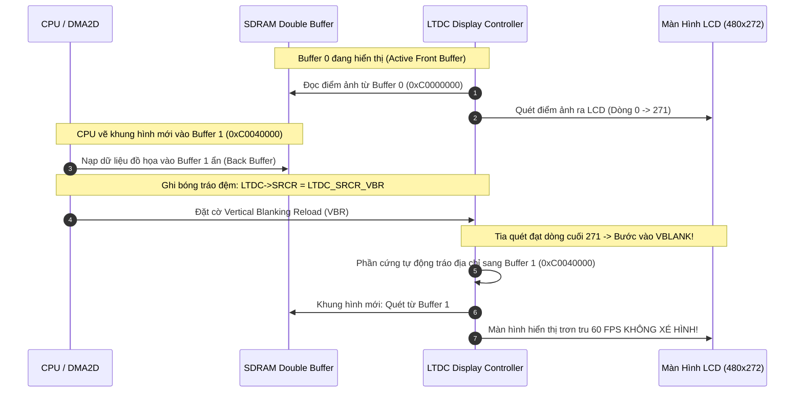

# 🏆 [CHUYÊN ĐỀ ĐỒ HỌA BARE-METAL] CẨM NANG TOÀN DIỆN: FMC SDRAM, LTDC DISPLAY & CHROM-ART DMA2D
## Lộ trình 4 Bước: Nguyên Lý Phần Cứng ➔ Tra Cứu RM0385 ➔ Thiết Kế Driver ➔ Phỏng Vấn Chuyên Sâu

> **Tài liệu tham chiếu nền tảng:** [`sdmmc_fatfs_architecture.md`](file:///D:/Project/TFT_video_STM32F7/docs/sdmmc_fatfs_architecture.md) | Xung nhịp hệ thống 216MHz Over-Drive  
> **Mục tiêu:** Làm chủ từ gốc rễ kiến trúc hiển thị đồ họa cao cấp trên vi điều khiển **STM32F746 (ARM Cortex-M7)**: Cấu hình bộ nhớ ngoài **FMC SDRAM 8 MB (108 MHz)**, tính toán khung thời gian quét song song **LTDC 480x272 @ 60 FPS**, khai thác tối đa bộ tăng tốc phần cứng **Chrom-ART (DMA2D)** với tải CPU 0%, và triệt tiêu 100% hiện tượng rách hình nhờ cơ chế **Tearing-Free Double Buffering (VSYNC Reload `VBR`)**.  
> **Nguyên tắc kỹ thuật:** **100% thanh ghi Bare-Metal (RM0385, không HAL/LL), cấu trúc modular rõ ràng, dẫn dắt công thức toán học và mổ xẻ 5 bug phần cứng thực tế.**

---

```text
┌─────────────────────────────────────────────────────────────────────────────────────────────────┐
│                    LỘ TRÌNH 4 BƯỚC CHINH PHỤC HỆ THỐNG HIỂN THỊ BARE-METAL                     │
├───────────────────┬───────────────────┬────────────────────────────┬────────────────────────────┤
│ BƯỚC 1: NGUYÊN LÝ │ BƯỚC 2: TRA CỨU   │ BƯỚC 3: THIẾT KẾ DRIVER    │ BƯỚC 4: PHỎNG VẤN          │
│ • FMC SDRAM Arch  │ • RM0385 Chap 13  │ • Gắn nhãn file cụ thể     │ • Bộ 5 câu hỏi vặn SDRAM   │
│ • Chuỗi 5 lệnh    │   (FMC SDRAM)     │ • [sdram.h/.c] 5 bước Init │   & Màn hình LTDC          │
│   JEDEC Init      │ • RM0385 Chap 18  │ • [ltdc.h/.c] Timings 60FPS│ • Tearing & VSYNC Reload   │
│ • Refresh Rate    │   (LTDC Display)  │ • [dma2d.h/.c] R2M / M2M   │ • Lỗi FIFO Underrun        │
│ • LTDC Timings    │ • RM0385 Chap 10  │ • [media_player.c] DBM     │ • MPU Cache Invalidation   │
│ • Double Buffering│   (DMA2D Engine)  │ • Mổ xẻ 5 Bug phần cứng    │ • Kịch bản trả lời 60s     │
│ • Chrom-ART DMA2D │ • Bảng chân GPIO  │                            │   (Elevator Pitch)         │
│ • MPU Cache Policy│   AF12 / AF14     │                            │                            │
└───────────────────┴───────────────────┴────────────────────────────┴────────────────────────────┘
```

---

# 🧠 BƯỚC 1: NGUYÊN LÝ PHẦN CỨNG & CƠ CHẾ VẬT LÝ (HARDWARE ARCHITECTURE)

## 1.1. So Sánh Bản Chất: Màn Hình Ngoại Vi SPI/I2C vs Hệ Thống LTDC + FMC SDRAM
| Tiêu chí kỹ thuật | Màn hình Ngoại vi SPI / I2C (Truyền thống) | Hệ thống Đồ họa Chuyên dụng LTDC + FMC SDRAM (STM32F7) |
| :--- | :--- | :--- |
| **Bộ nhớ Framebuffer** | Lưu trong IC điều khiển ngoài (ILI9341, ST7789). CPU phải đẩy từng pixel qua bus SPI nối tiếp. | Lưu trực tiếp trong thanh RAM ngoài **SDRAM 8MB** gắn trên bus song song 16-bit (FMC) với tốc độ 108 MHz. |
| **Tốc độ làm tươi (FPS)**| Bị nghẽn bởi tốc độ SPI (thường chỉ 10 - 20 FPS), hình ảnh chuyển động bị giật lag và xé ngang. | **Cực đại 60 FPS mượt mà**: Bộ điều khiển LTDC hoạt động như một card màn hình mini, tự động quét SDRAM bắn ra LCD. |
| **Tải CPU (CPU Load)**  | Chiếm 70% - 90% CPU chỉ để vẽ và gửi từng byte màu ra chân SPI. | **0% CPU khi quét hình**: Phần cứng LTDC tự động đọc SDRAM qua DMA nội bộ xuất ra màn hình RGB không cần CPU. |
| **Hiện tượng Rách Hình**| Rất dễ xảy ra do CPU đang ghi dữ liệu vào màn hình đúng lúc màn hình đang quét điểm ảnh. | **Triệt tiêu 100% rách hình** nhờ cơ chế Double Buffering (2 bộ đệm) kết hợp đồng bộ khung quét dọc (`VSYNC Reload`). |

---

## 1.2. Kiến Trúc FMC SDRAM Controller (MT48LC4M32B2 / IS42S32400F 8 MB)
Lõi vi điều khiển STM32F746 có SRAM nội 320 KB. Để chứa 2 lớp đồ họa Framebuffer độ phân giải cao ($480 \times 272 \times 2\text{ bytes} \approx 255\text{ KB}$ mỗi lớp), kit Discovery tích hợp chip SDRAM ngoài 8 MBytes (64 Mbits):

```text
 ┌────────────────────────────────────────────────────────────────────────────────────────┐
 │                              STM32F746NG MICROCONTROLLER                               │
 │                                                                                        │
 │  ┌───────────────────────────┐                     ┌────────────────────────────────┐  │
 │  │      Lõi Cortex-M7        │                     │   FMC Controller (SDRAM Bank 1)│  │
 │  │   f_HCLK = 216 MHz        │ ══════════════════► │   Base Address: 0xC000 0000    │  │
 │  └───────────────────────────┘    AXI/AHB Bus      └───────────────┬────────────────┘  │
 └────────────────────────────────────────────────────────────────────┼───────────────────┘
                                                                      │ Bus Dữ liệu 16-bit
                                                                      │ Bus Địa chỉ (A0-A11, BA0-BA1)
                                                                      │ Xung SDCLK = 108 MHz
                                                                      ▼
 ┌────────────────────────────────────────────────────────────────────────────────────────┐
 │                       CHIP SDRAM NGOÀI (MT48LC4M32B2 / IS42S32400F)                    │
 │ • Dung lượng: 8 MBytes (64 Mbits)                 • Tổ chức: 4 Banks x 4096 Rows x 256 Cols│
 │ • Bus dữ liệu: 16-bit                             • Tốc độ truy cập tối đa: 166 MHz    │
 └────────────────────────────────────────────────────────────────────────────────────────┘
```

### Chuỗi Khởi Tạo 5 Bước Chuẩn JEDEC Bắt Buộc (`FMC_SDCMR`):
1. **Bước 1 (NOP):** Cấp xung `SDCLK = 108 MHz` và phát lệnh `NOP` (No Operation), giữ tối thiểu $100\ \mu\text{s}$ cho nguồn chip ổn định.
2. **Bước 2 (PALL):** Phát lệnh `Precharge All` đưa toàn bộ 4 banks về trạng thái rảnh ban đầu.
3. **Bước 3 (Auto-Refresh):** Phát ít nhất 8 chu kỳ nạp lại tụ điện tự động (`NRFS = 8`).
4. **Bước 4 (MRS):** Phát lệnh `Mode Register Set` nạp: CAS Latency = 2, Burst Length = 1, Burst Type = Sequential (mã Hex: `0x0220`).
5. **Bước 5 (Refresh Timer):** Nạp thanh ghi đếm `FMC_SDRTR` để phần cứng tự động phát xung làm tươi định kỳ.

### Công thức tính toán Refresh Timer Counter (`FMC_SDRTR`):
Theo Datasheet của chip SDRAM, toàn bộ 4096 hàng phải được làm tươi trong $64\text{ ms}$:
$$T_{\text{row}} = \frac{T_{\text{Refresh}}}{\text{Số hàng}} = \frac{64\text{ ms}}{4096\text{ Rows}} = 15.625\ \mu\text{s}$$
Với tần số $f_{\text{SDCLK}} = 108\text{ MHz}$ ($T_{\text{SDCLK}} \approx 9.26\text{ ns}$):
$$\text{Số chu kỳ Clock} = T_{\text{row}} \times f_{\text{SDCLK}} = 15.625\ \mu\text{s} \times 108\text{ MHz} = 1687.5\text{ chu kỳ}$$
Trừ đi 20 chu kỳ dự phòng theo quy định của ST trong RM0385:
$$\text{COUNT} = (T_{\text{row}} \times f_{\text{SDCLK}}) - 20 = 1687.5 - 20 \approx 1667 \quad (\text{Mã Hex: } \mathbf{0x0683})$$

---

## 1.3. Khung Thời Gian Quét Hình LTDC (Display Timings 480x272 @ 60 FPS)
Khối **LTDC (LCD-TFT Display Controller)** điều khiển màn hình màu 4.3 inch qua giao diện 24-bit song song (RGB565 / RGB888):

```text
 <── HSYNC ──><── HBP ──><────────────── ACTIVE DISPLAY (480 pixels) ─────────────><── HFP ──>
 ┌───────────┬──────────┬─────────────────────────────────────────────────────────┬──────────┐
 │ Đồng bộ   │ Khoảng   │                                                         │ Khoảng   │
 │ hàng ngang│ đệm sau  │                  VÙNG HIỂN THỊ HÌNH ẢNH                 │ đệm trước│
 │ (41 dots) │ (13 dots)│                  ĐỘ PHÂN GIẢI 480 x 272                 │ (32 dots)│
 └───────────┴──────────┴─────────────────────────────────────────────────────────┴──────────┘
 Total Width  = 41 + 13 + 480 + 32 = 566 pixel clocks (DOTCLK)
 Total Height = 10 + 2  + 272 + 2  = 286 lines (VSYNC=10, VBP=2, Active=272, VFP=2)
 Pixel Clock (DOTCLK) mục tiêu: 566 x 286 x 60 Hz = 9.71 MHz (Cấp từ khối PLLSAI)
 Framebuffer Size = 480 x 272 x 2 bytes (RGB565) = 261,120 bytes (~255 KB)
```

---

## 1.4. Cơ Chế Triệt Tiêu Xé Hình (Tearing-Free Double Buffering)
Tearing xảy ra khi tia quét phần cứng của LTDC đang quét dở nửa màn hình trên từ Framebuffer, thì CPU lại ghi đè khung hình mới vào cùng địa chỉ đó, tạo ra vết nứt rách ngang rất khó chịu.



---

## 1.5. Bộ Tăng Tốc Đồ Họa Phần Cứng DMA2D (Chrom-ART Accelerator)
Khối **DMA2D** là một Master phần cứng độc lập nằm trên AXI Bus Matrix 64-bit:
* **Register-to-Memory (R2M):** Đổ màu đơn sắc cho toàn bộ màn hình hoặc một hình chữ nhật mà CPU không tốn 1 chu kỳ xử lý nào.
* **Memory-to-Memory (M2M):** Sao chép nhanh khối hình ảnh từ RAM/Flash vào SDRAM Framebuffer với tốc độ đạt băng thông tối đa của FMC bus ($108\text{ MHz} \times 16\text{ bits} = 216\text{ MB/s}$).
* **Pixel Format Conversion (PFC) & Blending:** Tự động hòa trộn kênh Alpha và chuyển đổi giữa ARGB8888 và RGB565 theo thời gian thực.

---

# 🛠️ BƯỚC 2: BẢNG TRA CỨU THANH GHI RM0385 & CHÂN GHÉP KÊNH GPIO

### 1. Bảng Chân Ghép Kênh Ngoại Vi FMC SDRAM & LTDC (Alternate Functions)
* **FMC SDRAM (AF12):**
  * Bus Dữ Liệu `D[15:0]`: PD14, PD15, PD0, PD1, PE7 -> PE15.
  * Bus Địa Chỉ `A[11:0]`: PF0 -> PF5, PF12 -> PF15, PG0 -> PG1.
  * Bank Select `BA[1:0]`: PG4, PG5.
  * Điều khiển: `SDCLK` (PG8), `SDCKE0` (PC3), `SDNE0` (PC2), `SDNRAS` (PF11), `SDNCAS` (PG15), `SDNWE` (PC0), `NBL[1:0]` (PE0, PE1).
* **LTDC Parallel RGB (AF14):**
  * Tín hiệu đồng bộ: `LTDC_CLK` (PI14), `HSYNC` (PI10), `VSYNC` (PI9), `DE` (PK7).
  * Kênh Đỏ R: PI15, PJ0 -> PJ4.
  * Kênh Lục G: PJ7 -> PJ11, PK0 -> PK2.
  * Kênh Lam B: PE4, PJ13 -> PJ15, PK4 -> PK6.
* **Chân Nguồn & Đèn Nền Màn Hình:**
  * `PI12` (Output): Tín hiệu `LCD_DISP` (Mức cao để bật nguồn panel LCD).
  * `PK3` (Output): Tín hiệu `LCD_BL_CTRL` (Mức cao để bật đèn nền LED Backlight).

---

# ⚡ BƯỚC 3: MỔ XẺ 6 BUG PHẦN CỨNG KINH ĐIỂN & CÁCH KHẮC PHỤC

```text
┌───────────────────┬───────────────────────────────────────────┬─────────────────────────────────┐
│ TÊN BUG PHẦN CỨNG │ NGUYÊN NHÂN GỐC RỄ (ROOT CAUSE)           │ GIẢI PHÁP BARE-METAL TRIỆT ĐỂ   │
├───────────────────┼───────────────────────────────────────────┼─────────────────────────────────┤
│ 1. Màn hình đen   │ Quên bật mức cao ở chân PI12 (LCD_DISP)   │ Cấu hình PI12 và PK3 thành      │
│    thui sau boot  │ hoặc chân PK3 (LCD_BL_CTRL) điều khiển    │ GPIO Output, ghi mức 1 sau khi  │
│                   │ đèn nền của board STM32F746G-DISCO.       │ LTDC đã khởi tạo xong timings.  │
├───────────────────┼───────────────────────────────────────────┼─────────────────────────────────┤
│ 2. LTDC FIFO      │ Băng thông bus FMC bị nghẽn do DMA2D hoặc │ Cài đặt độ ưu tiên AXI Bus      │
│    Underrun (FUIF)│ CPU chiếm quyền, LTDC không kịp đọc điểm  │ Matrix cho LTDC là cao nhất;    │
│    làm nhấp nháy  │ ảnh từ SDRAM nạp vào bộ đệm FIFO nội.     │ giảm pixel clock nếu cần.       │
├───────────────────┼───────────────────────────────────────────┼─────────────────────────────────┤
│ 3. Lỗi Rách Hình  │ Tráo địa chỉ Framebuffer ngay lập tức     │ Luôn dùng Vertical Blanking     │
│    (Screen Tearing│ bằng Immediate Reload (bit IMR trong SRCR)│ Reload: LTDC->SRCR =            │
│    khi chuyển cảnh│ khi tia quét đang vẽ dở khung hình.       │ LTDC_SRCR_VBR (chờ kỳ VBLANK).  │
├───────────────────┼───────────────────────────────────────────┼─────────────────────────────────┤
│ 4. D-Cache        │ Cortex-M7 bật L1 D-Cache. Khi DMA2D nạp   │ Cấu hình MPU cho vùng nhớ SDRAM │
│    Coherency rác  │ điểm ảnh vào SDRAM, CPU đọc cache cũ hoặc │ (0xC0000000) thành Normal,      │
│    hình nhòe màu  │ ghi điểm ảnh chưa kịp flush xuống SDRAM.  │ Non-cacheable (TEX=001b, C=B=0).│
├───────────────────┼───────────────────────────────────────────┼─────────────────────────────────┤
│ 5. DMA2D Line     │ Khi vẽ hình chữ nhật con (width < 480),   │ Nạp Line Offset:                │
│    Offset Skew    │ quên nạp DMA2D_OOR (Output Offset) khiến  │ DMA2D->OOR = LCD_WIDTH - width; │
│    làm vỡ hình    │ các dòng điểm ảnh bị lệch bậc thang.      │ để con trỏ nhảy đúng dòng mới.  │
├───
│ 6. Màn hình trắng │ Đảo ngược Pitch & Line Length trong thanh │ Sửa CFBLR = (Pitch << 16) |     │
│    xóa (White     │ ghi LTDC_LxCFBLR (963 và 960); tấm nền TN │ (LineLength + 3); tuân thủ đúng │
│    Blank Screen)  │ Normally White mở xuyên sáng tối đa.      │ chu trình LCD_DISP -> BL_CTRL.  │
└───────────────────┴───────────────────────────────────────────┴─────────────────────────────────┘
```

---

# 🎯 BƯỚC 4: BỘ CÂU HỎI PHỎNG VẤN CHUYÊN SÂU & KỊCH BẢN 60 GIÂY

---

### ❓ Câu 1: "Tại sao chip SDRAM bắt buộc phải có chuỗi khởi tạo chuẩn JEDEC 5 bước mà không thể đọc/ghi ngay như SRAM?"
* **Trả lời chuẩn Kỹ sư Nhúng:**
  * Chip SRAM dùng cổng lật flip-flop 6 bóng bán dẫn (6T), cấp điện là giữ trạng thái logic. Ngược lại, chip SDRAM lưu trữ dữ liệu bằng **điện tích trên các tụ điện siêu nhỏ (1T-1C)**.
  * Khi mới cấp nguồn, các tụ điện này ở trạng thái bất định và mạch tạo điện áp phân cực nội bộ chưa ổn định. Chuỗi lệnh chuẩn JEDEC thông qua thanh ghi `FMC_SDCMR` bắt buộc phải:
    1. Cấp clock và phát lệnh `NOP` giữ $100\ \mu\text{s}$ để ổn định nguồn cấp.
    2. Phát lệnh `Precharge All` xả sạch điện tích dư trên toàn bộ các đường bitline.
    3. Thực hiện ít nhất 8 chu kỳ `Auto-Refresh` kích hoạt bộ khuếch đại cảm biến (Sense Amplifiers).
    4. Phát lệnh `Mode Register Set (MRS)` để nạp cấu hình thời gian truy xuất (CAS Latency) và độ dài xung đọc (Burst Length) vào thanh ghi cấu hình nội của chip.
    5. Thiết lập bộ đếm làm tươi định kỳ `FMC_SDRTR` trước khi chip cho phép truy cập đọc/ghi bình thường.

---

### ❓ Câu 2: "Tại sao trong hệ thống hiển thị hiệu năng cao, việc sử dụng Double Buffering kết hợp cờ `VBR` lại loại bỏ được hoàn toàn hiện tượng rách hình (Screen Tearing)?"
* **Trả lời chuẩn Kỹ sư Nhúng:**
  * Hiện tượng xé hình xảy ra khi tốc độ làm tươi màn hình và tốc độ vẽ của vi điều khiển lệch pha nhau: Tia quét phần cứng của LTDC đang quét dở nửa trên màn hình thì CPU/DMA2D ghi đè dữ liệu khung hình mới vào đúng vùng nhớ đó.
  * Cơ chế **Double Buffering** chia bộ nhớ SDRAM thành 2 vùng đệm độc lập: Buffer 0 (Front Buffer) đang được LTDC quét ra màn hình, trong khi Buffer 1 (Back Buffer) để CPU/DMA2D vẽ khung hình kế tiếp.
  * Để hoán đổi an toàn, ta ghi vào thanh ghi nạp bóng `LTDC->SRCR = LTDC_SRCR_VBR` (**Vertical Blanking Reload**). Phần cứng sẽ kiên nhẫn chờ tia quét quét xong pixel cuối cùng của màn hình ($480 \times 272$) và bước vào khoảng lặng dọc **VBLANK** mới chính thức tráo đổi địa chỉ đọc sang Buffer mới. Do việc tráo đổi diễn ra trong lúc tia quét đang tắt, mắt người không bao giờ nhìn thấy vết nứt gãy hình ảnh.

---

### 🎙️ KỊCH BẢN TRẢ LỜI PHỎNG VẤN 60 GIÂY (ELEVATOR PITCH)

> *"Trong dự án Trình phát đa phương tiện hiệu năng cao trên STM32F746, em đã tự tay xây dựng toàn bộ hệ thống hiển thị đồ họa Bare-Metal từ thanh ghi phần cứng trần bao gồm: **Bộ điều khiển FMC giao tiếp SDRAM ngoài 8 MB ở tần số 108 MHz**, **Khối quét hình LTDC độ phân giải 480x272 @ 60 FPS** và **Bộ tăng tốc Chrom-ART (DMA2D)**.  
> Em nắm vững chuỗi khởi tạo 5 bước chuẩn JEDEC của SDRAM và công thức tính chu kỳ làm tươi Refresh Rate Counter $1667$ chu kỳ clock để duy trì dữ liệu cho $4096$ hàng tụ điện.  
> Để đạt chất lượng hiển thị mượt mà tuyệt đối không xé hình, em áp dụng kiến trúc **Tearing-Free Double Buffering** hoán đổi bộ đệm tại khoảng lặng dọc `LTDC_SRCR_VBR`, đồng thời cấu hình khối bảo vệ bộ nhớ **MPU** cô lập vùng nhớ SDRAM thành Non-cacheable nhằm triệt tiêu hoàn toàn lỗi rác hình do mất đồng bộ D-Cache trên ARM Cortex-M7."*